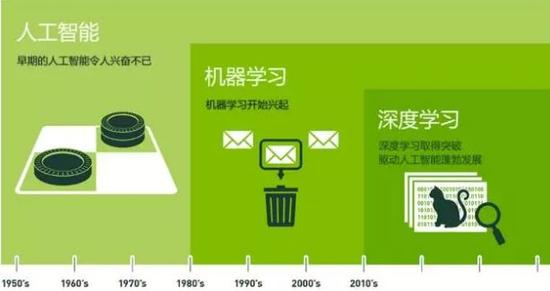

# 一、深度学习简介

## 1、概述

说到深度学习，也就是 deep learning，我们就不得不说一下，AI、机器学习（ML）、深度学习（DL）之间的关系，因为好多人都会把他们的关系搞混淆。

首先，我们看一下下面的图：

图下面的时间轴，显示的是有比较大发展的年份。

我们从上图中也可以看到，人工智能是最早出现的，也是最大，最外侧的同心圆；其次，是机器学习，稍微晚一点；最内侧，是深度学习，当今人工智能大爆炸的核心驱动。总结下来，就是这样：

 - AI 是个广泛意义上的总称，就是 Artificial Intelligence ，翻译过来就是人工智能。它的目的就是为机器赋予人的智能。
 - ML ，也就是 Machine Learning 的简称，翻译过来就是机器学习。它是 AI 的一个领域，是一种实现 AI 的方法。
 - DL ，也就是 Deep Learning 的简称，翻译过来就是深度学习。它是 ML 的一个领域，是一种实现机器学习的方法。

现在差不多就懂了吧，深度学习只是 ML 的一个小分支。

## 2、详细介绍

### 2.1、人工智能（Artificial Intelligence）——为机器赋予人的智能

早在1956年夏天那次会议，人工智能的先驱们就梦想着用当时刚刚出现的计算机来构造复杂的、拥有与人类智慧同样本质特性的机器。这就是我们现在所说的 “强人工智能”（General AI）。这个无所不能的机器，它有着我们所有的感知（甚至比人更多），我们所有的理性，可以像我们一样思考。

人们在电影里也总是看到这样的机器：友好的，像星球大战中的 C-3PO；邪恶的，如终结者。强人工智能现在还只存在于电影和科幻小说中，原因不难理解，我们还没法实现它们，至少目前还不行。

我们目前能实现的，一般被称为 “弱人工智能”（Narrow AI）。弱人工智能是能够与人一样，甚至比人更好地执行特定任务的技术。例如，Pinterest 上的图像分类；或者 Facebook 的人脸识别。

这些是弱人工智能在实践中的例子。这些技术实现的是人类智能的一些具体的局部。但它们是如何实现的？这种智能是从何而来？这就带我们来到同心圆的里面一层，机器学习。

### 2.2、机器学习—— 一种实现人工智能的方法

机器学习最基本的做法，是使用算法来解析数据、从中学习，然后对真实世界中的事件做出决策和预测。与传统的为解决特定任务、硬编码的软件程序不同，机器学习是用大量的数据来“训练”，通过各种算法从数据中学习如何完成任务。

机器学习直接来源于早期的人工智能领域。传统算法包括决策树学习、推导逻辑规划、聚类、强化学习和贝叶斯网络等等。众所周知，我们还没有实现强人工智能。早期机器学习方法甚至都无法实现弱人工智能。

机器学习最成功的应用领域是计算机视觉，虽然也还是需要大量的手工编码来完成工作。人们需要手工编写分类器、边缘检测滤波器，以便让程序能识别物体从哪里开始，到哪里结束；写形状检测程序来判断检测对象是不是有八条边；写分类器来识别字母 “ST-O-P” 。使用以上这些手工编写的分类器，人们总算可以开发算法来感知图像，判断图像是不是一个停止标志牌。

这个结果还算不错，但并不是那种能让人为之一振的成功。特别是遇到云雾天，标志牌变得不是那么清晰可见，又或者被树遮挡一部分，算法就难以成功了。这就是为什么前一段时间，计算机视觉的性能一直无法接近到人的能力。它太僵化，太容易受环境条件的干扰。

随着时间的推进，学习算法的发展改变了一切。

### 2.3、深度学习——一种实现机器学习的技术

深度学习是机器学习研究中的一个新的领域，其动机在于建立、模拟人脑进行分析学习的神经网络，它模仿人脑的机制来解释数据，例如图像，声音和文本。

深度学习的概念源于人工神经网络的研究。含多隐层的多层感知器就是一种深度学习结构。

2012 年吴恩达（Andrew Ng）教授在 Google 实现了神经网络学习到猫的样子，他的突破在于，把这些神经网络从基础上显著地增大了。层数非常多，神经元也非常多，然后给系统输入海量的数据，来训练网络。在吴教授这里，数据是一千万 YouTube 视频中的图像。吴教授为深度学习（deep learning）加入了 “深度”（deep）。这里的“深度”就是说神经网络中众多的层。

## 3、小结

机器学习把人工智能推向了历史的高潮，而深度学习又将机器学习推向了历史的顶端。

深度学习使得机器学习能够实现众多的应用，并拓展了人工智能的领域范围。深度学习摧枯拉朽般地实现了各种任务，使得似乎所有的机器辅助功能都变为可能。无人驾驶汽车，预防性医疗保健，甚至是更好的电影推荐，都近在眼前，或者即将实现。

人工智能就在现在，就在明天。有了深度学习，人工智能甚至可以达到我们畅想的科幻小说一般。