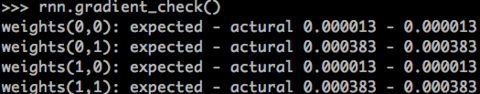

# 十、循环神经网络（Recurrent Neural Network, RNN）（二）

本章主要讲我们上一章介绍的循环神经网络（RNN）的实现。

## 1、代码实现

完整代码请参考：https://github.com/chenyyx/deeplearning-notes/blob/master/src/7days/rnn.py

为了加深我们对前面介绍的知识的理解，我们来动手实现一个 RNN 层。我们用到上一次介绍的卷积神经网络的代码，所以我们把他们先导入进来。

```python
import numpy as np
from cnn import ReluActivator, IdentityActivator, element_wise_op
```

我们用 RecurrentLayer 类来实现一个**循环层** 。下面的代码是初始化一个循环层，可以在构造函数中设置卷积层的超参数，我们注意到，循环层有两个权重数组，U 和 W 。

```python
class RecurrentLayer(object):
    def __init__(self, input_width, state_width, activator, learning_rate):
        self.input_width = input_width
        self.state_width = state_width
        self.activator = activator
        self.learning_rate = learning_rate
        self.times = 0       # 当前时刻初始化为t0
        self.state_list = [] # 保存各个时刻的state
        self.state_list.append(np.zeros((state_width, 1)))           # 初始化s0
        self.U = np.random.uniform(-1e-4, 1e-4,(state_width, input_width))  # 初始化U
        self.W = np.random.uniform(-1e-4, 1e-4,(state_width, state_width))  # 初始化W
```

在 forward 方法中，实现循环层的前向计算，这部分比较简单。

```python
    def forward(self, input_array):
        '''
        根据『式2』进行前向计算
        '''
        self.times += 1
        state = (np.dot(self.U, input_array) +
                 np.dot(self.W, self.state_list[-1]))
        element_wise_op(state, self.activator.forward)
        self.state_list.append(state)
```

在 backword 方法中，实现 BPTT 算法。

```python
    def backward(self, sensitivity_array, 
                 activator):
        '''
        实现BPTT算法
        '''
        self.calc_delta(sensitivity_array, activator)
        self.calc_gradient()
    def calc_delta(self, sensitivity_array, activator):
        self.delta_list = []  # 用来保存各个时刻的误差项
        for i in range(self.times):
            self.delta_list.append(np.zeros(
                (self.state_width, 1)))
        self.delta_list.append(sensitivity_array)
        # 迭代计算每个时刻的误差项
        for k in range(self.times - 1, 0, -1):
            self.calc_delta_k(k, activator)
    def calc_delta_k(self, k, activator):
        '''
        根据k+1时刻的delta计算k时刻的delta
        '''
        state = self.state_list[k+1].copy()
        element_wise_op(self.state_list[k+1],
                    activator.backward)
        self.delta_list[k] = np.dot(
            np.dot(self.delta_list[k+1].T, self.W),
            np.diag(state[:,0])).T
    def calc_gradient(self):
        self.gradient_list = [] # 保存各个时刻的权重梯度
        for t in range(self.times + 1):
            self.gradient_list.append(np.zeros(
                (self.state_width, self.state_width)))
        for t in range(self.times, 0, -1):
            self.calc_gradient_t(t)
        # 实际的梯度是各个时刻梯度之和
        self.gradient = reduce(
            lambda a, b: a + b, self.gradient_list,
            self.gradient_list[0]) # [0]被初始化为0且没有被修改过
    def calc_gradient_t(self, t):
        '''
        计算每个时刻t权重的梯度
        '''
        gradient = np.dot(self.delta_list[t],
            self.state_list[t-1].T)
        self.gradient_list[t] = gradient
```

有意思的是，BPTT 算法虽然数学推导的过程很麻烦，但是写成代码却并不复杂。

在 update 方法中，实现梯度下降算法。

```python
    def update(self):
        '''
        按照梯度下降，更新权重
        '''
        self.W -= self.learning_rate * self.gradient
```

上面的代码不包含权重 U 的更新。这部分实际上和全连接神经网络是一样的。

循环层是一个带状态的层，每次 forward 都会改变循环层的内部状态，这给梯度检查带来了麻烦。因此，我们需要一个 reset_state 方法，来重置循环层的内部状态。

```python
    def reset_state(self):
        self.times = 0       # 当前时刻初始化为t0
        self.state_list = [] # 保存各个时刻的state
        self.state_list.append(np.zeros((self.state_width, 1)))      # 初始化s0
```

最后是梯度检查的代码。

```python
def gradient_check():
    '''
    梯度检查
    '''
    # 设计一个误差函数，取所有节点输出项之和
    error_function = lambda o: o.sum()
    rl = RecurrentLayer(3, 2, IdentityActivator(), 1e-3)
    # 计算forward值
    x, d = data_set()
    rl.forward(x[0])
    rl.forward(x[1])
    # 求取sensitivity map
    sensitivity_array = np.ones(rl.state_list[-1].shape,
                                dtype=np.float64)
    # 计算梯度
    rl.backward(sensitivity_array, IdentityActivator())
    # 检查梯度
    epsilon = 10e-4
    for i in range(rl.W.shape[0]):
        for j in range(rl.W.shape[1]):
            rl.W[i,j] += epsilon
            rl.reset_state()
            rl.forward(x[0])
            rl.forward(x[1])
            err1 = error_function(rl.state_list[-1])
            rl.W[i,j] -= 2*epsilon
            rl.reset_state()
            rl.forward(x[0])
            rl.forward(x[1])
            err2 = error_function(rl.state_list[-1])
            expect_grad = (err1 - err2) / (2 * epsilon)
            rl.W[i,j] += epsilon
            print 'weights(%d,%d): expected - actural %f - %f' % (
                i, j, expect_grad, rl.gradient[i,j])
```

需要注意的是，每次计算 error 之前，都要调用 reset_state 方法重置循环层的内部状态。下面是梯度检查的结果，没问题！



## 2、小结

我们讲完了基本的 **循环神经网络**、以及它的训练算法：**BPTT**，以及在语言模型上的应用。然而，**循环神经网络** 这个话题并没有完结。我们在前面说到过，基本的循环神经网络存在梯度爆炸和梯度消失问题，并不能真正的处理好长距离的依赖（虽然有一些技巧可以减轻这些问题）。事实上，真正得到广泛的应用的是循环神经网络的一个变体：**长短时记忆网络**。它内部有一些特殊的结构，可以很好的处理长距离的依赖，我们在下一章节介绍它。