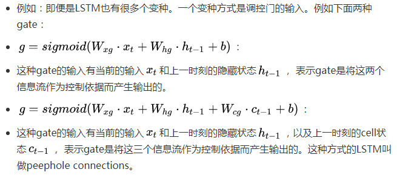
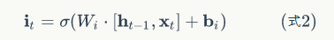

# 十一、长短时记忆网络（LSTM）（一）

## 1、概述

在上一篇文章中，我们介绍了 **循环神经网络** 以及它的训练算法。我们也介绍了 **循环神经网络** 很难训练的原因，这导致了它在实际应用中，很难处理长距离的依赖。在本文中，我们将介绍一种改进之后的循环神经网络：**长短时记忆网络（Long Short Term Memory Network, LSTM）** ，它成功地解决了原始循环神经网络的缺陷，成为当前最流行的 RNN ，在语音识别、图片描述、自然语言处理等许多领域中成功应用。但不幸的是，LSTM 的结构很复杂，因此，我们需要花上一些力气，才能把 LSTM 以及它的训练算法弄明白。在搞清楚 LSTM 之后，我们再介绍一种 LSTM 的变体：GRU(Gated Recurrent Unit) 。它的结构比 LSTM 简单，而效果却和 LSTM 一样好，因此，它正在逐渐流行起来。最后的最后，我们仍然会像之前一样，动手实现一个 **LSTM** 。

## 2、长短时记忆网络

### 2.1、回顾 RNN

我们在上一个文章中介绍了 **循环神经网络（RNN）** ，那到底什么是 RNN 呢？先举个例子：

当我们在思考问题的时候，并不是每分每秒都是将事情的源头重复地去回忆和了解，所有的思考都是基于对事情之前的认识来的；当我们阅读文章时，理解文章的意思也是基于之前的文章段落的句意的，所以人脑对事情的理解是有记忆的。

以往传统的神经网络算法是没办法做到这一点的，因此也算是一个重要的算法的缺陷存在，比如你想要去分析电影中发生的事件，如果利用传统的神经网络是没有办法推理的，更没有办法预知事情的发展。

解决上述问题，其实 RNN 就可以，它具有循环的神经网络结构并且可以持续化神经元的信息。如下图：

在上图中 x_t 作为输入端输入的信息，输出为 h_t ，单个神经元上允许使用网络循环传递信息。这样的结构是与其他一般的神经网络是有不同的。

那如果我们将神经元结构进行扩展呢？又会是什么情况呢？

循环神经网络是由这种序列的单个神经元组成的，也形成特有的网络结构。

### 2.2、普通 RNN 中存在的问题 —— 梯度消失和梯度爆炸

如下图，我们的 RNN 是这样的：

涉及到的数学公式如下：

我们希望循环神经网络可以将过去时刻发生的状态信息传递给当前时刻的计算中。

但是我们在实际使用的时候，普通的 RNN 结构难以传递相隔较远的信息。

若只看上图蓝色箭头线的、隐藏状态的传递过程，不考虑非线性部分，那么就会得到一个简化的式子(1)，考虑一下下面这些问题：

当特征值小于 1 时，不断相乘的结果是特征值的 t 次方向着 0 衰减，这就是**梯度消失**；当特征值大于 1 时，不断相乘的结果是特征值的 t 次方向着 无穷 扩增，这就是 **梯度爆炸**。这时想要传递的 h_0 中的信息会被掩盖掉，无法传递到 h_t 。

可以类比一下，设想  ，如果 a 等于 0.1 ，x 在被不断乘以 0.1 一百次后会变成多小？如果 a 等于 5 ，x 在被不断乘以 5 一百次后会变得多大？若想要 x 所包含的信息既不消失，又不爆炸，就需要尽可能的将 a 的值保持在 1 。

假设某轮训练中，各时刻的梯度以及最终的梯度如下图：

从上面我们就可以看到，从 t-3 时刻开始，梯度已经几乎减少到 0 了。那么，从这个时刻开始再往之前走，得到的梯度（几乎为零）就不会对最终的梯度值有任何贡献，这就相当于无论 t-3 时刻之前的网络状态 h 是什么，在训练中都不会对权重数组 W 的更新产生影响，也就是网络事实上已经忽略了 t-3 时刻之前的状态。这就是原始 RNN 无法处理长距离依赖的原因。

既然找到了问题的原因，那么我们就能解决它。从问题的定位到解决，科学家们大概花了 7、8年时间。终于有一天，科学家发明出了 **长短时记忆网络**，一举解决了这个问题。

### 2.3、Long Short Term Memory (LSTM)

上面我们介绍的现象可能并不意味着无法学习，但是即便可以，也会非常非常的慢。为了有效的利用梯度下降法学习，我们希望使不断相乘的梯度的积（the product of derivatives）保持在接近 1 的数值。

一种实现方式是建立自连接单元（linear self-connections）和在自连接部分数值接近 1 的权重，叫做 leaky units 。但是 Leaky units 的线性自连接权重是手动设置或设为参数，而目前最有效的方式 gated RNNs 是通过 gates 的调控，**允许线性自连接的权重在每一步都可以自我变化调节**。LSTM 就是 gated RNNs 中的一个实现。

#### 2.3.1、LSTM 的初步理解

LSTM （或者其他 gated RNNs）是在标准 RNN （）的基础上装备了若干个控制数级（magnitude）的 gates 。可以理解成神经网络（RNN 整体）中加入其他神经网络（gates），而这些 gates 只是控制数级，控制信息的流动量。

 - 数学公式：这里我们贴出基本 LSTM 的数学公式，看一眼就好了，仅仅是为了让大家先留下一个印象，不需要记住，不需要理解。

尽管上面的式子不算复杂，却包含了很多知识，接下来就是逐步分析这些式子以及背后的原理。比如 上面式子中的一个圆的中心一个点 的意义和使用原因，sigmoid 的使用原因。

##### 2.3.1.1、门（gate）的理解

理解 Gated RNNs 的第一步就是明白 gate 到底起到什么作用。

 - **物理意义：** gate 本身可以看成是十分有物理意义的一个神经网络。
    - 输入：gate 的输入是控制依据；
    - 输出：gate 的输出是值域为 (0, 1) 的数值，表示该如何调节其他数据的数级的控制方式。

 - **使用方式：** gate 所产生的输出会用于控制其他数据的数级，相当于过滤器的作用。
    - 类比图：可以把信息想象成水流，而 gate 就是控制多少水流可以流过。
    
    - 例如：当用 gate 来控制向量 [20 5 7 8] 时，若 gate 的输出为 [0.1 0.2 0.9 0.5] 时，原来的向量就会被对应元素相乘 (element-wise) 后变成：
    
    - 若 gate 的输出为 [0.5 0.5 0.5 0.5]时，原来的向量就会被对应元素相乘 (element-wise) 后变成：
    

 - **控制依据：** 明白了 gate 的输出后，剩下要确定以什么信息为控制依据，也就是什么是 gate 的输入。

#### 2.3.2、LSTM 的再次理解

明白了 gate 之后再回过头来看 LSTM 的数学公式

 - **gates：** 先将前半部分的三个式子  统一理解。在 LSTM 中，网络首先构建了 3 个 gates 来控制信息的流通量。
 
 - 注：虽然 gates 的式子构成方式一样，但是注意 3 个 gates 式子 W 和 b 的下角标并不相同。它们有各自的物理意义，在网络学习过程中会产生不同的权重。

 - 有了这 3 个 gates 后，接下来要考虑的就是如何用它们装备在普通的 RNN 上来控制信息流，而根据它们所用于控制信息流通的地点不同，它们又被分为：
 
    - 输入门 i_t ：控制有多少信息可以流入 memory cell（第四个式子 c_t ）。
    - 遗忘门 f_t ：控制有多少上一时刻的memory cell中的信息可以累积到当前时刻的memory cell中。
    - 输出门 o_t ：控制有多少当前时刻的 memory cell 中的信息可以流入当前隐藏状态 h_t 中。
    - 注：gates 并不提供额外信息，gates 只是起到限制信息的量的作用。因为 gates 起到的是过滤器作用，所以所用的激活函数是 sigmoid 而不是 tanh 。

 - **信息流：** 信息流的来源只有三处，当前的输入 x_t ，上一时刻的隐藏状态 h_{t-1} ，上一时刻的 cell 状态 c_{t-1}，其中 c_{t-1} 是额外制造出来、可线性自连接的单元（请回想起 leaky units）。真正的信息流来源可以说只有当前的输入 x_t ，上一时刻的隐藏状态 h_{t-1} 两处。三个 gates 的控制依据，以及数据的更新都是来源于这两处。

 - 分析了 gates 和信息流后，再分析剩下的两个等式，来看 LSTM 是如何累积历史信息和计算隐藏状态 h 的。

 - **历史信息累积：**

所以历史信息的累积是并不是靠隐藏状态 h 自身，而是依靠 memory cell 这个自连接来累积。在累积时，靠 **遗忘门** 来限制上一时刻的 memory cell 的信息，并靠 **输入门** 来限制新信息。并且真的达到了 leaky units 的思想，memory cell 的自连接是线性的累积。

### 2.4、普通 RNN 与 LSTM 的比较

下面，我们看一下普通 RNN 与 LSTM 的区别吧。

 - 示图比较：

 - **LSTM** 靠 3 个 gates 将信息的积累建立在线性自连接的权重接近 1 的 memory cell 之上，并靠其作为中间物来计算当前 h_t 。

### 2.5、更形象的理解 LSTM 的前向计算

其实，LSTM 的思路比较简单。原始 RNN 的隐藏层只有一个状态，即 h ，它对于短期的输入非常敏感。那么假如我们再增加一个状态，即 c ，让它来保存长期的状态，那么问题不就迎刃而解了吗？如下图所示：

新增加的状态 c，称为 **单元状态（cell state）**。我们把上图按照时间维度展开：

上图仅仅是一个示意图，我们可以看出，在 t 时刻，LSTM 的输入有三个：当前时刻网络的输入值 x_t 、上一时刻 LSTM 的输出值 h_{t-1}、以及上一时刻的单元状态 c_{t-1}；LSTM 的输出有两个：当前时刻 LSTM 输出值 h_t 、和当前时刻的单元状态 c_t 。注意 x、h、c 都是向量。

LSTM 的关键，就是怎样控制长期状态 c 。在这里，LSTM 的思路是使用三个控制开关。第一个开关，负责控制继续保存长期状态 c ；第二个开关，负责控制把即时状态输入到长期状态 c ；第三个开关，负责控制是否把长期状态 c 作为当前的 LSTM 的输出。三个开关的作用如下图所示：

下面是我们要描述的，输出 h 和单元状态 c 的具体计算方法。

那么，前面描述的开关是怎么样在算法中实现的呢？这就用到了我们前面提到的 gate （门）的概念。门实际上就是一层**全连接层**，它的输入是一个向量，输出是一个 0 到 1 之间的实数向量。假设 W 是门的权重向量， b 是偏置项，那么门可以表示为：

门的使用，就是用门的输出向量按元素乘以我们需要控制的那个向量。因为门的输出是 0 到 1 的实数向量，那么当门输出为 0 时，任何向量与之相乘都会得到 0 向量，这就相当于啥都不能通过；输出为 1 时，任何向量与之相乘都不会有任何改变，这就相当于啥都可以通过。因为 sigmoid 函数的值域是 (0, 1) ，所以门的状态都是半开半闭的。

LSTM 用两个门来控制单元状态 c 的内容，一个是 **遗忘门（forget gate）**，它决定了上一时刻的单元状态 c_{t-1} 有多少保留到当前时刻 c_t ；另一个是 **输入门（input gate）**，它决定了当前时刻的网络的输入 x_t 有多少保存到单元状态 c_t 。LSTM 用 **输出门（output gate）** 来控制单元状态 c_t 有多少输出到 LSTM 的当前输出值 h_t 。

我们先来看一下遗忘门：

下图显示了遗忘门的计算：

接下来，我们看看输入门：

上式中，W_i 是输入门的权重矩阵，b_i 是输入门的偏置项。下图表示了输入门的计算：

接下来，我们计算用于描述当前输入的单元状态 ~c_t ，它是根据上一次的输出和本次输入来计算的：

下图是 ~c_t 的计算：

现在，我们计算当前时刻的单元状态 c_t 。它是由上一次的单元状态 c_{t-1} 按元素乘以遗忘门 f_t ，再用当前输入的单元状态 ~c_t 按元素乘以输入门 i_t ，再将两个积加和产生的：

符号 o 表示 **按元素乘** 。下图是 c_t 的计算：

这样，我们就把 LSTM 关于当前的记忆 ~c_t 和长期的记忆 c_{t-1} 组合在一起，形成了新的单元状态 c_t 。由于遗忘门的控制，它可以保存很久很久之前的信息，由于输入门的控制，它又可以避免当前无关紧要的内容进入记忆。下面，我们要看看输出门，它控制了长期记忆对当前输出的影响：

下图表示输出门的计算：

LSTM 最终的输出，是由输出门和单元状态共同确定的：

下图表示 LSTM 最终输出的计算：

**式1**到**式6** 就是 LSTM 前向计算的全部公式。至此，我们就把 LSTM 的前向计算讲完了。

 - 关于 LSTM 的反向传播和计算，具体参考：https://zybuluo.com/hanbingtao/note/581764

## 3、Gated RNNs 的变种

神经网络之所以被称为网络是因为它可以非常自由地创建合理的连接。而我们上面所介绍的 LSTM 也只是最基本的 LSTM 。只要遵守几个关键点，读者可以根据需求设计自己的 Gated RNNs，而至于在不同任务上的效果需要通过实验去验证。下面就简单介绍几个 Gated RNNs 的变种的设计方向。

