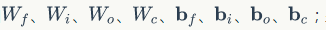
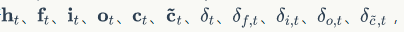
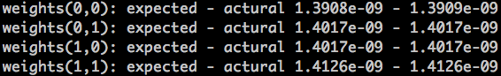

# 十二、长短时记忆网络（二）

## 1、概述

我们在上一章节中主要讲解了 LSTM 的一些原理性的东西，并且前向计算我们也着重讲解了一下，后面的反向传播没有细细讲解，只是给出了一个链接，那里写着详细的计算和推导过程。这一章，我们介绍 LSTM 的实现。

## 2、代码实现

完整代码请参考 GitHub：https://github.com/chenyyx/deeplearning-notes/blob/master/src/7days/lstm.py

在下面的实现中， LSTMLayer 的参数包括输入维度、输出维度、隐藏层维度，单元状态维度等于隐藏层维度。 gate 的激活函数为 sigmoid 函数，输出的激活函数为 tanh 。

### 2.1、激活函数的实现

我们先实现两个激活函数：sigmoid 和 tanh 。

```python
class SigmoidActivator(object):
    def forward(self, weighted_input):
        return 1.0 / (1.0 + np.exp(-weighted_input))
    def backward(self, output):
        return output * (1 - output)
class TanhActivator(object):
    def forward(self, weighted_input):
        return 2.0 / (1.0 + np.exp(-2 * weighted_input)) - 1.0
    def backward(self, output):
        return 1 - output * output
```

### 2.2、LSTM 初始化

我们把 LSTM 的实现放在 LstmLayer 类中。

根据 LSTM 前向计算和方向传播算法，我们需要初始化一系列矩阵和向量。这些矩阵和向量有两类用途，一类是用于保存模型参数，例如  另一类是保存各种中间计算结果，以便于反向传播算法使用，它们包括  以及各个权重对应的梯度。

在构造函数的初始化中，值只初始化了与 forward 计算相关的变量，与 backward 相关的变量没有初始化。这是因为构造 LSTM 对象的时候，我们还不知道它未来是用于训练（既有 forward 又有 backward）还是推理（只有 forward）。

```python
class LstmLayer(object):
    def __init__(self, input_width, state_width, 
                 learning_rate):
        self.input_width = input_width
        self.state_width = state_width
        self.learning_rate = learning_rate
        # 门的激活函数
        self.gate_activator = SigmoidActivator()
        # 输出的激活函数
        self.output_activator = TanhActivator()
        # 当前时刻初始化为t0
        self.times = 0       
        # 各个时刻的单元状态向量c
        self.c_list = self.init_state_vec()
        # 各个时刻的输出向量h
        self.h_list = self.init_state_vec()
        # 各个时刻的遗忘门f
        self.f_list = self.init_state_vec()
        # 各个时刻的输入门i
        self.i_list = self.init_state_vec()
        # 各个时刻的输出门o
        self.o_list = self.init_state_vec()
        # 各个时刻的即时状态c~
        self.ct_list = self.init_state_vec()
        # 遗忘门权重矩阵Wfh, Wfx, 偏置项bf
        self.Wfh, self.Wfx, self.bf = (
            self.init_weight_mat())
        # 输入门权重矩阵Wfh, Wfx, 偏置项bf
        self.Wih, self.Wix, self.bi = (
            self.init_weight_mat())
        # 输出门权重矩阵Wfh, Wfx, 偏置项bf
        self.Woh, self.Wox, self.bo = (
            self.init_weight_mat())
        # 单元状态权重矩阵Wfh, Wfx, 偏置项bf
        self.Wch, self.Wcx, self.bc = (
            self.init_weight_mat())
    def init_state_vec(self):
        '''
        初始化保存状态的向量
        '''
        state_vec_list = []
        state_vec_list.append(np.zeros(
            (self.state_width, 1)))
        return state_vec_list
    def init_weight_mat(self):
        '''
        初始化权重矩阵
        '''
        Wh = np.random.uniform(-1e-4, 1e-4,
            (self.state_width, self.state_width))
        Wx = np.random.uniform(-1e-4, 1e-4,
            (self.state_width, self.input_width))
        b = np.zeros((self.state_width, 1))
        return Wh, Wx, b
```

### 2.3、前向计算的实现

forward 方法实现了 LSTM 的前向计算：

```python
    def forward(self, x):
        '''
        根据式1-式6进行前向计算
        '''
        self.times += 1
        # 遗忘门
        fg = self.calc_gate(x, self.Wfx, self.Wfh, 
            self.bf, self.gate_activator)
        self.f_list.append(fg)
        # 输入门
        ig = self.calc_gate(x, self.Wix, self.Wih,
            self.bi, self.gate_activator)
        self.i_list.append(ig)
        # 输出门
        og = self.calc_gate(x, self.Wox, self.Woh,
            self.bo, self.gate_activator)
        self.o_list.append(og)
        # 即时状态
        ct = self.calc_gate(x, self.Wcx, self.Wch,
            self.bc, self.output_activator)
        self.ct_list.append(ct)
        # 单元状态
        c = fg * self.c_list[self.times - 1] + ig * ct
        self.c_list.append(c)
        # 输出
        h = og * self.output_activator.forward(c)
        self.h_list.append(h)
    def calc_gate(self, x, Wx, Wh, b, activator):
        '''
        计算门
        '''
        h = self.h_list[self.times - 1] # 上次的LSTM输出
        net = np.dot(Wh, h) + np.dot(Wx, x) + b
        gate = activator.forward(net)
        return gate
```

从上面的代码中我们可以看到，门的计算都是相同的算法，而门和 ~c_t 的计算仅仅是激活函数不同。因此我们提出了 calc_gate 方法，这样减少了很多重复代码。

### 2.4、反向传播算法的实现

backward 方法实现了 LSTM 的反向传播算法。需要注意的是，与 backward 相关的内部状态变量是在调用 backward 方法之后才初始化的。这种延迟初始化的一个好处是，如果 LSTM 只是用来推理，那么就不需要初始化这些变量，节省了很多内存。

```python
    def backward(self, x, delta_h, activator):
        '''
        实现LSTM训练算法
        '''
        self.calc_delta(delta_h, activator)
        self.calc_gradient(x)
```

算法主要分成两个部分，一部分是计算误差项：

```python
    def calc_delta(self, delta_h, activator):
        # 初始化各个时刻的误差项
        self.delta_h_list = self.init_delta()  # 输出误差项
        self.delta_o_list = self.init_delta()  # 输出门误差项
        self.delta_i_list = self.init_delta()  # 输入门误差项
        self.delta_f_list = self.init_delta()  # 遗忘门误差项
        self.delta_ct_list = self.init_delta() # 即时输出误差项
        # 保存从上一层传递下来的当前时刻的误差项
        self.delta_h_list[-1] = delta_h
        # 迭代计算每个时刻的误差项
        for k in range(self.times, 0, -1):
            self.calc_delta_k(k)
    def init_delta(self):
        '''
        初始化误差项
        '''
        delta_list = []
        for i in range(self.times + 1):
            delta_list.append(np.zeros(
                (self.state_width, 1)))
        return delta_list
    def calc_delta_k(self, k):
        '''
        根据k时刻的delta_h，计算k时刻的delta_f、
        delta_i、delta_o、delta_ct，以及k-1时刻的delta_h
        '''
        # 获得k时刻前向计算的值
        ig = self.i_list[k]
        og = self.o_list[k]
        fg = self.f_list[k]
        ct = self.ct_list[k]
        c = self.c_list[k]
        c_prev = self.c_list[k-1]
        tanh_c = self.output_activator.forward(c)
        delta_k = self.delta_h_list[k]
        # 根据式9计算delta_o
        delta_o = (delta_k * tanh_c * 
            self.gate_activator.backward(og))
        delta_f = (delta_k * og * 
            (1 - tanh_c * tanh_c) * c_prev *
            self.gate_activator.backward(fg))
        delta_i = (delta_k * og * 
            (1 - tanh_c * tanh_c) * ct *
            self.gate_activator.backward(ig))
        delta_ct = (delta_k * og * 
            (1 - tanh_c * tanh_c) * ig *
            self.output_activator.backward(ct))
        delta_h_prev = (
                np.dot(delta_o.transpose(), self.Woh) +
                np.dot(delta_i.transpose(), self.Wih) +
                np.dot(delta_f.transpose(), self.Wfh) +
                np.dot(delta_ct.transpose(), self.Wch)
            ).transpose()
        # 保存全部delta值
        self.delta_h_list[k-1] = delta_h_prev
        self.delta_f_list[k] = delta_f
        self.delta_i_list[k] = delta_i
        self.delta_o_list[k] = delta_o
        self.delta_ct_list[k] = delta_ct
```

另一部分是计算梯度：

```python
    def calc_gradient(self, x):
        # 初始化遗忘门权重梯度矩阵和偏置项
        self.Wfh_grad, self.Wfx_grad, self.bf_grad = (
            self.init_weight_gradient_mat())
        # 初始化输入门权重梯度矩阵和偏置项
        self.Wih_grad, self.Wix_grad, self.bi_grad = (
            self.init_weight_gradient_mat())
        # 初始化输出门权重梯度矩阵和偏置项
        self.Woh_grad, self.Wox_grad, self.bo_grad = (
            self.init_weight_gradient_mat())
        # 初始化单元状态权重梯度矩阵和偏置项
        self.Wch_grad, self.Wcx_grad, self.bc_grad = (
            self.init_weight_gradient_mat())
       # 计算对上一次输出h的权重梯度
        for t in range(self.times, 0, -1):
            # 计算各个时刻的梯度
            (Wfh_grad, bf_grad,
            Wih_grad, bi_grad,
            Woh_grad, bo_grad,
            Wch_grad, bc_grad) = (
                self.calc_gradient_t(t))
            # 实际梯度是各时刻梯度之和
            self.Wfh_grad += Wfh_grad
            self.bf_grad += bf_grad
            self.Wih_grad += Wih_grad
            self.bi_grad += bi_grad
            self.Woh_grad += Woh_grad
            self.bo_grad += bo_grad
            self.Wch_grad += Wch_grad
            self.bc_grad += bc_grad
            print '-----%d-----' % t
            print Wfh_grad
            print self.Wfh_grad
        # 计算对本次输入x的权重梯度
        xt = x.transpose()
        self.Wfx_grad = np.dot(self.delta_f_list[-1], xt)
        self.Wix_grad = np.dot(self.delta_i_list[-1], xt)
        self.Wox_grad = np.dot(self.delta_o_list[-1], xt)
        self.Wcx_grad = np.dot(self.delta_ct_list[-1], xt)
    def init_weight_gradient_mat(self):
        '''
        初始化权重矩阵
        '''
        Wh_grad = np.zeros((self.state_width,
            self.state_width))
        Wx_grad = np.zeros((self.state_width,
            self.input_width))
        b_grad = np.zeros((self.state_width, 1))
        return Wh_grad, Wx_grad, b_grad
    def calc_gradient_t(self, t):
        '''
        计算每个时刻t权重的梯度
        '''
        h_prev = self.h_list[t-1].transpose()
        Wfh_grad = np.dot(self.delta_f_list[t], h_prev)
        bf_grad = self.delta_f_list[t]
        Wih_grad = np.dot(self.delta_i_list[t], h_prev)
        bi_grad = self.delta_f_list[t]
        Woh_grad = np.dot(self.delta_o_list[t], h_prev)
        bo_grad = self.delta_f_list[t]
        Wch_grad = np.dot(self.delta_ct_list[t], h_prev)
        bc_grad = self.delta_ct_list[t]
        return Wfh_grad, bf_grad, Wih_grad, bi_grad, \
               Woh_grad, bo_grad, Wch_grad, bc_grad
```


### 2.5、梯度下降算法的实现

下面是梯度下降算法来更新权重：

```python
    def update(self):
        '''
        按照梯度下降，更新权重
        '''
        self.Wfh -= self.learning_rate * self.Whf_grad
        self.Wfx -= self.learning_rate * self.Whx_grad
        self.bf -= self.learning_rate * self.bf_grad
        self.Wih -= self.learning_rate * self.Whi_grad
        self.Wix -= self.learning_rate * self.Whi_grad
        self.bi -= self.learning_rate * self.bi_grad
        self.Woh -= self.learning_rate * self.Wof_grad
        self.Wox -= self.learning_rate * self.Wox_grad
        self.bo -= self.learning_rate * self.bo_grad
        self.Wch -= self.learning_rate * self.Wcf_grad
        self.Wcx -= self.learning_rate * self.Wcx_grad
        self.bc -= self.learning_rate * self.bc_grad
```

### 2.6、剃度检查的实现

和 RecurrentLayer 一样，为了支持梯度检查，我们需要支持重置内部状态：

```python
    def reset_state(self):
        # 当前时刻初始化为t0
        self.times = 0       
        # 各个时刻的单元状态向量c
        self.c_list = self.init_state_vec()
        # 各个时刻的输出向量h
        self.h_list = self.init_state_vec()
        # 各个时刻的遗忘门f
        self.f_list = self.init_state_vec()
        # 各个时刻的输入门i
        self.i_list = self.init_state_vec()
        # 各个时刻的输出门o
        self.o_list = self.init_state_vec()
        # 各个时刻的即时状态c~
        self.ct_list = self.init_state_vec()
```

最后，是梯度检查的代码：

```python
def data_set():
    x = [np.array([[1], [2], [3]]),
         np.array([[2], [3], [4]])]
    d = np.array([[1], [2]])
    return x, d
def gradient_check():
    '''
    梯度检查
    '''
    # 设计一个误差函数，取所有节点输出项之和
    error_function = lambda o: o.sum()
    lstm = LstmLayer(3, 2, 1e-3)
    # 计算forward值
    x, d = data_set()
    lstm.forward(x[0])
    lstm.forward(x[1])
    # 求取sensitivity map
    sensitivity_array = np.ones(lstm.h_list[-1].shape,
                                dtype=np.float64)
    # 计算梯度
    lstm.backward(x[1], sensitivity_array, IdentityActivator())
    # 检查梯度
    epsilon = 10e-4
    for i in range(lstm.Wfh.shape[0]):
        for j in range(lstm.Wfh.shape[1]):
            lstm.Wfh[i,j] += epsilon
            lstm.reset_state()
            lstm.forward(x[0])
            lstm.forward(x[1])
            err1 = error_function(lstm.h_list[-1])
            lstm.Wfh[i,j] -= 2*epsilon
            lstm.reset_state()
            lstm.forward(x[0])
            lstm.forward(x[1])
            err2 = error_function(lstm.h_list[-1])
            expect_grad = (err1 - err2) / (2 * epsilon)
            lstm.Wfh[i,j] += epsilon
            print 'weights(%d,%d): expected - actural %.4e - %.4e' % (
                i, j, expect_grad, lstm.Wfh_grad[i,j])
    return lstm
```

我们只对 W_{fh} 做了检查，读者可以自行增加对其他梯度的检查。下面是某次梯度检查的结果：




## 3、小结

至此，LSTM —— 也许是最复杂的一类神经网络，就讲完了。现在我们已经了解了 **循环神经网络** 和它最流行的变体 —— **LSTM** ，它们都可以用来处理序列。但是呢，有时候仅仅拥有处理序列的能力还不够，还需要处理比序列更为复杂的结构（比如树结构），这时候就需要用到另外一类网络：**递归神经网络（Recursive Neural Network）**，巧合的是，它的缩写也是 RNN 。下一章，我们介绍 **递归神经网络** 以及它的训练算法。