# 十三、递归神经网络（Recursive Neural Network, RNN）（一）

## 1、概述

在上一章节，我们介绍了 **循环神经网络（Recurrent Neural Network）**以及它的实现。它可以用来处理包含序列结构的信息。然而，除此之外，信息往往还存在着诸如树结构、图结构等更复杂的结构。对于这些结构呢，**循环神经网络** 就无能为力了。本文介绍一种更为强大、复杂的神经网络： **递归神经网络（Recursive Neural Network, RNN）** ，以及它的训练算法 **BPTS（Back Propagation Through Structure）**。顾名思义，**递归神经网络** （巧合的是，它的缩写和 **循环神经网络** 一样，也是 RNN）可以处理诸如树、图这样的**递归结构** 。如之前几篇一样，我们在最终会实现一个 **递归神经网络** ，并介绍它的几个应用场景。

## 2、递归神经网络

### 2.1、递归神经网络（recursive neural network） 与 循环神经网络（recurrent neural network） 比较

 - recurrent ：时间维度上的展开，代表信息在时间维度从前往后的传递和积累，可以类比 markov 假设，后面的信息的概率建立在前面信息的基础上，在神经网络结构上表现为后面的神经网络的隐藏层的输入是前面的神经网络的隐藏层的输出；

 - recursive ：空间维度上的展开，是一个树结构，比如 nlp 里某句话，用 recurrent neural network 来建模的话就是假设句子后面的词的信息和前面的词有关，而用 recursive neural network 来建模的话，就是假设句子是一个树状结构，由几个部分（主语，谓语，宾语）组成，而每个部分又可以再分成几个小部分，即某一部分的信息由它的子树的信息组合而来，整句话的信息由组成这句话的几个部分组合而来。

### 2.2、递归神经网络是什么

因为神经网络的输入层单元个数是固定的，因此必须用循环或者递归的方式来处理长度可变的输入。**循环神经网络** 实现了前者，通过将长度不定的输入分割为等长度的小块，然后再依次的输入到网络中，从而实现了神经网络对变长输入的处理。一个典型的例子是，当我们处理一句话的时候，我们可以把一句话看做是词组成的序列，然后，每次向 **循环神经网络** 输入一个词，如此循环直至整句话输入完毕，**循环神经网络** 将产生对应的输出。如此，我们就能处理任意长度的句子了。如下图所示：

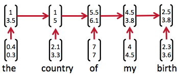

然而，有时候把句子看做是词的序列是不够的，比如下面这句话 【两个外语学院的学生】：

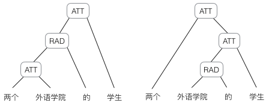

上图显示了这句话的两个不同的语法解析树。可以看出来这句话有歧义，不同的语法解析树则对应了不同的意思。一个是【两个外语学院的/学生】，也就是学生可能有许多，但他们来自于两所外语学院；另一个是【两个/外语学院的学生】，也就是只有两个学生，他们是外语学院的。为了能够让模型区分出两个不同的意思，我们的模型必须能够按照树结构去处理信息，而不是序列，这就是 **递归神经网络** 的作用。当面对按照 树/图 结构处理信息更有效的任务时，**递归神经网络** 通常都会获得不错的结果。

**递归神经网络** 可以把一个 树/图 结构信息编码为一个向量，也就是把信息映射到一个语义向量空间中。这个语义向量空间满足某类性质，比如语义相似的向量距离更近。也就是说，如果两句话（尽管内容不同）它的意思是相似的，那么把它们分别编码后的两个向量的距离也相近；反之，如果两句话的意思截然不同，那么编码后向量的距离则很远。如下图所示：

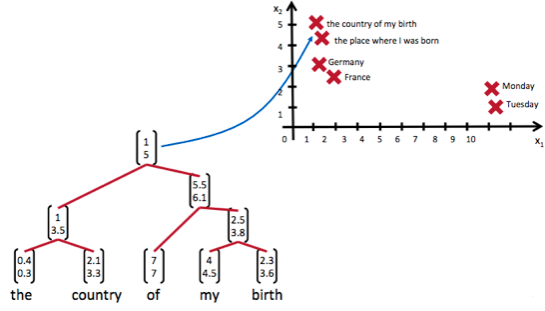

从上图我们可以看到，**递归神经网络** 将所有的词、句都映射到一个 2 维向量空间中。句子 【the country of my birth】和句子 【the place where I was born】的意思是非常接近的，所以表示它们的两个向量空间中的距离很近。另外两个词【Germany】 和 【France】因为表示的都是地点，它们的向量与上面两句话的向量的距离，就比另外两个表示时间的词 【Monday】和 【Tuesday】的向量的距离近的多。这样，通过向量的距离，就得到了一种语义上的表示。

上图还显示了自然语言**可组合**的性质：词可以组成句、句可以组成段落、段落可以组成篇章，而更高层的语义取决于底层的语义以及它们的组合方式。**递归神经网络** 是一种表示学习，它可以将词、句、段、篇按照他们的语义映射到同一个向量空间中，也就是把可组合（树/图结构）的信息表示为一个个有意义的向量。比如上面这个例子，**递归神经网络**把句子 “the country of my birth” 表示为二维向量 [1,5]。有了这个 【编码器】之后，我们就可以以这些有意义的向量为基础去完成更高级的任务（比如情感分析等）。如下图所示，**递归神经网络**在做情感分析时，可以比较好的处理否定句，这是胜过其他一些模型的：

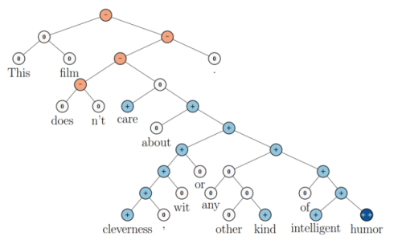

在上图中，蓝色表示正面评价，红色表示负面评价。每个节点是一个向量，这个向量表达了以它为根的子树的情感评价。比如 “intelligent humor” 是正面评价，而 “care about cleverness wit or any other kind of intelligent humor” 是中性评价。我们可以看到，模型能够正确地处理 doesn't 的含义，将正面评价转变为负面评价。

尽管 **递归神经网络** 具有更为强大的表示能力，但是在实际应用中并不太流形。其中一个主要的原因是，**递归神经网络** 的输入是 树/图结构，而这种结构需要花费很多人工去标注。想象一下，如果我们用 **循环神经网络** 处理句子，那么我们可以直接把句子作为输入。然而，如果我们用 **递归神经网络**处理句子，我们就必须把每个句子标注为语法解析树的形式，这无疑要花费非常大的精力。很多时候，相对于 **递归神经网络** 能够带来的性能提升，这个投入是不太划算的。

现在我们基本上了解了一些 **递归神经网络** 的套路，和它是用来做什么的，接下来，我们探讨它的算法细节。

### 2.3、递归神经网络的前向计算

接下来，我们详细介绍一下 **递归神经网络** 是如何处理 **树/图结构** 的信息的。在这里，我们以处理 **树型信息** 为例进行介绍。

递归神经网络的输入是两个子节点（也可以是多个），输出就是将这两个子节点编码后产生的父节点，父节点的维度和每个子节点是相同的。如下图所示：

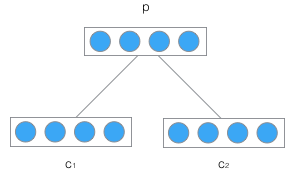

c1 和 c2 分别是表示两个子节点的向量，p 是表示父节点的向量。子节点和父节点组成一个全连接神经网络，也就是子节点的每个神经元和父节点的每个神经元两两相连。我们用矩阵 W 表示这些连接上的权重，它的维度将是 d x 2d ，其中， d 表示每个节点的维度。父节点的计算公式可以写成：

在上式中，tanh 是激活函数（当然也可以用其它的激活函数）， b 是偏置项，它也是一个维度为 d 的向量。如果读过前面的文章，相信大家已经非常熟悉这些计算了，在此不做过多的解释了。

然后，我们把产生的父节点的向量和其他子节点的向量再次作为网络的输入，再次产生它们的父节点。如此递归下去，直至整棵树处理完毕。最终，我们将得到根节点的向量，我们可以认为它是对整棵树的表示，这样我们就实现了把树映射为一个向量。在下图中，我们使用 **递归神经网络** 处理一棵树，最终得到的向量 P_3 ，就是对整棵树的表示：

举个例子，我们使用 **递归神经网络** 将 【两个外语学校的学生】映射为一个向量，如下图所示：

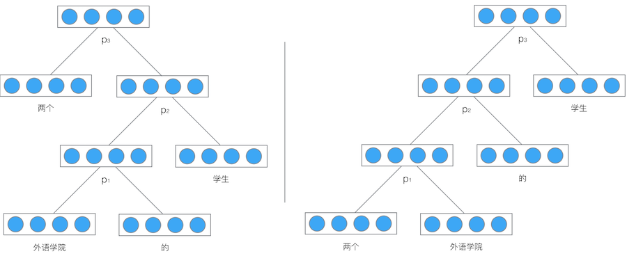

最后得到的向量 p_3 就是对整个句子 【两个外语学校的学生】的表示。由于整个结构是递归的，不仅仅是根节点，事实上每个节点都是以其为根的子树的表示。比如，在左边的这棵树中，向量 p_2 是短语【外语学院的学生】的表示，而向量 p_1 是短语【外语学院的】的表示。

**式1** 就是 **递归神经网络** 的前向计算算法。它和全连接神经网络的计算没有什么区别，只是在输入的过程中需要根据输入的树结构依次输入每个子节点。

需要特别注意的是，**递归神经网络** 的权重 **W** 和偏置项 **b** 在所有的节点都是共享的。

### 2.4、递归神经网络的训练

**递归神经网络** 的训练算法和 **循环神经网络** 类似，两者不同之处在于，前者需要将残差从根节点反向传播到各个子节点，而后者是将残差从当前时刻 t_k 反向传播到初始时刻 t_1 。

下面，我们介绍适用于 **递归神经网络** 的训练算法，也就是 **BPTS** 算法。

#### 2.4.1、误差项的传递

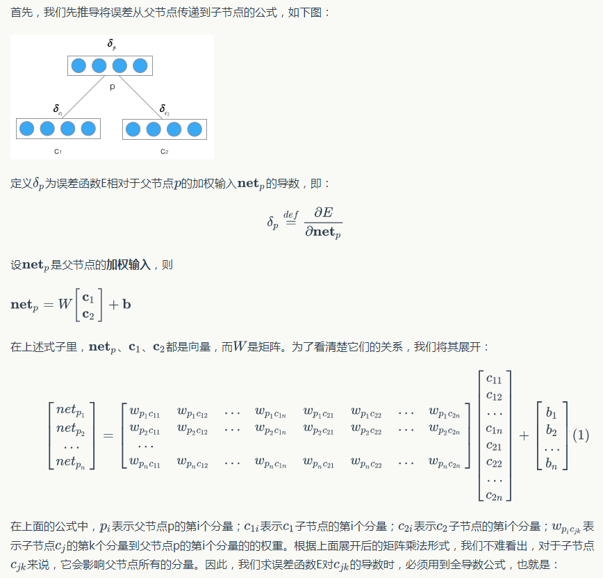

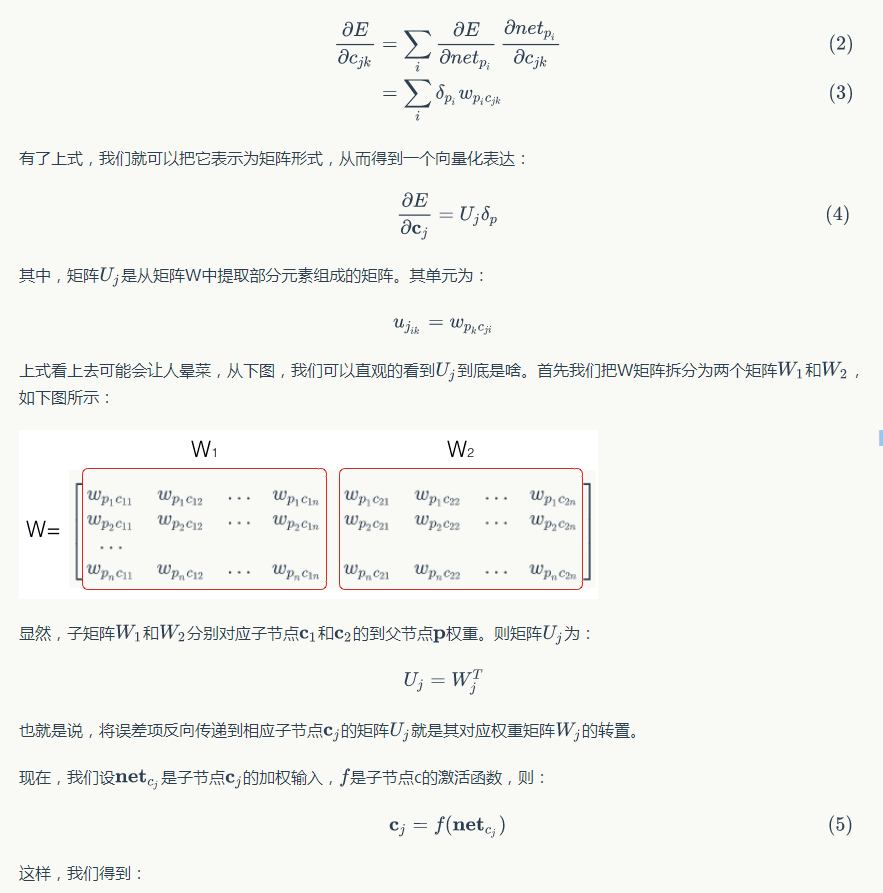

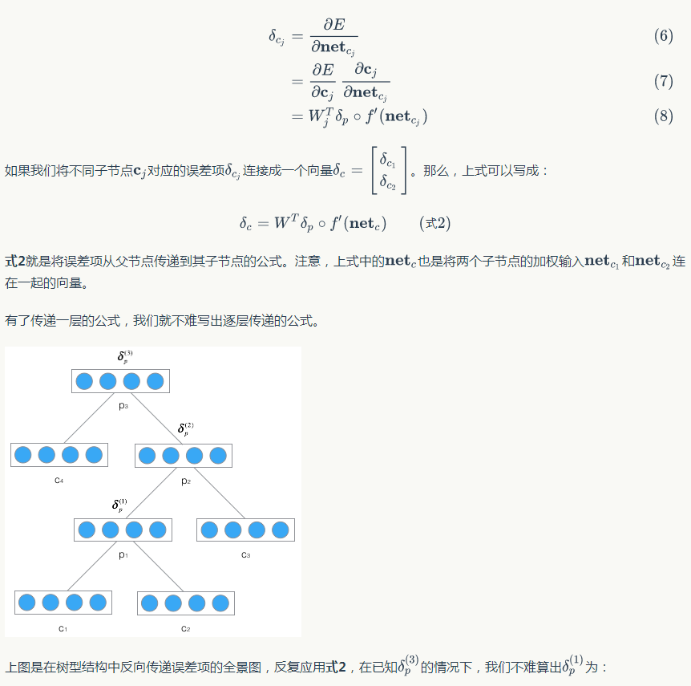

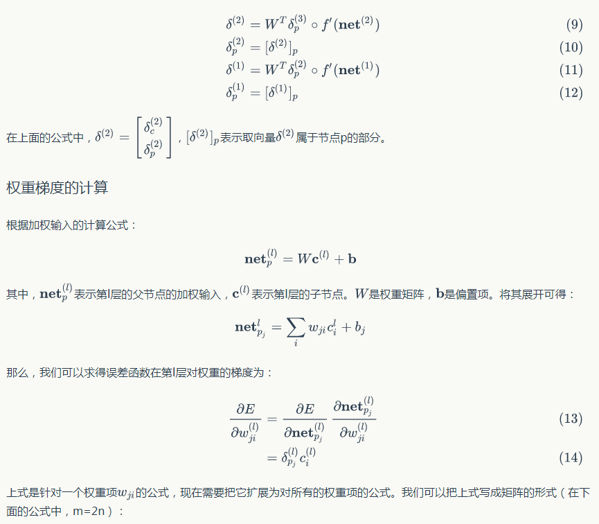

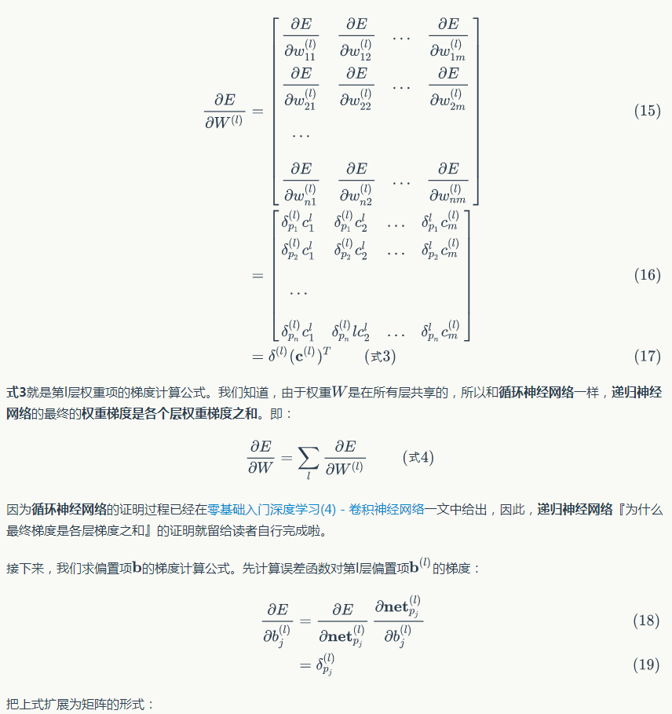

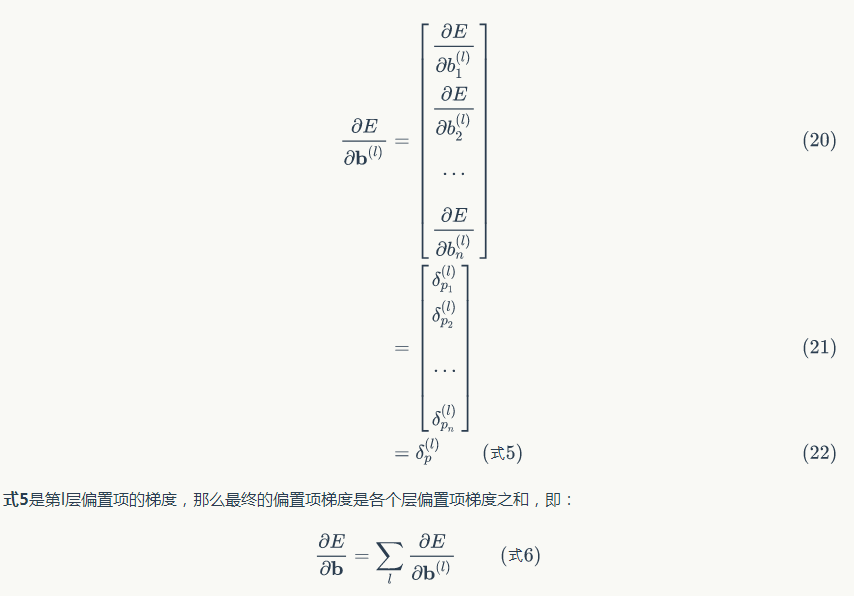

#### 2.4.2、权重更新

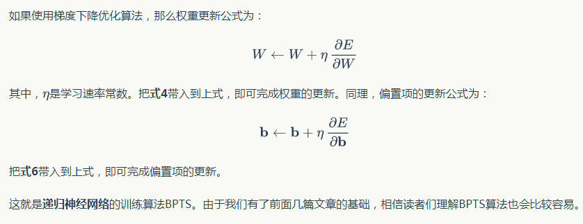

