# 十三、递归神经网络（Recursive Neural Network, RNN）（二）

## 1、概述

我们在上一章节中介绍了 **递归神经网络** 的一些基本知识和训练算法，接下来，我们这一章主要介绍 **递归神经网络** 的代码实现，以及后面我们会介绍一些递归神经网络的应用。

## 2、代码实现

 - 完整代码实现：https://github.com/chenyyx/deeplearning-notes/blob/master/src/7days/recursive.py

现在，我们实现一个处理树型结构的 **递归神经网络** 。

首先，我们在文件的开头，加入如下代码：

```python
#!/usr/bin/env python
# -*- coding: UTF-8 -*-

import numpy as np
from cnn import IdentityActivator
```

上述代码，我们引入必要的库，以及 IdentityActivator 这个激活函数是我们之前在讲解 **卷积神经网络** 时写的，现在引用一下它。

我们首先定义一个树节点结构，这样，我们就可以用它保存卷积神经网络生成的整棵树：

```python
class TreeNode(object):
    def __init__(self, data, children=[], children_data=[]):
        self.parent = None
        self.children = children
        self.children_data = children_data
        self.data = data
        for child in children:
            child.parent = self
```

接下来，我们把 **递归神经网络** 的实现代码都放在 RecursiveLayer 类中，下面是这个类的构造函数：

```python
# 递归神经网络实现
class RecursiveLayer(object):
    def __init__(self, node_width, child_count, 
                 activator, learning_rate):
        '''
        递归神经网络构造函数
        node_width: 表示每个节点的向量的维度
        child_count: 每个父节点有几个子节点
        activator: 激活函数对象
        learning_rate: 梯度下降算法学习率
        '''
        self.node_width = node_width
        self.child_count = child_count
        self.activator = activator
        self.learning_rate = learning_rate
        # 权重数组W
        self.W = np.random.uniform(-1e-4, 1e-4,
            (node_width, node_width * child_count))
        # 偏置项b
        self.b = np.zeros((node_width, 1))
        # 递归神经网络生成的树的根节点
        self.root = None
```

下面是前向计算的实现：

```python
    def forward(self, *children):
        '''
        前向计算
        '''
        children_data = self.concatenate(children)
        parent_data = self.activator.forward(np.dot(self.W, children_data) + self.b)
        self.root = TreeNode(parent_data, children, children_data)
```

forward 函数接收一系列的树节点对象作为输入，然后，递归神经网络将这些树节点作为子节点，并计算它们的父节点。最后，将计算的父节点保存在 self.root 变量中。

上面用到的 concatenate 函数，是将各个子节点中的数据拼接成一个长向量，其代码如下：

```python
    def concatenate(self, tree_nodes):
        '''
        将各个树节点中的数据拼接成一个长向量
        '''
        concat = np.zeros((0,1))
        for node in tree_nodes:
            concat = np.concatenate((concat, node.data))
        return concat
```

下面是反向传播算法 BPTS 的实现：

```python
    def backward(self, parent_delta):
        '''
        BPTS反向传播算法
        '''
        self.calc_delta(parent_delta, self.root)
        self.W_grad, self.b_grad = self.calc_gradient(self.root)
    def calc_delta(self, parent_delta, parent):
        '''
        计算每个节点的delta
        '''
        parent.delta = parent_delta
        if parent.children:
            # 根据式2计算每个子节点的delta
            children_delta = np.dot(self.W.T, parent_delta) * (
                self.activator.backward(parent.children_data)
            )
            # slices = [(子节点编号，子节点delta起始位置，子节点delta结束位置)]
            slices = [(i, i * self.node_width, 
                        (i + 1) * self.node_width)
                        for i in range(self.child_count)]
            # 针对每个子节点，递归调用calc_delta函数
            for s in slices:
                self.calc_delta(children_delta[s[1]:s[2]], 
                                parent.children[s[0]])
    def calc_gradient(self, parent):
        '''
        计算每个节点权重的梯度，并将它们求和，得到最终的梯度
        '''
        W_grad = np.zeros((self.node_width, 
                            self.node_width * self.child_count))
        b_grad = np.zeros((self.node_width, 1))
        if not parent.children:
            return W_grad, b_grad
        parent.W_grad = np.dot(parent.delta, parent.children_data.T)
        parent.b_grad = parent.delta
        W_grad += parent.W_grad
        b_grad += parent.b_grad
        for child in parent.children:
            W, b = self.calc_gradient(child)
            W_grad += W
            b_grad += b
        return W_grad, b_grad
```

在上述算法中，calc_delta 函数和 calc_gradient 函数分别计算各个节点的误差项以及最终的梯度。它们都采用递归算法，先序遍历整个树，并逐一完成每个节点的计算。

下面是梯度下降算法的实现（没有 weight decay），这个非常简单：

```python
    def update(self):
        '''
        使用SGD算法更新权重
        '''
        self.W -= self.learning_rate * self.W_grad
        self.b -= self.learning_rate * self.b_grad
```

以上就是递归神经网络的实现，总共 100 行左右，和上一篇文章的 LSTM 相比简单多了。

最后，我们用梯度检查来验证程序的正确性：

```python
def gradient_check():
    '''
    梯度检查
    '''
    # 设计一个误差函数，取所有节点输出项之和
    error_function = lambda o: o.sum()
    rnn = RecursiveLayer(2, 2, IdentityActivator(), 1e-3)
    # 计算forward值
    x, d = data_set()
    rnn.forward(x[0], x[1])
    rnn.forward(rnn.root, x[2])
    # 求取sensitivity map
    sensitivity_array = np.ones((rnn.node_width, 1),
                                dtype=np.float64)
    # 计算梯度
    rnn.backward(sensitivity_array)
    # 检查梯度
    epsilon = 10e-4
    for i in range(rnn.W.shape[0]):
        for j in range(rnn.W.shape[1]):
            rnn.W[i,j] += epsilon
            rnn.reset_state()
            rnn.forward(x[0], x[1])
            rnn.forward(rnn.root, x[2])
            err1 = error_function(rnn.root.data)
            rnn.W[i,j] -= 2*epsilon
            rnn.reset_state()
            rnn.forward(x[0], x[1])
            rnn.forward(rnn.root, x[2])
            err2 = error_function(rnn.root.data)
            expect_grad = (err1 - err2) / (2 * epsilon)
            rnn.W[i,j] += epsilon
            print 'weights(%d,%d): expected - actural %.4e - %.4e' % (
                i, j, expect_grad, rnn.W_grad[i,j])
    return rnn
```

下面是梯度检查的结果，完全正确， OH YEAH !

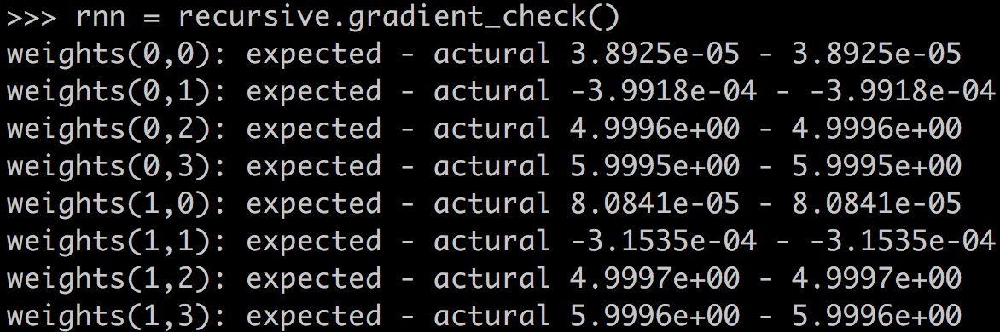


## 3、递归神经网络的应用

### 3.1、自然语言和自然场景解析

在自然语言处理任务中，如果我们能够实现一个解析器，将自然语言解析为语法树，那么毫无疑问，这将大大提升我们对自然语言的处理能力。解析器如下所示：

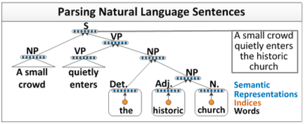

可以看出，**递归神经网络** 能够完成句子的语法分析，并产生一个语法解析树。

除了自然语言之外，自然场景也具有 **可组合** 的性质。因此，我们可以用类似的模型完成自然场景的解析，如下图所示：

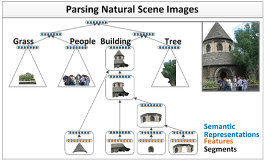

两种不同的场景，可以用相同的 **递归神经网络** 模型来实现。我们以第一个场景，自然语言解析为例。

我们希望将一句话逐字输入到神经网络中，然后，神经网络返回一个解析好的树。为了做到这一点，我们需要给神经网络再加上一层，负责打分。分数越高，说明两个子节点结合更加紧密，分数越低，说明两个子节点结合更松散。如下图所示：

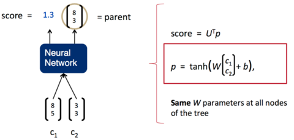

一旦这个打分函数训练好了（也就是矩阵 U 的各项值变为合适的值），我们就可以利用贪心算法来实现句子的解析。第一步，我们先将词按照顺序两两输入神经网络，得到第一组打分：

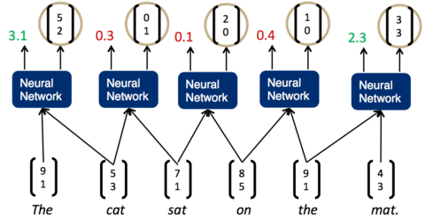

我们发现，现在分数最高的是第一组，The cat，说明它们的结合是最紧密的。这样，我们可以先将它们组合为一个节点。然后，再次两两计算相邻子节点的打分：

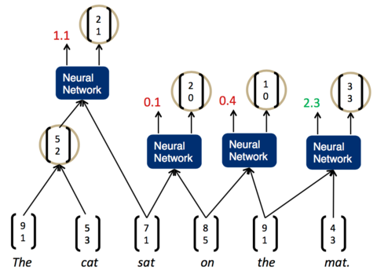

现在，分数最高的是最后一组， the mat 。于是，我们将它们组合为一个节点，再两两计算相邻节点的打分：

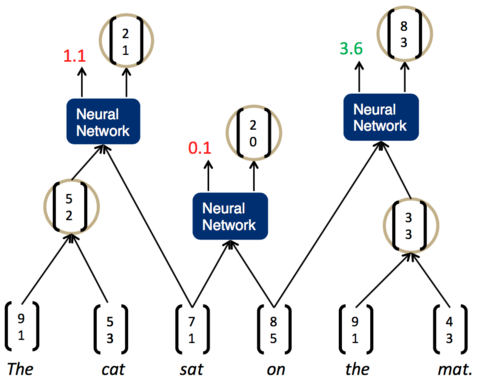

这时，我们发现最高的分数是 on the mat ，把它们组合为一个节点，继续两两计算相邻节点的打分....最终，我们就能够得到整个解析树：

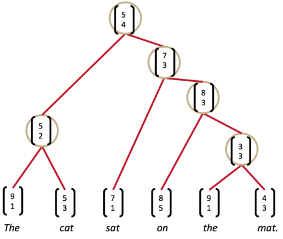

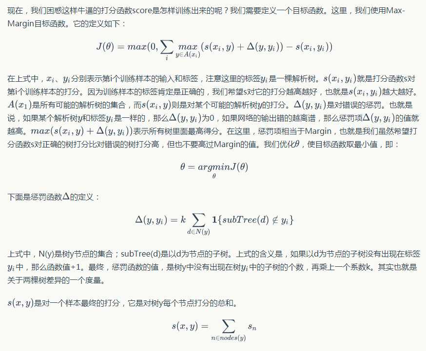

## 4、小结

我们在这一系列系列文章中已经介绍的 **全连接神经网络、卷积神经网络、循环神经网络** 和 **递归神经网络**，在训练时都使用了 **监督学习(Supervised Learning)** 作为训练方法。在 **监督学习** 中，每个训练样本既包括输入特征 **x**，也包括标记 **y**，即样本 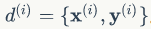 。然而，很多情况下，我们无法获得形如 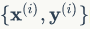 的样本，这时，我们就不能采用 **监督学习** 的方法。