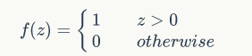
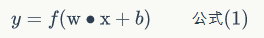
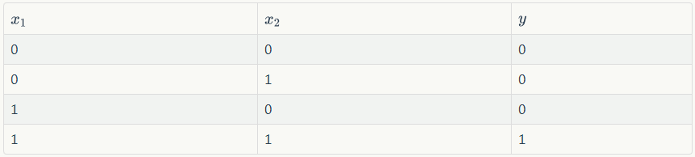
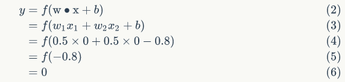
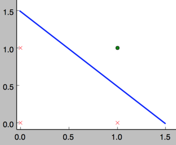
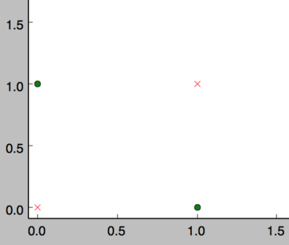
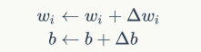
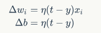

# 二、感知器

## 1、引入

我们从上一节就知道了，深度学习是含多隐层的多层感知器就是一种深度学习结构，这里的 “深度” 就是说神经网络中众多的层。

我们先看一下，人脑中真正的神经网络是怎样进行思考的呢？

人脑中的神经网络是这样运作的。

 - 外部刺激通过神经末梢，转化为电信号，传导到神经细胞（又叫做神经元）。
 - 无数神经元构成神经中枢。
 - 神经中枢综合各种信号，做出判断。
 - 人体根据神经中枢的指令，对外部刺激做出反应。

我们可以看到，既然思考的基础是神经元，如果能够“人造神经元”，那我们就能组成人工神经网络，模拟以上人类的思考。上世纪六十年代，有大佬提出了最早的“人造神经元”模型，叫做“感知器”，直到今天我们仍在使用它。

## 2、感知器

我们首先介绍一种被称为 “感知器” 的人工神经元。现代的神经网络工作中，主要使用的是一种叫做 S 型神经元的神经元模型。但是我们要理解为什么 S 型神经元被定义为那样的方式，值得花一些时间来理解感知器。

### 2.1、感知器的定义

一个感知器接受几个二进制输入，比如，x1， x2 ... ，并产生一个二进制输出，见下面这个图：


上面的图就是一个感知器，可以看到，一个感知器有如下组成部分：

 - 输入权值：一个感知器可以接收多个输入 (x1,x2,...,xn | xi \in R)，每个输入上有一个权值 wi \in R，此外还有一个偏置项 b \in R，就是上图中的 w0。

 - 激活函数：感知器的激活函数可以有很多选择，比如我们可以选择下面这个阶跃函数 f 来作为激活函数：



 - 输出：感知器的输出由下面的这个公式来计算：



如果看完上面的公式一下就晕了，不要紧，我们用一个简单的例子来帮助理解一下。

### 2.2、感知器的例子

【例1】用感知器实现 and 函数

我们设计一个感知器，让它来实现 and 运算。程序员应该都知道， and 是一个二元函数（带有两个参数 x1 和 x2），下面是它的真值表：



为了计算方便，我们用 0 表示 false ，用 1 表示 true 。这其实没啥难理解的，对于 C 语言程序员来说，这是天经地义的。

我们首先让 w1 = 0.5; w2 = 0.5;b = -0.8 ，而激活函数 f 就是前面写出来的阶跃函数，这时，感知器就相当于 and 函数。不明白？那我们来验证一下：

输入上面真值表的第一行，即 x1 = 0; x2 = 0 ，那么根据公式（1），计算输出：



也就是当 x1 和 x2 都为 0 的时候， y 为 0 ，这就是真值表的第一行。读者可以自行验证上述真值表的2,3,4 行。

同样的，我们也可以用感知器来实现 or 运算。仅仅需要把偏置项 b 的值设置为 -0.3 就可以了。大家也可以验证一下，我们这里就不进行验证了。

我们再看一个更加贴近我们生活的例子。

【例2】假设周末，咱们 ApacheCN 要组织一起去爬山，到了山顶，一起论剑。你很喜欢运动和健身，也很想出去走走，接触更多的人，正在决定是否要去参加。但是你考虑到了 3 个方面的因素，给 3 个因素设置权重来做出决定：

 - 1、天气好不好？
 - 2、你男/女朋友会不会陪你去？
 - 3、爬山的地点是否靠近交通站点（前提是你没有车）？

你可以将这三个因素对应地用二进制变量 x1,x2,x3 来表示。例如，如果天气好，我们把 x1 = 1 ，如果不好，x1 = 0 。类似的，如果你的女朋友或者男朋友同去， x2 = 1 否则 x2 = 0 。x3 也类似地表示交通情况。

现在，假设你是个登山爱好者，以至于即使你的男朋友或者女朋友不感兴趣，也不管路有多难走你都乐意去。但是也许你确实厌恶糟糕的天气，而且如果天气太糟你也没办法出门。你也可以使用感知器来给这种决策建立数学模型。一种方式是给天气权重选择为 w1 = 6 ，其他条件为 w2 = 2 和 w3 = 2 。 w1 被赋予更大的值，表示天气对你来说很重要，比你的男朋友或女朋友陪你，或者最近的交通站点都要重要的多。最后，假设你将感知器的偏置项 b 设置为 5 。 这样，感知器实现了期望的决策模型，只要天气好就输出 1 ，天气不好则为 0 。对于你的男朋友或女朋友是否想去，或者附近是否有公共交通站点，其输出都没有差别。

我们其实可以看到，随着权重和偏置项 b 的变化，你可以得到不同的决策模型。例如，假设我们把阈值改为 3 。那么感知器会按照天气好坏，或者结合交通情况和你的男朋友或女朋友同行的意愿，来得出结果。换句话说，它变成了另一个不同的决策模型。降低 偏置项 b 表示你更加想去。

### 2.3、感知器还能做什么

事实上，感知器不仅仅能实现简单的布尔运算。它可以拟合任何的线性函数，任何线性分类或线性回归问题都是可以用感知器来解决的。前面我们介绍的布尔运算可以看作是二分类问题，即给定一个输入，输出 0（属于分类0）或 1（属于分类1）。如下面所示， and 运算是一个线性分类问题，即可以用一条直线把分类 0（false，红叉表示）和分类 1（true，绿点表示）分开。



然而，感知器却不能实现异或运算，如下图所示，异或运算不是线性的，你无法用一条直线把分类0和分类1分开。



### 2.4、感知器的训练

现在呢，你可能困惑前面的权重项和偏置项的值是如何获得的呢？这就要用到感知器训练算法：将权重项和偏置项初始化为 0 ，然后利用下面的感知器规则迭代地修改 wi 和 b，直到训练完成。



其中



wi 是与输入 xi 对应的权重项，b 是偏置项。事实上，可以把 b 看作是值永远为1的输入 xb 所对应的权重。t 是训练样本的实际值，一般称之为 label 。而 y 是感知器的输出值，它是根据 公式(1) 计算得出。η 是一个称为学习速率的常数，其作用是控制每一步调整权的幅度。

每次从训练数据中取出一个样本的输入向量 x ，使用感知器计算其输出 y，再根据上面的规则来调整权重。每处理一个样本就调整一次权重。经过多轮迭代后（即全部的训练数据被反复处理多轮），就可以训练出感知器的权重，使之实现目标函数。

### 2.5、代码实现：感知器

对于我们来说，没有什么比自己动手实现学得更快了。而且，很多时候一行代码抵得上千言万语。接下来我们就实现一个感知器。

```python
class Perceptron(object):
    def __init__(self, input_num, activator):
        '''
        初始化感知器，设置输入参数的个数，以及激活函数。
        激活函数的类型为double -> double
        '''
        self.activator = activator
        # 权重向量初始化为0
        self.weights = [0.0 for _ in range(input_num)]
        # 偏置项初始化为0
        self.bias = 0.0


    def __str__(self):
        '''
        打印学习到的权重、偏置项
        '''
        return 'weights\t:%s\nbias\t:%f\n' % (self.weights, self.bias)


    def predict(self, input_vec):
        '''
        输入向量，输出感知器的计算结果
        '''
        # 把input_vec[x1,x2,x3...]和weights[w1,w2,w3,...]打包在一起
        # 变成[(x1,w1),(x2,w2),(x3,w3),...]
        # 然后利用map函数计算[x1*w1, x2*w2, x3*w3]
        # 最后利用reduce求和
        return self.activator(
            reduce(lambda a, b: a + b,
                   map(lambda (x, w): x * w,  
                       zip(input_vec, self.weights))
                , 0.0) + self.bias)


    def train(self, input_vecs, labels, iteration, rate):
        '''
        输入训练数据：一组向量、与每个向量对应的label；以及训练轮数、学习率
        '''
        for i in range(iteration):
            self._one_iteration(input_vecs, labels, rate)


    def _one_iteration(self, input_vecs, labels, rate):
        '''
        一次迭代，把所有的训练数据过一遍
        '''
        # 把输入和输出打包在一起，成为样本的列表[(input_vec, label), ...]
        # 而每个训练样本是(input_vec, label)
        samples = zip(input_vecs, labels)
        # 对每个样本，按照感知器规则更新权重
        for (input_vec, label) in samples:
            # 计算感知器在当前权重下的输出
            output = self.predict(input_vec)
            # 更新权重
            self._update_weights(input_vec, output, label, rate)


    def _update_weights(self, input_vec, output, label, rate):
        '''
        按照感知器规则更新权重
        '''
        # 把input_vec[x1,x2,x3,...]和weights[w1,w2,w3,...]打包在一起
        # 变成[(x1,w1),(x2,w2),(x3,w3),...]
        # 然后利用感知器规则更新权重
        delta = label - output
        self.weights = map(
            lambda (x, w): w + rate * delta * x,
            zip(input_vec, self.weights))
        # 更新bias
        self.bias += rate * delta
```

接下来，我们利用上面编写的这个感知器类来实现 and 函数。

```python
def f(x):
    '''
    定义激活函数f
    '''
    return 1 if x > 0 else 0

def get_training_dataset():
    '''
    基于and真值表构建训练数据
    '''
    # 构建训练数据
    # 输入向量列表
    input_vecs = [[1,1], [0,0], [1,0], [0,1]]
    # 期望的输出列表，注意要与输入一一对应
    # [1,1] -> 1, [0,0] -> 0, [1,0] -> 0, [0,1] -> 0
    labels = [1, 0, 0, 0]
    return input_vecs, labels


def train_and_perceptron():
    '''
    使用and真值表训练感知器
    '''
    # 创建感知器，输入参数个数为2（因为and是二元函数），激活函数为f
    p = Perceptron(2, f)
    # 训练，迭代10轮, 学习速率为0.1
    input_vecs, labels = get_training_dataset()
    p.train(input_vecs, labels, 10, 0.1)
    #返回训练好的感知器
    return p
```

将我们上述程序保存为 perceptron.py 文件，通过命令执行这个程序，其运行结果为：


是不是有些神奇呢？感知器竟然完全实现了 and 函数。

代码中，我还用我们编写的感知器实现了 or 函数，有兴趣的可以自己实现试试。

完整代码：

## 3、小结

我们这一节讲解了感知器的一些知识，并动手实现了一下。是不是很兴奋？对于零基础的你来说，走到这里应该已经很烧脑了吧。没关系，休息一下。值得高兴的是，你终于已经走出了深度学习入门的第一步，这是巨大的进步；坏消息是，这仅仅是最简单的部分，后面还有无数艰难险阻等着你。不过，你学的困难往往意味着别人学的也困难，掌握一门高门槛的技艺，进可糊口退可装逼，是很值得的。

下一节，我们将讨论另外一种感知器：线性单元，并由此引出一种可能是最最重要的优化算法：梯度下降算法。

