# 三、神经网络的编程基础

## 1、概述

上一篇文章中，我们已经学会了编写一个简单的感知器，并用它来实现一个线性分类器。你应该还记得用来训练感知器的 【感知器规则】。然而，我们并没有关心这个规则是怎么得到的。这一节我们将介绍另外一种【感知器】，也就是【线性单元】，来说明关于机器学习的一些基本概念，比如模型、目标函数、优化算法等。这些概念对于所有的机器学习算法来说都是通用的，掌握了这些概念，就掌握了机器学习的基本套路。

## 2、线性单元

### 2.1、线性单元定义

我们了解到的感知器有一个问题，当面对的数据集不是线性可分的时候，【感知器规则】可能无法收敛，这就意味着我们永远无法完成一个感知器的训练。为了解决这个问题，我们使用一个可导的线性函数来替代感知器的阶跃函数，这种感知器就叫做【线性单元】。线性单元在面对线性不可分的数据集时，会收敛到一个最佳的近似上。

为了简单起见，我们设置线性单元的激活函数 f 为：

f(x) = x

这样的线性单元如下图所示：

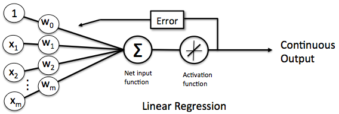

对比此前我们讲过的感知器：

这样替换了激活函数 f 之后，线性单元将返回一个实数值而不是 0,1 分类。因此线性单元用来解决回归问题而不是分类问题。

### 2.2、线性单元模型

当我们在说模型时，我们实际上在谈论根据输入 x 预测输出 y 的算法。比如，x 可以是一个人的工作年限，y 可以是他的月薪，我们可以用某种算法来根据一个人的工作年限来预测他的收入。比如：

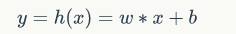

函数 h(x) 叫做假设，而 w, b 是它的参数。我们假设参数 w = 1000，参数 b = 500，如果一个人的工作年限是 5 年的话，我们的模型会预测他的月薪为：

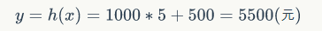

你也许会说，这个模型有些不靠谱啊。是这样的，因为我们考虑的因素太少了，仅仅包含了工作年限。如果考虑更多的因素，比如所处的行业，公司，职级等等，可能预测就会靠谱的多。我们把工作年限，行业，公司，职级这些因素，称之为特征（features）。对于一个工作了 5 年，在 IT 行业，百度公司，职级 T6 这样的人，我们可以用这样的一个特征向量来表示他

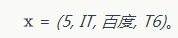

既然输入 x 变成了一个具备四个特征的向量，相对应的，仅仅一个参数 w 就不够用了，我们应该使用4个参数 w1,w2, w3, w4，每个特征对应一个。这样，我们的模型就变成了

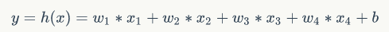

其中，x1 对应工作年限，x2 对应行业， x3 对应公司， x4 对应职级。

为了书写和计算方便，我们可以令 w0 等于 b，同时令 w0 对应于特征 x0 。由于 x0 其实并不存在，我们可以令它的值永远为 1 。也就是说

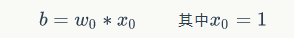

这样上面的式子就可以写成

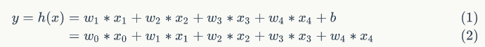

我们可以把上式写成向量的形式

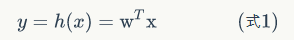

长成这种样子的模型就叫做线性模型，因为输出 y 就是输入特征 x1,x2,x3,... 的线性组合。

### 2.3、线性单元的目标函数

在监督学习下，对于一个样本，我们知道它的特征 x，以及标记 y。同时，我们还可以根据模型 h(x) 计算得到输出 yp。注意这里面我们用 y 表示训练样本里面的标记，也就是实际值；用 yp 的表示模型计算的出来的预测值。我们当然希望模型计算出来的 yp 和 y 越接近越好。

数学上有很多方法来表示的 yp 和 y 的接近程度，比如我们可以用 yp 和 y 的差的平方的 1/2 来表示它们的接近程度。

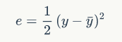

我们把 e 叫做单个样本的误差。至于为什么前面要乘 1/2 ，是为了后面计算方便。

训练数据中会有很多样本，比如 N 个，我们可以用训练数据中所有样本的误差的和，来表示模型的误差 E，也就是

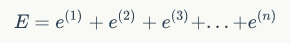

上式中的 e(1) 表示第一个样本的误差， e(2) 表示第二个样本的误差....

我们还可以把上面的式子写成和式的形式。使用和式，不光书写起来简单，逼格也跟着暴涨，一举两得。所以一定要写成下面这样：

上述中的 式(2) 中，x(i) 表示第 i 个训练样本的特征， y(i) 表示第 i 个样本的标记，我们也可以用元组 (x(i), y(i)) 表示第 i 个训练样本。 yp(i) 则是模型对第 i 个样本的预测值。

我们当然希望对于一个训练数据集来说，误差越小越好，也就是 式(2) 的值越小越好。对于特定的训练数据集来说， (x(i), y(i)) 的值都是已知的，所以 式(2) 其实是参数 w 的函数。

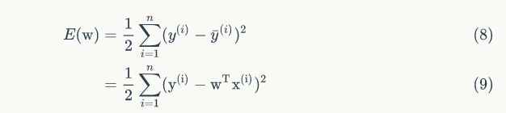

由此可见，模型的训练，实际上就是求取到合适的 w ，使得 式(2) 取得最小值。这在数学上称作 优化问题，而 E(w) 就是我们优化的目标，称之为目标函数。

## 3、导数

这一小节主要是帮你获得对微积分和导数直观的理解。或许你认为自从大学毕业之后，就再没有接触微积分。但是这取决于你什么时候毕业，可能时间并不太长，如果你对这一点有一些顾虑，请不要担心。高效应用神经网络和深度学习，你并不需要非常深入理解微积分。你只需要直观地认识微积分，用来构建和成功地应用这些算法就好了。如果，你是精通微积分的那一小部分人群，你对微积分非常熟悉，那就可以跳过这一小节了。

比如下面这个图：

一个函数 f(a) = 3a ，它是一条直线。下面我们来简单理解下导数。让我们看一下函数中的几个点，假定 a = 2，那么 f(a) 是 a 的 3 倍等于 6 ，也就是说如果 a = 2，那么函数 f(a) = 6 。假定稍微改变一点点 a 的值，只增加一点，变为 2.001 ，这时 a 将向右做微小的移动。0.001 的差别实在是太小了，不能在图中显示出来，我们把它向右移动一点，现在 f(a) 等于 a 的 3 倍是 6.003 ，画在图里，比例不太符合。

请看绿色高亮部分的这个小三角形，如果向右移动 0.001，那么 f(a) 增加 0.003，f(a) 的值增加 3 倍于右移的 a，因此我们说函数 f(a) 在 a = 2，是这个导数的斜率，或者说，当 a = 2 时，斜率是3。导数这个概念意味着斜率，导数听起来是一个很可怕、很令人惊恐的词，但是斜率以一种很友好的方式来描述导数这个概念。所以提到导数，我们把它当作函数的斜率就好了。更正式的斜率定义为在上图这个绿色的小三角形中，高除以宽。即斜率等于 0.003 除以 0.001 ，等于 3。或者说导数等于 3，这表示当你将右移 0.001，f(a) 的值增加 3 倍水平方向的量。

那么现在让我们从不同的角度理解这个函数。假设 a = 5，此时 f(a) = 3a = 15 。把 a 右移一个很小的幅度，增加到 5.001 ，f(a) = 15.003 。即在 a = 5 时，斜率是 3，这就是表示，当微小改变变量 a 的值，df(a)/da = 3 。一个等价的导数表达式可以这样写 d/da f(a) ，不管你是否将 f(a) 放在上面或者放在右边都没有关系。在这个视频中，我讲解导数讨论的情况是我们将 a 便宜 0.001 ，如果你想知道导数的数学定义，导数是你右移很小的 a 值（不是 0.001 ，而是一个非常非常小的值）。通常导数的定义是你右移 a （可度量的值）一个无限小的值， f(a) 增加 3 倍（增加了一个非常非常小的值）。也就是这个三角形右边的高度。

那就是导数的正式定义。但是为了直观的认识，我们将探讨右移 a = 0.001 这个值，即使 0.001 并不是无穷小的可测数据。导数的一个特性是：这个函数任何地方的斜率总是等于 3，不管 a = 2 或 a = 5，这个函数的斜率总等于 3 ，也就是说不管 a 的值如何变化，如果你增加了 0.001 ，那么 f(a) 的值就增加 3 倍。这个函数在所有地方的斜率都相等。一种证明方式是无论你将小三角形画在哪里，它的高除以宽总是 3 。

说了这么多，你只需要记住这两点：

 - 导数就是斜率，而函数的斜率，在不同的点是不同的。在第一个例子中 f(a) = 3a ，这是一条直线，在任何点它的斜率都是相同的，均为 3。但是对于函数 f(a) = a^2 ，或者 f(a) = loga，它们的斜率是变化的，所以它们的导数或者斜率，在曲线上不同的点处是不同的。

 - 如果你想知道一个函数的导数，你可以参考你的微积分课本或者维基百科，然后你就能找到这些函数的导数公式。

## 4、梯度下降优化算法（Gradient Descent）

### 4.1、梯度下降算法简介

大学时我们学过怎样求函数的极值。函数 y = f(x) 的极值点，就是它的导数 f'(x) = 0 的那个点。因此我们可以通过解方程 f'(x) = 0，求得函数的极值点 (x0, y0) 。

不过对于计算机来说，它可不会解方程。但是它可以凭借强大的计算能力，一步一步地去把函数的极值点【试】出来。如下图所示：

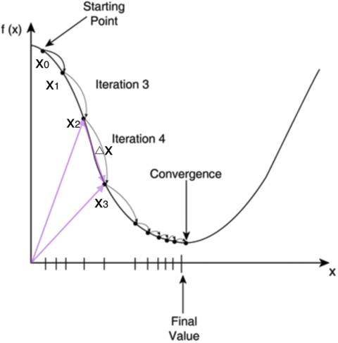

首先，我们随便选择一个点开始，比如上图的 x0 点。接下来，每次迭代修改 x 的为 x1,x2,x3,....，经过数次迭代后最终达到函数的最小值点。

你可能要问了，为啥每次修改 x 的值，都能往函数最小值那个方向前进呢？这里的奥秘在于，我们每次都是向函数 y = f(x) 的梯度的相反方向来修改 x 。什么是梯度呢？翻开大学高数课的课本，我们会发现梯度是一个向量，它指向函数值上升最快的方向。显然，梯度的反方向当然就是函数值下降最快的方向了。我们每次沿着梯度相反方向去修改的值，当然就能走到函数的最小值附近。之所以是最小值附近而不是最小值那个点，是因为我们每次移动的步长不会那么恰到好处，有可能最后一次迭代走远了越过了最小值那个点。步长的选择是门手艺，如果选择小了，那么就会迭代很多轮才能走到最小值附近；如果选择大了，那可能就会越过最小值很远，收敛不到一个好的点上。

按照上面的讨论，我们就可以写出梯度下降算法的公式

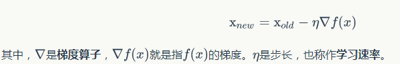

对于上一节列出的目标函数（式2）

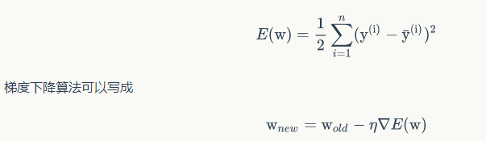

聪明的你应该能想到，如果要求目标的最大值，我们就应该用梯度上升算法，它的参数修改规则是

接下来，我们看一下关于 ▽E(w) 的推导过程，单独把它放到一节中。您既可以选择慢慢看，也可以选择无视。您只需要知道经过一大串推导，目标函数 E(w) 的梯度是

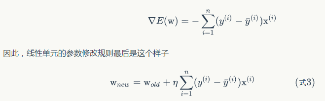

有了上面这个式子，我们就可以根据它来写出训练线性单元的代码了。

需要说明一下的是，如果每个样本有 M 个特征，则上式中的 x，w 都是 M+1 维向量（因为我们加上了一个恒为 1 的虚拟特征 x0），而 y 是标量。用高逼格的数学符号表示，就是

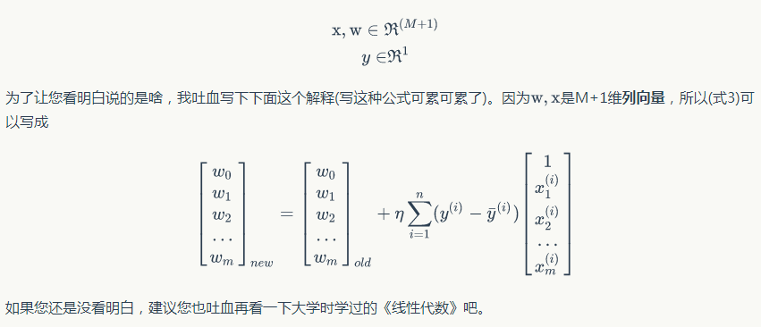

### 4.2、▽E(w) 推导

这一节，如果你的数学知识并不是很雄厚，可以跳过去，只需要知道最后推导出来的结果就好了。

首先，我们先做一个简单的前戏。我们知道函数的梯度的定义就是它相对于各个变量的偏导数，所以我们写下下面的式子

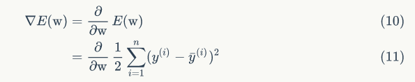

但是接下来怎么办呢？我们知道和的导数等于导数的和，所以我们可以先把 和式 符号 里边的导数求出来，然后再把它们加在一起就行了，也就是

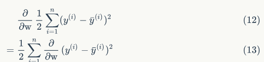

现在我们可以不管高大上的 和式 了，先专心把里边的导数求出来。

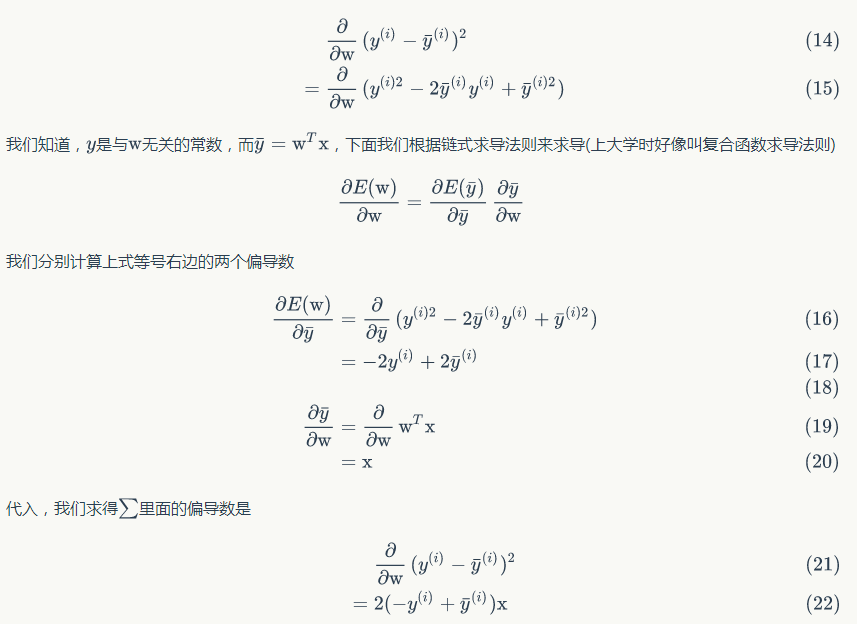

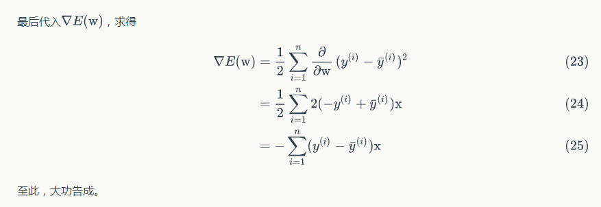

### 4.3、随机梯度下降（Stochastic Gradient Descent, SGD）

