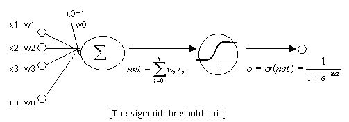

# 四、神经网络

## 1、概述

上一节中，我们已经掌握了机器学习的基本套路，对模型、目标函数、优化算法这些概念有了一定程度的理解，而且已经会训练单个的感知器或者线性单元了。在这篇文章中，我们将把这些单独的单元按照一定的规则相互连接在一起形成神经网络，从而奇迹般的获得强大的学习能力。我们还将介绍这种网络的训练算法：反向传播算法。最后，我们依然会用代码来实现一个神经网络。

## 2、神经元

神经元和感知器本质上是一样的，只不过我们说感知器的时候，它的激活函数是阶跃函数；而当我们说神经元的时候，激活函数往往选择为 sigmoid 函数或者 tanh 函数。这里也就解释了我们上一节埋下的一个坑，S 型神经元，就是使用 Sigmoid 函数作为激活函数的神经元。如下图所示：

计算一个神经元的输出的方法和计算一个感知器的输出是一样的。假设神经元的输入是向量 x ，权重向量是 w （偏置项是 w0），激活函数是 sigmoid 函数，则其输出 y ：

sigmoid 函数是一个非线性函数，值域为 (0,1) 。函数图像如下图所示：

sigmoid 函数的导数是：

