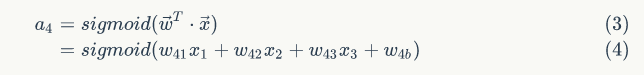

# 四、神经网络

## 1、概述

上一节中，我们已经掌握了机器学习的基本套路，对模型、目标函数、优化算法这些概念有了一定程度的理解，而且已经会训练单个的感知器或者线性单元了。在这篇文章中，我们将把这些单独的单元按照一定的规则相互连接在一起形成神经网络，从而奇迹般的获得强大的学习能力。我们还将介绍这种网络的训练算法：反向传播算法。最后，我们依然会用代码来实现一个神经网络。


## 2、神经元

神经元和感知器本质上是一样的，只不过我们说感知器的时候，它的激活函数是阶跃函数；而当我们说神经元的时候，激活函数往往选择为 sigmoid 函数或者 tanh 函数。这里也就解释了我们上一节埋下的一个坑，S 型神经元，就是使用 Sigmoid 函数作为激活函数的神经元。如下图所示：


计算一个神经元的输出的方法和计算一个感知器的输出是一样的。假设神经元的输入是向量 x ，权重向量是 w （偏置项是 w0），激活函数是 sigmoid 函数，则其输出 y ：


sigmoid 函数是一个非线性函数，值域为 (0,1) 。函数图像如下图所示：


sigmoid 函数的导数是：


## 3、神经网络

### 3.1、神经网络简介


神经网络其实就是按照一定规则连接起来的 **多个神经元**。上图展示了一个全连接(full connected, FC)神经网络，通过观察上面的图，我们可以发现它的规则包括：

 - 神经元按照 **层** 来布局。最左边的层叫做 **输入层**，其中的神经元被称为 **输入神经元** ，负责接收输入数据，；最右边的层叫 **输出层**，其中的神经元被称为 **输出神经元** ，我们可以从这层获取神经网络的输出数据。输入层和输出层之间的层叫做 **隐藏层**，因为它们对于外部来说是不可见的，即它们既非输入层也非输出层。

 - 同一层的神经元之间没有连接。

 - 第 N 层的每个神经元和第 N-1 层的所有神经元相连（这就是 full connected 的含义），第 N-1 层神经元的输出就是第 N 层神经元的输入。

 - 每个连接都有一个**权值**。

 上面的这些规则定义了全连接神经网络的结构。事实上，还存在很多其他结构的神经网络，比如卷积神经网络（CNN），循环神经网络（RNN），他们都具有不同的连接规则。

### 3.2、计算神经网络的输出

神经网络实际上就是一个输入向量 x 到输出向量 y 的函数，即：


根据输入计算神经网络的输出，需要首先将输入向量 x 的每个元素 x_i 的值赋给神经网络的输入层的对应神经元，然后根据 **式1** 依次向前计算每一层的每个神经元的值，直到最后一层输出层的所有神经元的值计算完毕。最后，将输出层每个神经元的值串在一起就得到了输出向量 y 。

接下来，我们举一个例子来说明这个过程，我们先给神经网络的每个神经元写上编号。


如上图所示，输入层有三个节点，我们将其依次编号为 1，2,3；隐藏层的 4 个节点，编号依次为 4,5,6,7；最后输出层的两个节点编号为 8,9。因为我们这个神经网络是全连接网络，所以可以看到每个节点都和 **上一层的所有节点** 有连接。比如，我们可以看到隐藏层的节点 4 ，它和输入层的三个节点1,2,3，之间都有连接，其连接上的权重分别为 w_41, w_42, w_43 。那么，我们怎样计算节点 4 的输出值 a_4 呢？

为了计算节点 4 的输出值，我们必须先得到其所有上游节点（也就是节点 1,2,3）的输出值。节点 1,2，3是 **输入层** 的节点，所以，他们的输出值就是输入向量 x 本身。按照上图画出的对应关系，可以看到节点 1,2,3 的输出值分别是 x_1, x_2, x_3 。我们要求 **输入向量的维度和输入层神经元个数相同**，而输入向量的某个元素对应到哪个输入节点是可以自由决定的，你偏非要把 x_1 赋值给节点 2  也是完全没有问题的，但这样除了把自己弄晕之外，并没有什么其他的价值。

一旦我们有了节点 1,2,3 的输出值，我们就可以根据 **式1** 计算节点4 的输出值 a_4 ：



上式的 w_4b 是节点 4 的 **偏置项** ，图中没有画出来。而 w_41, w_42, w_43 分别为节点 1,2，3 到节点 4 连接的权重，在给权重 w_ji 编号时，我们把目标节点的编号 j 放在前面，把源节点的编号 i 放在后面。

同样，我们可以继续计算出节点 5,6,7 的输出值 a_5, a_6, a_7 。这样，隐藏层的 4 个节点的输出值就计算完成了，我们就可以接着计算输出层的节点 8 的输出值 y_1 ：


同理，我们还可以计算出 y_2 的值。这样输出层所有节点的输出值计算完毕，我们就得到了在输入向量  时，神经网络的输出向量  。这里我们也看到，**输出向量的维度和输出层神经元个数相同**。

### 3.3、神经网络的矩阵表示

神经网络的计算如果用矩阵来表示会很方便（当然了，逼格也会很高），我们先来看看隐藏层的矩阵表示。

首先我们把隐藏层 4 个节点的计算依次排列出来：


接着，定义网络的输入向量 x 和隐藏层每个节点的权重向量 w_j 。令


代入到前面的一组式子，得到：


现在，我们把上述计算 a_4, a_5, a_6, a_7 的四个式子写到一个矩阵里面，每个式子作为矩阵的一行，就可以利用矩阵来表示它们的计算了。令


代入前面的一组式子，得到


在 **式2** 中，f  是激活函数，在本例中是 sigmoid 函数； W 是某一层的权重矩阵； x 是某层的输入向量； a 是某层的输出向量。 **式2** 说明神经网络的每一层的作用实际上就是先将输入向量 **左乘** 一个数组进行线性变换，得到一个新的向量，然后再对这个向量 **逐元素** 应用一个激活函数。

每一层的算法都是一样的。比如，对于包含一个输入层，一个输出层和三个隐藏层的神经网络，我们假设其权重矩阵分别为 W_1, W_2, W_3, W_4 ，每个隐藏层的输出分别是 a_1, a_2, a_3 ，神经网络的输入为 x ，神经网络的输入为 y ，如下图所示：


则每一层的输出向量的计算可以表示为：


这就是神经网络输出值的计算方法。


### 3.4、神经网络训练

目前为止，我们讨论的神经网络，都是以上一层的输出作为下一层的输入。这种网络被称为 **前馈神经网络** 。这意味着网络中是没有回路的 —— 信息总是向前传播，从不反向回馈。

现在，我们需要知道一个神经网络的每个连接上的权值是如何得到的。我们可以说神经网络是一个 **模型**，那么这些权值就是模型的 **参数**，也就是模型要学习的东西。然而，一个神经网络的连接方式、网络层数、每层的节点数这些参数，则不是学习出来的，而是人为事先设置的。对于这些人为设置的参数，我们称之为 **超参数（Hyper-Parameters）**。

接下来，我们将要介绍神经网络的训练算法：反向传播算法。

#### 3.4.1、反向传播算法（Back Propagation）

我们首先直观的介绍反向传播算法，最后再来介绍这个算法的推导。当然，大家如果看不太懂推导的部分，可以直接跳过，因为即使不知道如何推导，也不影响你写出来一个神经网络的训练代码。事实上，现在神经网络成熟的开源实现多如牛毛，除了练手之外，你可能都没有机会需要去写一个神经网络。

我们首先说一下前提，我们这里以监督学习为例来解释反向传播算法。另外，我们设神经网络的激活函数 f 为 sigmoid 函数（但是不同的激活函数的计算公式是不同的）。

我们假设每个训练样本为 (x, t) ，其中向量 x 是训练样本的特征，而 t 是样本的目标值。


首先，我们根据上一节介绍的算法，用样本的特征 x ，计算出神经网络中每个隐藏层节点的输出 a_i ，以及输出层每个节点的输出 y_i 。


我们已经介绍了神经网络每个节点误差项的计算和权重更新方式。显然，计算一个节点的误差项，需要先计算每个与其相连的下一层节点的误差项。这就要求误差项的计算顺序必须是从输出层开始，然后反向依次计算每个隐藏层的误差项，直到与输入层相连的那个隐藏层。这就是反向传播算法的名字的含义。当所有节点的误差项计算完毕后，我们就可以根据 **式5** 来更新所有的权重。

上面介绍的就是基本的反向传播算法，并不是想象中的那么复杂，你弄清楚了没？如果不是太清楚的话，并且你的数学功底还不错的话，可以看看下面，对于反向传播算法的推导，这也许会对你有更好的理解有些帮助。


#### 3.4.2、反向传播算法的推导

反向传播算法其实就是链式求导法则的应用。然而，这个如此简单且显而易见的方法，却是在 Roseblatt 提出感知器算法将近 30 年之后才被发明和普及的。对此，Bengio 这样回应道：

很多显而易见的想法只有在事后才变得显而易见。

接下来，我们用链式求导法则来推导反向传播算法，也就是上一小节的 **式3、式4、式5** 。

**前方高能预警 —— 接下来是数学重灾区，读者可酌情阅读，不必强求。**

按照机器学习的通用套路，我们先确定神经网络的目标函数，然后用 **随机梯度下降** 优化算法去求目标函数最小值时的参数值。

我们取网络所有输出层节点的误差平方和作为目标函数：


然后，我们在上一章的文章中，介绍了一些神经网络的先备知识，其中介绍了我们将要用到的 **随机梯度下降** 算法对目标函数进行优化：


随机梯度下降算法也就是需要求出误差 E_d 对于每个权重 w_ji 的偏导数（也就是梯度），怎么求呢？


观察上图，我们发现权重 w_ji 仅能通过影响节点 j 的输入值影响网络的其他部分，设 net_j 是节点 j 的 **加权输入** ，即


 - 输出层权值训练

对于 **输出层** 来说，net_j 仅能通过节点 j 的输出值 y_j 来影响网络其他部分，也就是说 E_d 是 y_j 的函数，而 y_j 是 net_j 的函数，其中 y_j = sigmoid(net_j) 。所以我们可以再次使用链式求导法则：


将上述推导代入随机梯度下降公式，得到：


 - 隐藏层权值训练


**数学公式警报解除！！！**

至此，我们已经推导出来了反向传播算法。需要注意的是，我们刚刚推导出的训练规则是根据激活函数是 sigmoid 函数，平方和误差，全连接网络，随机梯度下降优化算法。如果激活函数不同，误差计算方法不同，网络连接结构不同，优化算法不同，则具体的训练规则也会不一样。但是无论怎样，训练规则的推导方法都是一样的，应用链式求导法则进行推导即可。


## 4、代码实现：神经网络

### 4.1、基本神经网络实现

现在，我们要根据上面我们的介绍，实现一个基本的全连接神经网络，这并不需要太多的代码。我们这里依然采用面向对象的设计。

首先，我们先做一个模型：


如上图，可以分解出 5 个领域对象来实现神经网络：

 - Network 神经网络对象，提供 API 接口。它由若干层对象组成以及连接对象组成。
 - Layer 层对象，由多个节点组成。
 - Node 节点对象计算和记录节点自身的信息（比如输出值 a 、误差项 \delta 等），以及与这个节点相关的上下游的连接。
 - Connection 每个连接对象都要记录该连接的权重。
 - Connections 仅仅作为 Connection 的集合对象，提供一些集合操作。


Node 节点的实现如下：

```python
class Node(object):
    '''
    Desc:
        神经网络中的节点类
    Args:
        object --- 节点对象
    Returns：
        None
    '''
    def __init__(self, layer_index, node_index):
        '''
        Desc:
            构造节点对象
        Args:
            self
            layer_index --- 节点所属的层的索引，表示输出层，隐藏层还是输出层
            node_index --- 节点的索引，对应的层的第几个节点
        Returns:
            None
        '''
        self.layer_index = layer_index # 层索引
        self.node_index = node_index   # 节点索引 
        self.downstream = [] # 下一层的节点信息
        self.upstream = [] # 上一层的节点信息
        self.output = 0 # 当前节点的输出
        self.delta = 0 # 当前节点的 delta

    def set_output(self, output):
        '''
        Desc:
            设置节点的输出值。如果节点属于输入层会用到这个函数
        Args:
            self
            output --- 节点的输出值
        Returns:
            None
        '''
        self.output = output

    def append_downstream_connection(self, conn):
        '''
        Desc:
            添加一个到下游节点的连接
        Args:
            self
            conn --- 到下游节点的连接
        Returns:
            None
        '''
        self.downstream.append(conn)

    def append_upstream_connection(self, conn):
        '''
        Desc:
            添加一个到上游节点的连接
        Args:
            self
            conn --- 到上游节点的连接
        Returns:
            None
        '''
        self.upstream.append(conn)

    def calc_output(self):
        '''
        Desc:
            计算节点的输出值，根据 output = sigmoid(wTx)
        Args:
            self
        Returns:
            None
        '''
        # 理解 python 的 reduce 函数，请参考链接：https://www.cnblogs.com/XXCXY/p/5180245.html
        # 这里用的 lambda 匿名函数，实际上就是遍历 self.upstream （也就是上游的所有节点，因为我们是全连接）的所有节点，计算与权重相乘之后得到的 sum ，然后代入到 sigmoid 函数，得到output
        output = reduce(lambda ret, conn: ret + conn.upstream_node.output * conn.weight, self.upstream, 0)
        self.output = sigmoid(output)

    def calc_hidden_layer_delta(self):
        '''
        Desc:
            节点属于隐藏层时，根据 式4 计算 delta
        Args:
            self
        Returns:
            None
        '''
        # 根据 BP 原理来计算隐藏层节点的 delta
        downstream_delta = reduce(
            lambda ret, conn: ret + conn.downstream_node.delta * conn.weight,
            self.downstream, 0.0)
        self.delta = self.output * (1 - self.output) * downstream_delta

    def calc_output_layer_delta(self, label):
        '''
        Desc:
            节点属于输出层时，根据 式3 计算 delta
        Args:
            self
            label --- 对应数据的 label
        Returns:
            None
        '''
        self.delta = self.output * (1 - self.output) * (label - self.output)

    def __str__(self):
        '''
        Desc:
            打印出节点信息
        Args:
            self
        Returns:
            node_str + '\n\tdownstream:' + downstream_str + '\n\tupstream:' + upstream_str ---- 节点信息
        '''
        node_str = '%u-%u: output: %f delta: %f' % (self.layer_index, self.node_index, self.output, self.delta)
        downstream_str = reduce(lambda ret, conn: ret + '\n\t' + str(conn), self.downstream, '')
        upstream_str = reduce(lambda ret, conn: ret + '\n\t' + str(conn), self.upstream, '')
        return node_str + '\n\tdownstream:' + downstream_str + '\n\tupstream:' + upstream_str 
```

ConstNode 对象，为了实现一个输出恒为 1 的节点（计算偏置项 w_b 时需要）

```python
class ConstNode(object):
    '''
    Desc:
        偏置节点类
    Args:
        object --- 节点类对象
    Returns:
        None
    '''
    def __init__(self, layer_index, node_index):
        '''
        Desc:
            构造节点对象
        Args:
            self
            layer_index --- 节点所属的层的编号 
            node_index --- 节点的编号
        Returns:
            None
        '''
        self.layer_index = layer_index # 节点所属层的索引
        self.node_index = node_index # 节点的索引
        self.downstream = [] # 下游节点的链接
        self.output = 1 # 输出，恒定为 1

    def append_downstream_connection(self, conn):
        '''
        Desc:
            添加一个到下游节点的连接
        Args:
            self
            conn --- 到下游节点的连接
        Returns:
            None
        '''
        self.downstream.append(conn)

    def calc_hidden_layer_delta(self):
        '''
        Desc:
            节点如果属于隐藏层，根据 式4 计算 delta
        Args:
            self
        Returns:
            None
        '''
        # 根据下游节点计算 delta
        downstream_delta = reduce(
            lambda ret, conn: ret + conn.downstream_node.delta * conn.weight,
            self.downstream, 0.0)
        self.delta = self.output * (1 - self.output) * downstream_delta

    def __str__(self):
        '''
        Desc:
            打印节点的信息
        Args:
            self
        Returns:
            node_str + '\n\tdownstream:' + downstream_str ---- 节点的信息
        '''
        node_str = '%u-%u: output: 1' % (self.layer_index, self.node_index)
        downstream_str = reduce(lambda ret, conn: ret + '\n\t' + str(conn), self.downstream, '')
        return node_str + '\n\tdownstream:' + downstream_str
```

Layer 层对象，负责初始化一层。此外，作为 Node 的集合对象，提供对 Node 集合的操作。

```python
class Layer(object):
    '''
    Desc:
        节点所属层的类
    Args:
        object --- 层对象
    Returns:
        None
    '''
    def __init__(self, layer_index, node_count):
        '''
        Desc:
            初始化一层，作为 Node 的集合对象，提供对 Node 集合的操作
        Args:
            layer_index --- 层的索引
            node_count --- 层所包含的节点个数
        Returns:
            None
        '''
        self.layer_index = layer_index # 层索引
        self.nodes = [] # 节点集合
        # 将节点添加到 nodes
        for i in range(node_count):
            self.nodes.append(Node(layer_index, i))
        # 向 nodes 中添加 偏置项
        self.nodes.append(ConstNode(layer_index, node_count))

    def set_output(self, data):
        '''
        Desc:
            设置输出值
        Args:
            self
            data --- 要设置的输出值
        Returns:
            None
        '''
        # 为 nodes 中每个节点设置输出值
        for i in range(len(data)):
            self.nodes[i].set_output(data[i])

    def calc_output(self):
        '''
        Desc:
            计算输出值
        Args:
            self
        Returns:
            None
        '''
        # 为 nodes 计算输出值
        for node in self.nodes[:-1]:
            node.calc_output()

    def dump(self):
        '''
        Desc:
            打印层的信息
        Args:
            self
        Returns:
            None
        '''
        # 将 nodes 中节点信息 print 出来
        for node in self.nodes:
            print node
```

Connection 对象，主要职责是记录连接的权重，以及这个连接所关联的上下游节点。

```python
class Connection(object):
    '''
    Desc:
        connection 对象，主要职责是记录连接的权重，以及这个连接所关联的上下游节点
    Args:
        object --- connection 对象
    Returns:
        None
    '''
    def __init__(self, upstream_node, downstream_node):
        '''
        Desc:
            初始化连接，权重初始化为一个很小的随机数
        Args:
            self
            upstream_node --- 上游节点
            downstream_node --- 下游节点
        Returns:
            None
        '''
        self.upstream_node = upstream_node # 上游节点
        self.downstream_node = downstream_node # 下游节点
        self.weight = random.uniform(-0.1, 0.1) # 设置 weights 权重
        self.gradient = 0.0 # 梯度

    def calc_gradient(self):
        '''
        Desc:
            计算梯度
        Args:
            self
        Returns:
            None
        '''
        # 梯度 = 下游的 delta * 上游的 output
        self.gradient = self.downstream_node.delta * self.upstream_node.output

    def update_weight(self, rate):
        '''
        Desc:
            根据梯度下降算法更新权重
        Args:
            self
            rate --- 学习率
        Returns:
            None
        '''
        self.calc_gradient()
        self.weight += rate * self.gradient

    def get_gradient(self):
        '''
        Desc:
            获取当前梯度
        Args:
            self
        Returns:
            gradient --- 梯度
        '''
        return self.gradient

    def __str__(self):
        '''
        Desc:
            打印连接信息
        Args:
            self
        Returns:
            None
        '''
        return '(%u-%u) -> (%u-%u) = %f' % (
            self.upstream_node.layer_index, 
            self.upstream_node.node_index,
            self.downstream_node.layer_index, 
            self.downstream_node.node_index, 
            self.weight)
```

Connections 对象，提供 Connection 集合操作。

```python
class Connections(object):
    '''
    Desc:
        Connections对象，提供Connection集合操作
    Args:
        object --- Connections 对象
    Returns:
        None
    '''
    def __init__(self):
        '''
        Desc:
            初始化 connections，初始化一层中的几个节点
        Args:
            self
        Returns:
            None
        '''
        self.connections = []

    def add_connection(self, connection):
        '''
        Desc:
            在层中的 connections list 中添加节点
        Args:
            self
            connection --- 需要在 connections 的 list 中添加的节点
        Returns:
            None
        '''
        self.connections.append(connection)

    def dump(self):
        '''
        Desc:
            打印 connections 信息
        Args:
            self
        Returns:
            None
        '''
        for conn in self.connections:
            print conn
```

Network 对象，提供 API 。

```python
class Network(object):
    '''
    Desc:
        Network 对象，对外提供 API
    Args:
        object --- network 对象
    Returns:
        None
    '''
    def __init__(self, layers):
        '''
        Desc:
            初始化一个全连接神经网络
        Args:
            self
            layers --- 二维数组，描述神经网络每层节点数
        Returns:
            None
        '''
        # 初始化 Connections 对象，节点待添加
        self.connections = Connections()
        # 初始化 layers 对象，表示第几层
        self.layers = []
        # layer_count 表示我们设计的神经网络有几层
        layer_count = len(layers)
        # node_count 表示有多少个节点，初始化为 0
        node_count = 0
        # 在 layers 中添加 0~layer_count-1 层
        for i in range(layer_count):
            self.layers.append(Layer(i, layers[i]))
        # 遍历现有层，每一层中添加上游节点和下游节点，并在上游节点和下游节点中
        for layer in range(layer_count - 1):
            connections = [Connection(upstream_node, downstream_node) 
                           for upstream_node in self.layers[layer].nodes
                           for downstream_node in self.layers[layer + 1].nodes[:-1]]
            # 遍历 connections 中的节点，即每一层的所有节点。在初始化的list 中添加节点。
            for conn in connections:
                self.connections.add_connection(conn)
                conn.downstream_node.append_upstream_connection(conn)
                conn.upstream_node.append_downstream_connection(conn)


    def train(self, labels, data_set, rate, epoch):
        '''
        Desc:
            训练我们搭建的全连接神经网络
        Args:
            self
            labels --- 数组，训练样本的标签。每个元素是一个样本对应的标签
            data_set --- 二维数组，训练样本特征，每个元素是一个样本的特征
            rate --- 学习率
            epoch --- 迭代次数
        Returns:
            None
        '''
        # 迭代 epoch 次，训练神经网络
        for i in range(epoch):
            for d in range(len(data_set)):
                self.train_one_sample(labels[d], data_set[d], rate)
                # print 'sample %d training finished' % d

    def train_one_sample(self, label, sample, rate):
        '''
        Desc:
            内部函数，用一个样本训练网络
        Args:
            label --- 样本的标签
            sample --- 样本特征
            rate --- 学习率
        Returns:
            None
        '''
        self.predict(sample)
        self.calc_delta(label)
        self.update_weight(rate)

    def calc_delta(self, label):
        '''
        Desc:
            内部函数，计算每个节点的 delta
        Args:
            self
            label --- 样本的标签
        Returns:
            None
        '''
        # 输出层的节点 output_nodes
        output_nodes = self.layers[-1].nodes
        # 遍历所有的样本标签，计算输出层的 delta
        for i in range(len(label)):
            output_nodes[i].calc_output_layer_delta(label[i])
        # 计算隐藏层的 delta
        for layer in self.layers[-2::-1]:
            for node in layer.nodes:
                node.calc_hidden_layer_delta()

    def update_weight(self, rate):
        '''
        Desc:
            内部函数，更新每个连接权重
        Args:
            rate --- 学习率
        Returns:
            None
        '''
        # 遍历除最后一层的每一层，根据下游节点进行更新权重
        for layer in self.layers[:-1]:
            for node in layer.nodes:
                for conn in node.downstream:
                    conn.update_weight(rate)

    def calc_gradient(self):
        '''
        Desc:
            内部函数，计算每个连接的梯度
        Args:
            self
        Returns:
            None
        '''
        # 遍历除去最后一层的所有层，根据下游节点，计算梯度
        for layer in self.layers[:-1]:
            for node in layer.nodes:
                for conn in node.downstream:
                    conn.calc_gradient()

    def get_gradient(self, label, sample):
        '''
        Desc:
            获得网络在一个样本下，每个连接上的梯度
        Args:
            self
            label --- 样本的标签
            sample --- 样本的特征
        Returns:
            None
        '''
        # 调用 predict() 函数进行预测
        self.predict(sample)
        # 调用 calc_delta 函数进行计算 delta
        self.calc_delta(label)
        # 调用 calc_gradient() 函数获取梯度
        self.calc_gradient()

    def predict(self, sample):
        '''
        Desc:
            根据输入的样本预测输出值
        Args:
            self 
            sample --- 输入的样本的特征
        Returns:
            map(lambda node: node.output, self.layers[-1].nodes[:-1]) --- 预测得到的样本输出
        '''
        # 对第一层（输入层）设置输出值，也就是输入样本的特征
        self.layers[0].set_output(sample)
        # 遍历除输入层的每一层，计算output
        for i in range(1, len(self.layers)):
            self.layers[i].calc_output()
        # 获得根据输入样本计算得到的样本预测输出
        return map(lambda node: node.output, self.layers[-1].nodes[:-1])

    def dump(self):
        '''
        Desc:
            打印层的信息
        Args:
            self
        Returns:
            None
        '''
        # 遍历每一层，打印出层的信息
        for layer in self.layers:
            layer.dump()
```

完整代码：https://github.com/chenyyx/deeplearning-notes/blob/master/src/7days/bp.py

至此，我们实现了一个基本的全连接神经网络。可以看到，同神经网络的强大学习能力相比，其实现还算是很容易的。

### 4.2、梯度检查

现在我们已经实现了基本的神经网络。那么怎么才能保证我们自己写的神经网络没有 BUG 呢？事实上这是一个非常重要的问题。一方面，千辛万苦想到一个算法，结果效果不理想，那么是算法本身错了还是代码实现错了呢？定位这种问题肯定要花费大量的时间和精力。另一方面，由于神经网络的复杂性，我们几乎无法事先知道神经网络的输入和输出，因此类似 TDD (测试驱动开发)这样的开发方法似乎也不可行。

办法还是有滴，就是利用梯度检查来确认程序是否正确。梯度检查的思路如下：


梯度检查的代码实现：

```python
def gradient_check(network, sample_feature, sample_label):
    '''
    Desc:
        梯度检查
    Args:
        network --- 神经网络对象
        sample_feature --- 样本的特征
        sample_label --- 样本的标签
    Returns:
        None
    '''
    # 计算网络误差
    network_error = lambda vec1, vec2: \
            0.5 * reduce(lambda a, b: a + b, 
                      map(lambda v: (v[0] - v[1]) * (v[0] - v[1]),
                          zip(vec1, vec2)))

    # 获取网络在当前样本下每个连接的梯度
    network.get_gradient(sample_feature, sample_label)

    # 对每个权重做梯度检查    
    for conn in network.connections.connections: 
        # 获取指定连接的梯度
        actual_gradient = conn.get_gradient()
    
        # 增加一个很小的值，计算网络的误差
        epsilon = 0.0001
        conn.weight += epsilon
        error1 = network_error(network.predict(sample_feature), sample_label)
    
        # 减去一个很小的值，计算网络的误差
        conn.weight -= 2 * epsilon # 刚才加过了一次，因此这里需要减去2倍
        error2 = network_error(network.predict(sample_feature), sample_label)
    
        # 根据式6计算期望的梯度值
        expected_gradient = (error2 - error1) / (2 * epsilon)
    
        # 打印
        print 'expected gradient: \t%f\nactual gradient: \t%f' % (
            expected_gradient, actual_gradient)
```

至此，我们会推导，会实现，会找 BUG ，差不多摸到深度学习的大门了。剩下的就是不断地实践，用刚刚写过的神经网络去识别手写数字（这个我们在下一节讲解）。


## 5、小结

这一章节中，我们应该已经明白了神经网络的基本原理，如果有兴趣的话，你甚至可以动手去实现一个属于你自己的专属神经网络，并用它来解决实际的一些问题，比如 kaggle 的一些小比赛。

作为深度学习的入门的系列文章，本文也是上半场的结束。在这个半场，你掌握了机器学习，神经网络的基本概念，并且有能力去动手解决一些简单的问题（例如手写数字识别，如果用传统的观点来看，其实这些问题也并不简单）。而且，一旦掌握基本概念之后，后面的学习就容易多了。

后面的文章，我们要开始深度学习的下半场了。我们将介绍更多的 【深度】学习的内容，我们已经讲解了神经网络（Neutrol Network），但是并没有讲解深度神经网络（Deep Neutrol Network）。Deep 会带来更加强大的能力，同时也带来更多的问题。如果不理解这些问题和它们的解决方案，也不能说你入门了【深度】学习。

下一篇文章，我们要介绍一下神经网络的一个小例子，手写数字识别的神经网络。

真正的战斗，现在才只是刚刚开始。