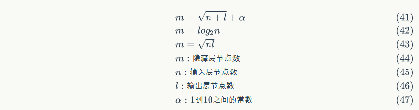
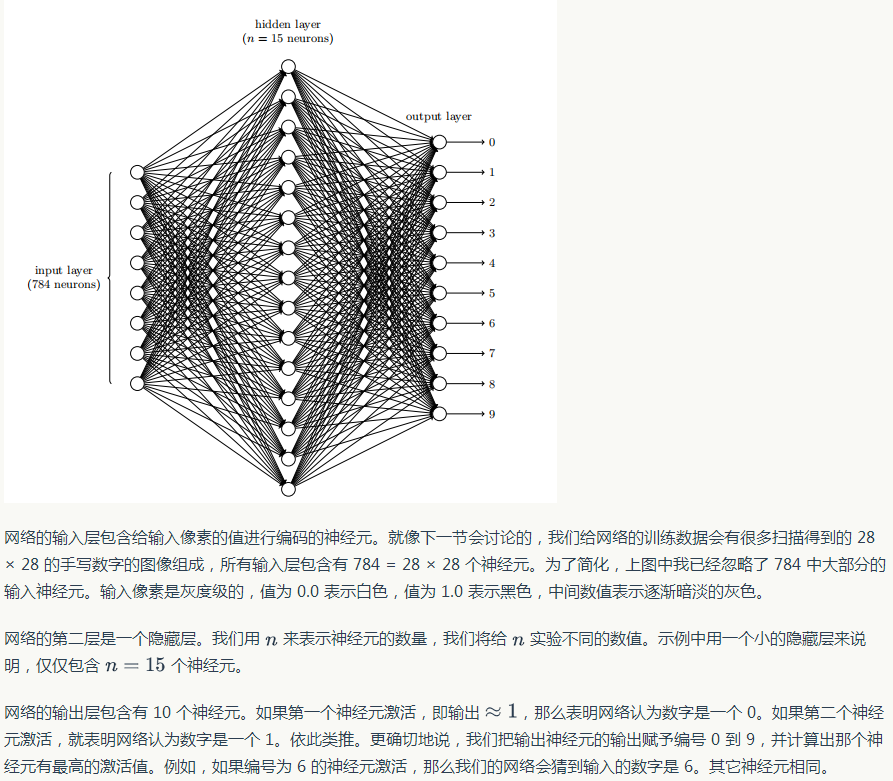
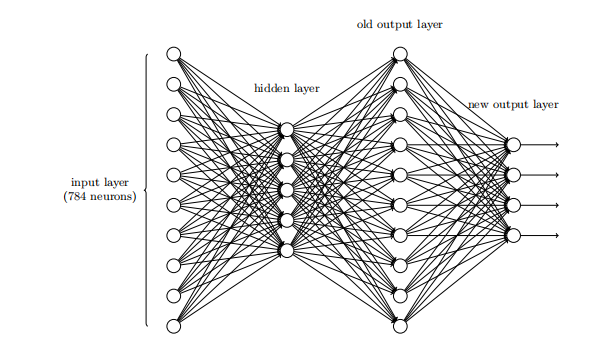
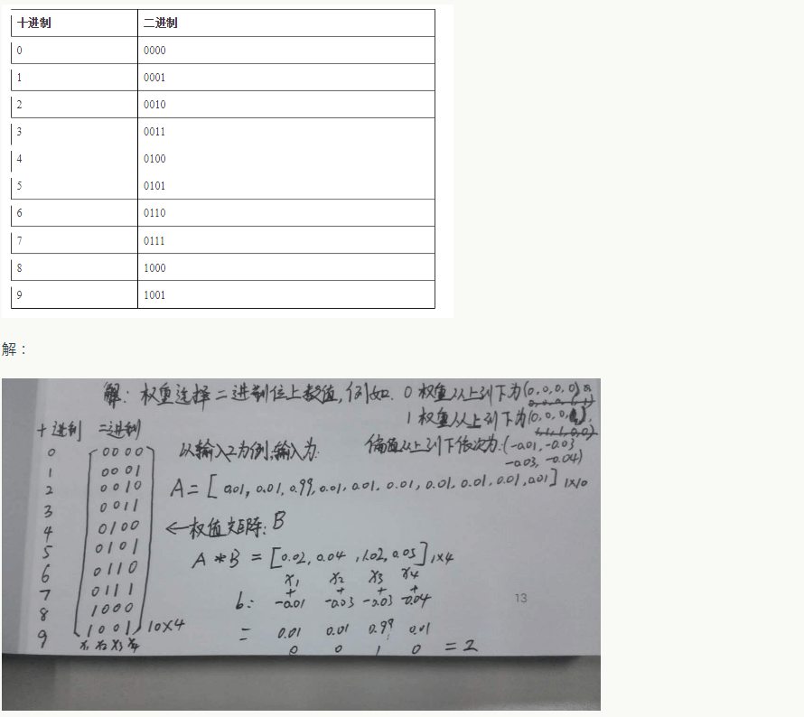
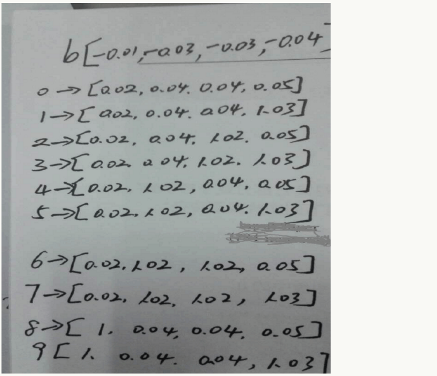

# 五、手写数字识别：神经网络小例子

## 1、概述

上一章，我们介绍了神经网络的一些知识和如何来训练我们的神经网络。但是呢，作为程序员的我，怎么说也是自己动手实现一个比口头上说多少话都实用，哈哈。那我们本章节就自己动手实现一个手写数字识别的神经网络小例子。

## 2、实现步骤

### 2.1、前提准备

针对这个任务，我们采用业界非常流行的 MNIST 数据集。MNIST 大约有 60000 个手写字母的训练样本，我们使用它训练我们的神经网络，然后再用训练好的网络去识别手写数字。

手写数字识别是个比较简单的任务，数字只可能是 0-9 中的一个，这是个 10 分类的问题。

### 2.2、超参数的确定

我们首先需要确定网络的层数和每层的节点数。关于第一个问题，也就是网络的层数，实际上并没有什么理论化的方法，大家都是根据经验来的，如果没有经验的话就随便设置一个。然后，你可以多试几个值，训练不同层数的神经网络，看看哪个效果最好就用哪个。嗯，现在你可能明白为什么说深度学习是个手艺活了，有些手艺让人很无语，而有些手艺还是很有技术含量的。

不过，有些基本道理我们还是明白的，我们知道网络层数越多越好，也知道层数越多训练难度越大。对于全连接网络，隐藏层最好不要超过三层。那么，我们先试一下仅有一个隐藏层的神经网络效果怎么样。毕竟模型小的话，训练起来也快速一些（因为我们刚开始玩模型的时候，都希望快点看到结果）。

输入层节点数是确定的。因为 MNIST 数据集每个训练数据是 28 * 28 的图片，共 784 个像素，因此，输入层节点数应该是 784 ，每个像素对应一个输入节点。

输出层的节点个数我们也是确定的。因为是 10 分类，我们可以用 10 个节点，每个节点对应一个分类。输出层 10 个节点中，输出最大值的那个节点对应的分类，就是模型的预测结果。

隐藏层节点数量是不好确定的，从 1 到 100 万都可以。下面有几个经验公式：



因此，我们可以先根据上面的公式设置一个隐藏层节点数。如果有时间，我们可以设置不同的节点数，分别训练，看看哪个效果最好就用哪个。我们先设置一个，设隐藏层节点数为 300 吧。

对于 3 层 784 * 300 * 10 的全连接网络，总共有 300 * (784 + 1) + 10 * (300 + 1) = 238510 个参数！神经网络之所以强大，是它提供了一种非常简单的方法去实现大量的参数。目前百亿参数，千亿样本的超大规模神经网络也是有的。因为 MNIST 只有 6 万个训练样本，参数太多了很容易过拟合，效果反而不好。

### 2.3、模型的训练和评估

MNIST 数据集包含 10000 个测试样本。我们先用 60000 个训练样本训练我们的网络，然后再用测试样本对网络进行测试，计算识别错误率：


我们每训练 10 轮，评估一次准确率。当准确率开始下降时（出现了过拟合）终止训练。

### 2.4、代码实现

首先，我们需要把 MNIST 数据集处理为神经网络能够接受的格式。MNIST 训练集的文件格式可以参考官方网站，这里不再赘述。每个训练样本是一个 28 * 28 的图像，我们按照行优先，把它转化为一个 784 维的向量。每个标签是 0-9 的值，我们将其转换为一个 10 维的 one-hot 向量：如果标签值为 n ，我们就把向量的第 n 维（从 0 开始编号）设置为 1，而其他维度设置为 0 。例如，向量 [0,0,1,0,0,0,0,0,0,0] 表示值 2 。

我们将使用一个三层神经网络来识别单个数字：



在列出一个完整的代码清单之前，让我解释一下神经网络代码的核心特性。核心片段是一个 Network 类，我们用来表示一个神经网络。这是我们用来初始化一个 Network 对象的代码：

```python
class Network(object):

    def __init__(self, sizes):
        self.num_layers = len(sizes)
        self.sizes = sizes
        self.biases = [np.random.randn(y, 1) for y in sizes[1:]]
        self.weights = [np.random.randn(y, x)
            for x, y in zip(sizes[:-1], sizes[1:])]
```
在这段代码中，列表 sizes 包含各层神经元的数量。例如，如果我们想创建一个在第一层有 2 个神经元，第二层有 3 个神经元，最后一层有 1 个神经元的 Network 对象，我们应这样写代码：

```python
net = Network([2,3,1])
```

有了这些，很容易写出一个 Network 实例计算输出的代码。我们从定义 S 型函数开始：

```python
def sigmoid(z):
    return 1.0/(1.0 + np.exp(-z))
```

注意，当输入 z 是一个向量或者 Numpy 数组时，Numpy 自动地按元素应用 sigmoid 函数，即以向量形式。

我们然后对 Network 类添加一个 feedforward 方法，对于网络给定一个输入 a ，返回对应的输出。

```python
def feedforward(self, a):
    """
    如果输入 "a"，则返回网络的输出。
    """
    for b, w in zip(self.biases, self.weights):
        a = sigmoid(np.dot(w, a)+b)
    return a
```
当然，我们想要 Network 对象做的主要事情是学习。为此我们给它们一个实现随机梯度下降算法的 SGD 方法。代码如下。

```python
def SGD(self, training_data, epochs, mini_batch_size, eta, test_data=None):
    """
    使用小批量随机梯度下降训练神经网络。
    "training_data" 是表示训练输入和期望输出的 "(x, y)" 的列表。
    其他非可选参数是不言自明的。
    如果提供 "test_data" ，则在每次迭代期之后将根据测试数据评估网络，并打印出部分进度。
    这对于跟踪进度很有帮助，但是却大大降低了速度。
    """
    if test_data: n_test = len(test_data)
    n = len(training_data)
    for j in xrange(epochs):
        random.shuffle(training_data)
        mini_batches = [
            training_data[k:k+mini_batch_size]
            for k in xrange(0, n, mini_batch_size)]
        for mini_batch in mini_batches:
            self.update_mini_batch(mini_batch, eta)
        if test_data:
            print "Epoch {0}: {1} / {2}".format(j, self.evaluate(test_data), n_test)
        else:
            print "Epoch {0} complete".format(j)
```

training_data 是一个 (x,y) 元组的列表，表示训练输入和其对应的期望输出。变量 epochs 和 mini_batch_size 正如你预料的 —— 迭代器数量，和采样时的小批量数据的大小。 eta 是学习速率 η 。如果给出了可选参数 test_data ，那么程序会在每个训练器后评估网络，并打印出部分进展。这对于追踪进度很有用，但相当拖慢执行速度。

代码如下工作。在每个迭代期，它首先随机地将训练数据打乱，然后将它分成多个适当大小的小批量数据。这是一个简单的从训练数据的随机采样方法。然后对于每一个 mini_batch 我们应用一次梯度下降。这是通过代码 self.update_mini_batch(mini_batch, eta) 完成的，它仅仅使用 mini_batch 中的训练数据，根据单词梯度下降的迭代更新网络的权重和偏置。下面是 update_mini_batch 方法的代码：

```python
def update_mini_batch(self, mini_batch, eta):
    """
    通过反向传播将梯度下降应用到单个小批量来更新网络的权重和偏置。
    "mini_batch" 是 元组 "(x, y)" 的一个列表，并且 "eta" 是学习率。
    """
    nabla_b = [np.zeros(b.shape) for b in self.biases]
    nabla_w = [np.zeros(w.shape) for w in self.weights]
    for x, y in mini_batch:
        delta_nabla_b, delta_nabla_w = self.backprop(x, y)
        nabla_b = [nb+dnb for nb, dnb in zip(nabla_b, delta_nabla_b)]
        nabla_w = [nw+dnw for nw, dnw in zip(nabla_w, delta_nabla_w)]
        self.weights = [w-(eta/len(mini_batch))*nw for w, nw in zip(self.weights, nabla_w)]
        self.biases = [b-(eta/len(mini_batch))*nb for b, nb in zip(self.biases, nabla_b)]
```

大部分工作由这行代码完成：

```python
delta_nabla_b, delta_nabla_w = self.backprop(x, y)
```
这一行调用了一个称为 **反向传播** 的算法，一种快速计算代价函数的梯度的方法。因此 update_mini_batch 的工作仅仅是对 mini_batch 中的每一个训练样本计算梯度，然后适当地更新 self.weights 和 self.biases 。

我现在不会列出 self.backprop 的代码。它返回与训练样本 x 相关代价的适当梯度。

下面让我们看一下完整的程序，包括我之前忽略的文档注释。除了 self.backprop 程序已经有了足够的文档注释 —— 所有的繁重工作有 self.SGD 和 self.update_mini_batch 完成，对此我们已经有讨论过。 self.backprop 方法利用一些额外的函数来帮助计算梯度，即 simoid_prime ，它计算 σ 函数的导数，以及 self.cost_derivative ，这里我不会对它过多描述。你能够通过查看代码或文档注释来获得这些的要点（或者细节）。注意，虽然程序看上去显得很长，但是很多代码都是用来使代码更容易理解的文档注释。

完整代码如下：

```python
#### 库
# 标准库
import random

# 第三方库
import numpy as np

class Network(object):

    def __init__(self, sizes):
        """
        ``sizes`` 列表包含网络各层中的神经元数量。
        例如，如果列表是 [2, 3, 1]，那么它将是三层网络，第一层包含 2 个神经元，第二层 3 个神经元和第三层 1 个神经元。使用均值为 0 ，方差为 1 的高斯分布随机地初始化网络的偏置和权重。注意，第一层被假定为输入层，并且按照惯例，我们不会为这些神经元设置任何偏置，因为偏置仅用于计算后一层的输出。
        """
        self.num_layers = len(sizes)
        self.sizes = sizes
        self.biases = [np.random.randn(y, 1) for y in sizes[1:]]
        self.weights = [np.random.randn(y, x) for x, y in zip(sizes[:-1], sizes[1:])]

    def feedforward(self, a):
        """
        如果输入 ``a`` 返回网络的输出。
        """
        for b, w in zip(self.biases, self.weights):
            a = sigmoid(np.dot(w, a)+b)
        return a

    def SGD(self, training_data, epochs, mini_batch_size, eta, test_data=None):
        """
        使用小批量随机梯度下降训练神经网络。
        "training_data" 是表示训练输入和期望输出的 "(x, y)" 的列表。
        其他非可选参数是不言自明的。
        如果提供 "test_data" ，则在每次迭代期之后将根据测试数据评估网络，并打印出部分进度。
        这对于跟踪进度很有帮助，但是却大大降低了速度。
        """
        if test_data: 
            n_test = len(test_data)
        n = len(training_data)
        for j in xrange(epochs):
            random.shuffle(training_data)
            mini_batches = [training_data[k:k+mini_batch_size]
            for k in xrange(0, n, mini_batch_size)]
        for mini_batch in mini_batches:
            self.update_mini_batch(mini_batch, eta)
        if test_data:
            print "Epoch {0}: {1} / {2}".format(j, self.evaluate(test_data), n_test)
        else:
            print "Epoch {0} complete".format(j)


    def update_mini_batch(self, mini_batch, eta):
        """
        通过反向传播将梯度下降应用到单个小批量来更新网络的权重和偏置。
        "mini_batch" 是 元组 "(x, y)" 的一个列表，并且 "eta" 是学习率。
        """
        nabla_b = [np.zeros(b.shape) for b in self.biases]
        nabla_w = [np.zeros(w.shape) for w in self.weights]
        for x, y in mini_batch:
            delta_nabla_b, delta_nabla_w = self.backprop(x, y)
            nabla_b = [nb+dnb for nb, dnb in zip(nabla_b, delta_nabla_b)]
            nabla_w = [nw+dnw for nw, dnw in zip(nabla_w, delta_nabla_w)]
        self.weights = [w-(eta/len(mini_batch))*nw for w, nw in zip(self.weights, nabla_w)]
        self.biases = [b-(eta/len(mini_batch))*nb for b, nb in zip(self.biases, nabla_b)]


    def backprop(self, x, y):
        """
        返回代表成本函数 C_x 的梯度的元组 ``(nabla_b, nabla_w)`` 。 ``nabla_b`` 和 ``nabla_w`` 是 numpy 数组的层层列表，类似于 ``self.biases`` 和 ``self.weights`` 。
        """
        nabla_b = [np.zeros(b.shape) for b in self.biases]
        nabla_w = [np.zeros(w.shape) for w in self.weights]
        # 前馈
        activation = x
        activations = [x] # 逐层存储所有激活函数的列表
        zs = [] # 逐层存储所有的 z 向量的列表
        for b, w in zip(self.biases, self.weights):
            z = np.dot(w, activation)+b
            zs.append(z)
            activation = sigmoid(z)
            activations.append(activation)
        # 反向传播
        delta = self.cost_derivative(activations[-1], y) * sigmoid_prime(zs[-1])
        nabla_b[-1] = delta
        nabla_w[-1] = np.dot(delta, activations[-2].transpose())
        # 请注意，下面的循环中的变量与之前我们写到的符号略有不同。
        # 这里，l = 1 表示最后一层神经元，l = 2 表示倒数第二层，以此类推。
        for l in xrange(2, self.num_layers):
            z = zs[-l]
            sp = sigmoid_prime(z)
            delta = np.dot(self.weights[-l+1].transpose(), delta) * sp
            nabla_b[-l] = delta
            nabla_w[-l] = np.dot(delta, activations[-l-1].transpose())
        return (nabla_b, nabla_w)


    def evaluate(self, test_data):
        """
        返回神经网络输出正确结果的测试输入的数量。
        请注意，神经网络的输出被认为是最后一层中具有最高激活的神经元的指数。
        """
        test_results = [(np.argmax(self.feedforward(x)), y) for (x, y) in test_data]
        return sum(int(x == y) for (x, y) in test_results)


    def cost_derivative(self, output_activations, y):
        """
        返回激活函数的偏导数 \partial C_x / \partial a 的向量。
        """
        return (output_activations-y)


#### 激活函数等
def sigmoid(z):
    """
    sigmoid 函数
    """
    return 1.0/(1.0+np.exp(-z))

def sigmoid_prime(z):
    """
    sigmoid 函数的导数。
    """
    return sigmoid(z)*(1-sigmoid(z))
```

下面给出了如何加载 MNIST 数据的代码细节。用于存储 MNIST 数据的数据结构在文档注释中有详细描述 —— 都是简单的类型，元组和 Numpy ndarry 对象的列表（如果你不熟悉 ndarray，那就把它们看成向量）：

```python
"""
mnist_loader
——————————-————
加载 MNIST 图像数据的库。有关返回的数据结构的详细信息，请参阅 ``load_data`` 和 ``load_data_wrapper`` 的文档字符串。实际上，``load_data_wrapper`` 是我们神经网络代码通常调用的函数。
"""
#### 库
# 标准库
import cPickle
import gzip

# 第三方库
import numpy as np

def load_data():
    """
    将 MNIST 数据作为包含训练数据，验证数据和测试数据的元组返回。
    ``training_data`` 作为一个包含两个 entry 的元组返回。第一个 entry 包含实际的训练图像。这是一个有 50000 个图像的 numpy ndarray 。每个 entry 依次是一个具有 784 个值的 numpy ndarray ，代表单个 MNIST 图像中的 28 * 28 = 784 个像素。

    ``training_data`` 元组中的第二个 entry 是一个包含 50000 个条目的 numpy ndarray 。这些条目只是包含在元组的第一个属性中的相应图像的数字值 (0...9) 。

    ``validation_data`` 和 ``test_data`` 是相似的，除了每个只包含 10000 个图像。

    这是一个很好的数据格式，但在神经网络中使用它有助于稍微修改 ``training_data`` 的格式，这在包装器函数 ``load_data_wrapper()`` 中完成，详情见下文.
    """
    
    f = gzip.open('../data/mnist.pkl.gz', 'rb')
    training_data, validation_data, test_data = cPickle.load(f)
    f.close()
    return (training_data, validation_data, test_data)

def load_data_wrapper():
    """
    返回一个包含 ``(training_data, validation_data,test_data)`` 的元组。基于 ``load_data`` ，但是这种格式在我们的神经网络实现中更加方便。

    特别是 ``training_data`` 是一个包含 500002-元组 ``(x, y)`` 的列表。 ``x`` 是包含输入图像的 784 维 numpy.ndarray 。``y`` 是一个 10 维的 numpy.ndarray ，代表与 ``x`` 的正确数字对应的单位向量。

    ``validation_data`` 和 ``test_data`` 是包含 100002-元组 ``(x, y)`` 的列表。在每种情况下， ``x`` 是一个包含输入图像的 784 维的 numpy.ndarray ， ``y`` 是相应的分类，即对应于 ``x`` 的数字值（整数）。

    显然，这意味着我们的训练数据和验证/测试数据的格式略有不同。这些格式在我们的神经网络代码中是最方便的。
    """
    tr_d, va_d, te_d = load_data()
    training_inputs = [np.reshape(x, (784, 1)) for x in tr_d[0]]
    training_results = [vectorized_result(y) for y in tr_d[1]]
    training_data = zip(training_inputs, training_results)
    validation_inputs = [np.reshape(x, (784, 1)) for x in va_d[0]]
    validation_data = zip(validation_inputs, va_d[1])
    test_inputs = [np.reshape(x, (784, 1)) for x in te_d[0]]
    test_data = zip(test_inputs, te_d[1])
    return (training_data, validation_data, test_data)


def vectorized_result(j):
    """
    在第 j 个位置返回一个具有 1.0 的 10 维单位向量，并将其他位置设置为 0 。这用于将数字 (0...9) 转换为神经网络相应的期望输出。
    """
    e = np.zeros((10, 1))
    e[j] = 1.0
    return e
```

### 3、练习题

通过上述的三层网络加一个额外的一层就可以实现按位表示数字。额外的一层把原来的输出层转化为一个二进制表示，如下图所示。为新的输出层寻找一些合适的权重和偏置。假定原先的 3 层神经网络在第三层得到正确的输出（即原来的输出层）的激活值至少是 0.99 ，得到错误的输出的激活值至多是 0.01 。



大家可以尽情思考一下，下面我会把答案写出来，供大家做一个参考。

【答案】

首先，我们设想 0~9 用四位二进制如何表示：





