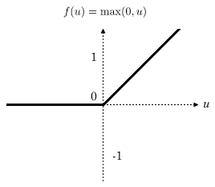
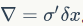
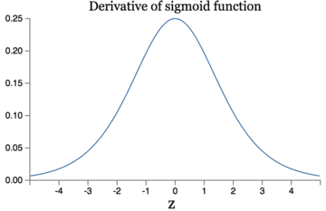

# 六、卷积神经网络（CNN）

## 1、概述

这一节我们介绍更适合图像，语音识别任务的神经网络结构 —— 卷积神经网络（Convolutional Neural Network，CNN）。

## 2、CNN 简介

### 2.1、一个新的激活函数 —— relu

最近几年卷积神经网络中，激活函数往往不选择 sigmoid 或 tanh 函数，而是选择 relu 函数。 Relu 函数的定义是：

f(x) = max(0,x)

Relu 函数图像如下图所示：

Relu 函数作为激活函数，有下面几大优势：

 - 速度快 —— 和 sigmoid 函数需要计算指数和倒数仔细相比，relu 函数其实就是一个 max(0,x) ，计算代价很多。
 - 减轻梯度消失问题 —— 回忆一下计算梯度的公式  。其中 σ' 是 sigmoid 函数的导数。在使用反向传播算法进行梯度计算时，没经过一层 sigmoid 神经元，梯度就要乘上一个 σ' 。从下图可以看出， σ' 函数最大值是 1/4 。因此，乘上一个 σ' 会导致梯度越来越小，这对于深层网络的训练是个很大的问题。而 relu 函数的导数是 1，不会导致梯度变小。当然，激活函数仅仅是导致梯度减小的一个因素，但无论如何在这方面 relu 的表现强于 sigmoid 。使用 relu 激活函数可以让你训练更深的网络。

 - 稀疏性 —— 通过对大脑的研究发现，大脑在工作的时候只有大约 5% 的神经元是激活的，而采用 sigmoid 激活函数的人工神经网络，其激活率大约是 50%。有论文生成人工神经网络在 15% - 30% 的激活率时是比较理想的。因为 relu 函数在输入小于 0 时是完全不激活的，因此可以获得一个更低的激活率。

### 2.2、全连接网络 VS 卷积网络

全连接神经网络之所以不太适合图像识别任务，主要有以下几个方面的问题：

 - 参数数量太多 —— 考虑一个输入 1000 * 1000  像素的图片（一百万像素。现在已经不能算大图了），输入层有 1000 * 1000 = 100万节点。假设第一个隐藏层有 100 个节点（这个数量并不多），那么仅有这一层就有 (1000*1000+1)*100 = 1亿参数，这实在是太多了！我们看到图像只扩大了一点，参数数量就会很多很多，因此它的扩展性很差。

 - 没有利用像素之间的位置信息 —— 对于图像识别任务来说，每个像素和其周围像素的联系是比较紧密的，和离得很远的像素的联系可能就很小了。如果一个神经元和上一层所有神经元相连，那么就相当于对于一个像素来说，把图像的所有像素都同等看待，这不符合前面的假设。当我们完成每个连接权重的学习之后，最终可能会发现，有大量的权重，它们的值都是很小的（也就是这些连接其实无关紧要）。努力学习大量并不重要的权重，这样的学习必将是非常低效的。

 - 网络层数限制 —— 我们知道网络层数越多其表达能力越强，但是通过梯度下降方法训练深度全连接神经网络很困难，以为全连接神经网络的梯度很难传递超过 3 层。因此，我们不可能得到一个很深的全连接神经网络，也就限制了它的能力。

那么，卷积神经网络又是怎样解决这个问题的呢？主要有以下三个思路：

 - 局部连接 —— 这个是最容易想到的，每个神经元不再和上一层的所有神经元相连，而只和一小部分神经元相连。这样就减少了很多参数。

 - 权职共享 —— 一组连接可以共享同一个权重，而不是每个连接有一个不同的权重，这样又减少了很多参数。

 - 下采样 —— 可以使用 Pooling 来减少每层的样本数，进一步减少参数数量，同时还可以提升模型的鲁棒性。

对于图像识别任务来说，卷积神经网络通过尽可能保留重要的参数，去掉大量的不重要的参数，来达到更好的学习效果。

接下来，我们将详述卷积神经网络到底是何方神圣。