# 七、卷积神经网络（CNN）详解（一）

参考链接：
 - https://zhuanlan.zhihu.com/p/27642620
 - https://zhuanlan.zhihu.com/p/27908027
 - https://zhuanlan.zhihu.com/p/30994790
 - https://www.zhihu.com/question/39022858/answer/194996805

## 1、视觉感知

### 1.1、画面识别是什么任务？

学习知识的第一步就是明确任务，清楚该知识的输入输出。卷积神经网络最初是服务于画面识别的，所以我们先来看看画面识别的实质是什么。

先看一下动物和人类视觉的差异对比图。

比如，苍蝇的视觉和人的视觉的差异：

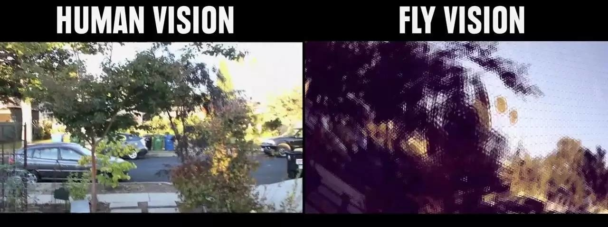

观察上面的对比图，我们可以发现，即便是相同的图片经过不同的视觉系统，也会得到不同的感知。

任何视觉系统都是将图像反光与脑中所看到的概念进行关联。

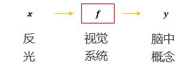

所以画面识别实际上并非识别这个东西客观上是什么，而是寻找人类的视觉关联方式，并再次应用。如果我们不是人类，而是苍蝇或者青蛙，那么画面识别所寻找的 f 就和现在的不一样了。

 - 画面识别实际上是寻找（学习）人类的视觉关联方式 f ，并再次应用。

### 1.2、图片被识别成什么取决于哪些因素？

下面我们看一个图来体会识别结果取决于哪些因素。

 - 老妇与少女

请观察上面这张图片，你看到的是老妇还是少女？以不同的方式去观察这张图片会得到不同的答案。图片可以观察成有大鼻子、大眼睛的老妇。也可以被观察成少女，但这时老妇的嘴会被识别成少女脖子上的项链，而老妇的眼睛则被识别为少女的耳朵。

 - 图片被识别成什么不仅仅取决于图片本身，还取决于图片是如何被观察的。

## 2、图像表达

### 2.1、画面识别的输入

我们通过上面介绍的两个例子，知道了“画面识别是从大量的 (x,y) 数据中寻找人类的视觉关联方式 f ，并再次应用。其中 x 是输入，表示所看到的东西， y 是输出，表示该东西是什么” 。

在自然界中，x 是物体的反光，那么在计算机中，图像又是如何被表达和存储的呢？看下图你就会了解一些：

图像在计算机中是一堆按顺序排列的数字，数值为 0 到 255 。0 表示最暗，255 表示最亮。你可以把这堆数字用一个长长的向量来表示，也就是我们之前做数字识别的时候，将 28 * 28 的图片处理成 784 维的向量表示形式。然而，我们会注意到一点，如果那样做的话，会失去平面结构的信息，也就是这个图中的点的相对位置信息。为了保留该结构信息，通常选择矩阵的表示方式： 28 X 28 的矩阵。

我们上边的图片是只有黑白颜色的灰度图，而更加普遍的图片表达方式是 RGB 颜色模型，即红（Red）、绿（Green）、蓝（Blue）三原色的色光以不同的比例相加，以产生多种多样的色光。

这样，RGB 颜色模型中，单个矩阵就扩展成了有序排列的三个矩阵，也可以用三维张量去理解，其中的每一个矩阵又叫这个图片的一个 channel 。

在电脑中，一张图片是数字构成的 “长方体” 。可用 宽（width），高（height），深（depth）来描述，如下图。

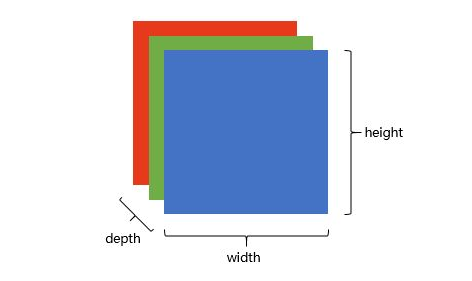

 - 画面识别的输入 x 是 shape 为 (width, height, depth) 的三维张量。

接下来，我们要考虑的就是该如何处理这样的 “数字长方体”。

### 2.2、画面不变性

在我们决定如何处理 “数字长方体” 之前，需要清楚所建立的网络拥有什么样的特点。我们知道一个物体不管在画面左侧还是右侧，都会被识别为同一个物体，这一特点就是不变性（invariance），如下图所示。

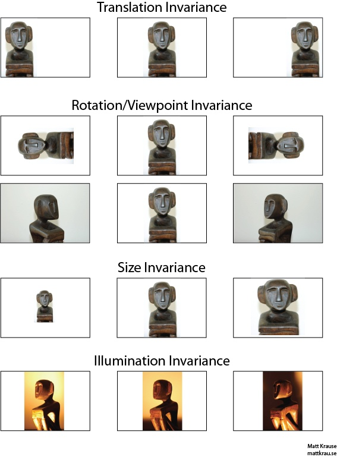

我们希望我们所建立的网络可以尽可能的满足这些不变性特点。

为了理解卷积神经网络对这些不变性特点的贡献，我们将用不具备这些不变性特点的前馈神经网络来进行比较。

## 3、前馈神经网络

方便起见，我们用 depth 只有 1 的灰度图来举例。想要完成的任务是：在宽长为 4x4 的图片中识别是否有下图所示的 “横折” 。图中，黄色圆点表示值为 0 的像素，深色圆点表示值为 1 的像素。我们知道不管这个横折在图片中的什么位置出现，都会被认为是相同的横折。

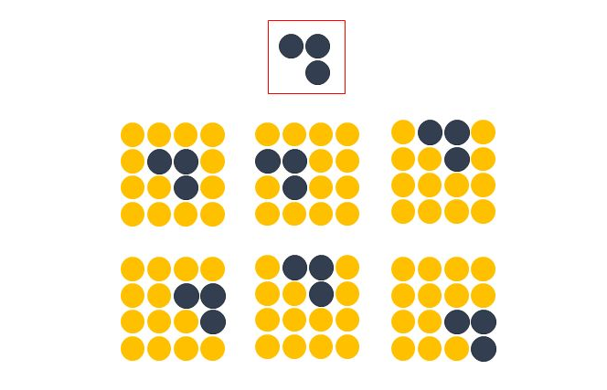

若训练前馈神经网络来完成该任务，那么表达图像的三维张量将会被摊平成一个向量，作为网络的输入，即 (width, height, depth) 为 (4, 4, 1) 的图片会被展成维度为 16 的向量作为网络的输入层。再经过几层不同节点个数的隐藏层，最终输出两个节点，分别表示 “有横折的概率” 和 “没有横折的概率” ，如下图所示。

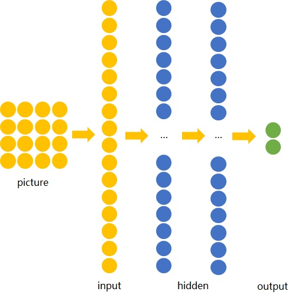

下面我们用数字（16进制）对图片中的每一个像素点（pixel）进行编号。当使用右侧那种物体位于中间的训练数据来训练网络时，网络就只会对编号为 5,6,9,a 的节点的权重进行调节。若让该网络识别位于右下角的 “横折”时，则无法识别。

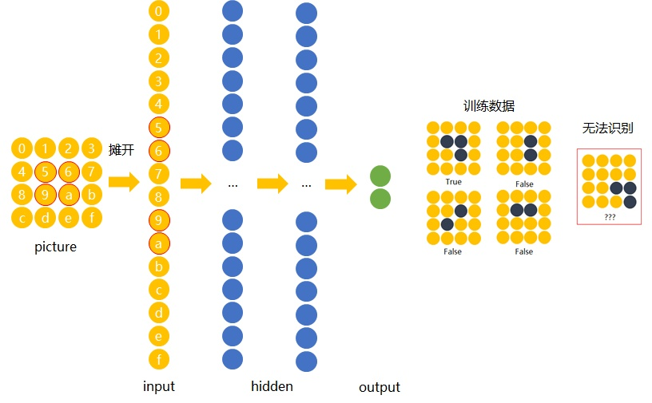

解决办法是用大量物体位于不同位置的数据训练，同时增加网络的隐藏层个数从而扩大网络学习这些变体的能力。

然而这样做十分没有效率，因为我们知道在左侧的 “横折” 也好，还是在右侧的 “横折” 也罢，大家都是 “横折” 。为什么不相同的东西在位置变了之后要重新学习？有没有什么方法可以将中间所学到的规律也运用在其他的位置？换句话说，也就是 **让不同位置用相同的权重** 。

## 4、卷积神经网络

卷积神经网络就是让权重在不同位置共享的神经网络。

### 4.1、局部连接

在卷积神经网络中，我们先选择一个局部区域，用这个区域去扫描整张图片。局部区域所圈起来的所有节点会被连接到下一层的一个节点上。

为了更好的和前馈神经网络作比较，我将这些以矩阵排列的节点展成了向量。下图展示了被红色方框所圈中编号为 0,1,4,5 的节点是如何通过 w1,w2,w3,w4 连接到下一层的节点 0 上的。

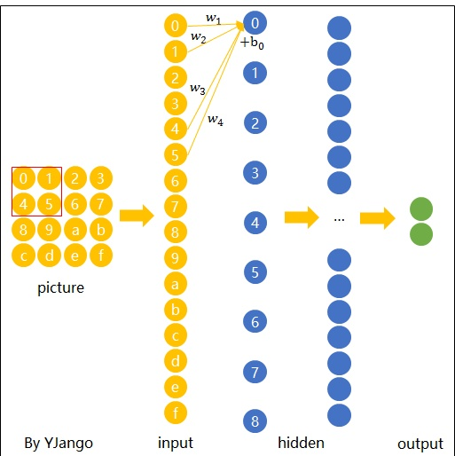

这个带有连接强弱的红色方框就叫做 filter 或 kernel 或 feature detector 。而 filter 的范围叫做 filter size ，这里所展示的是 2x2 的 filter size 。

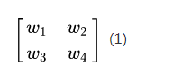

第二层的节点 0 的数值就是局部区域的线性组合，即被圈中节点的数值乘以对应的权重后相加。用 x 表示输入值， y 表示输出值，用图中标注数字表示角标，则下面列出了两种计算编号为 0 的输出值 y0 的表达式。

注：在局部区域的线性组合后，也会和前馈网络一样，加上一个偏移量 b0 。

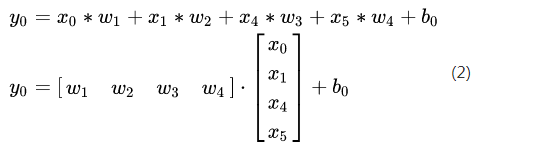

### 4.2、空间共享

当 filter 扫到其他位置计算输出节点 yi 时， w1, w2, w3, w4 ，包括 b0 是共用的。

下面这张动图展示了当 filter 扫过不同区域时，节点的连接方式。动态图的最后一帧则显示了所有连接。可以注意到，每个输出节点并非像前馈神经网络中那样与全部的输入节点连接，而是部分连接。这也就是为什么大家也叫前馈神经网络（feedforward neural network） 为 full-connected neural network 。图中显示的是一步一步地移动 filter 来扫描全图，一次移动多少叫做 stride 。

 - 空间共享也就是卷积神经网络所引入的先验知识。

### 4.3、输出表达

如先前在图像表达式中提到的，图片不用向量去表示是为了保留图片平面结构的信息。同样的，卷积后的输出若用上图的排列方式则丢失了平面结构信息。所以我们依然用矩阵的方式排列它们，就得到了下图所展示的连接。

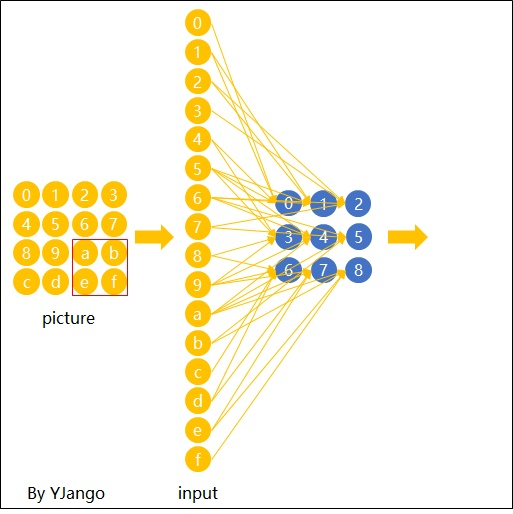

这也就是你们在网上所看到的下面这张图。在看这张图的时候请结合上图的连接一起理解，即输入（绿色）的每九个节点连接到输出（粉红色）的一个节点上的。

经过一个 feature detector 计算后得到的粉红色区域也叫做一个 “Convolved Feature” 或 “Activation Map” 或 “Feature Map” 。

### 4.4、Depth 维的处理

现在我们已经知道了 depth 维度只有 1 的灰度图是如何处理的。但前文提过，图片的普遍表达方式是下图这样有 3 个 channels 的 RGB 颜色模型。当 depth 为复数的时候，每个 feature detector 是如何卷积的？

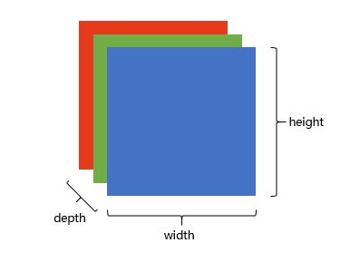

**现象：** 2x2 所表达的 filter size 中，一个 2 表示 width 维上的局部连接数，另一个 2 表示 height 维上的局部连接数，但却没有 depth 维上的局部连接数，是因为 depth 维上并非局部，而是全部连接的。

在 2D 卷积中，filter 在张量的 width 维、 height 维上是局部连接的，在 depth 维上是贯穿全部 channels 的。

**类比：** 想象在切蛋糕的时候，不管这个蛋糕有多少层，通常大家都会一刀切到底，但是在长和宽这两个维度上是局部切割的。

下面这张图展示了，在 depth 为复数时，filter 是如何连接输入节点到输出节点的。图中红、绿、蓝颜色的节点表示 3 个 channels 。黄色节点表示一个 feature detector 卷积后得到的 feature map 。其中被透明黑框圈中的 12 个节点会被连接到黄黑色的节点上。

 - 在输入 depth 为 1 时：被 filter size 为 2x2 所圈中的 4 个节点连接到 1 个输出节点上。
 - 在输入 depth 为 3 时：被 filter size 为 2x2，但是贯穿 3 个 channels 后，所圈中的 12 个输入节点被连接到 1 个输出节点上。
 - 在输入 depth 为 n 时： 2x2xn 个输入节点连接到 1 个输出节点上。

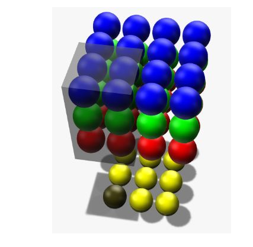

**注意：** 三个 channels 的权重并不共享。即当深度变为 3 后，权重也跟着扩增到了三组，如式子(3) 所示，不同 channels 用的是自己的权重。式子中增加的角标 r, g, b 分别表示 red channel， green channel， blue channel 的权重。

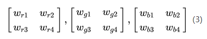

计算例子：用 x_r0 表示 red channel 的编号为 0 的输入节点， x_g5 表示 green channel 编号为 5 的输入节点。x_b1 表示 blue channel 。如式子(4) 所表达，这时的一个输出节点实际上是 12 个输入节点的线性组合。

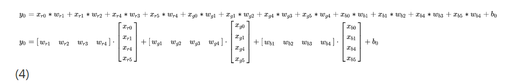

当 filter 扫到其他位置计算输出节点 yi 时，那 12 个权重在不同位置是共用的，如下面的动态图所展示。透明黑色框圈中的 12 个节点会连接到被白色边框选中的黄色节点上。

 - 每个 filter 会在 width 维、 height 维上，以局部连接和空间共享，并贯穿整个 depth 维的方式得到一个 Feature Map 。

### 4.5、Zero padding

细心的读者应该早就注意到了，4x4 的图片被 2x2 的 filter 卷积后变成了 3x3 的图片，每次卷积后会小一圈的话，经过若干层后岂不是变的越来越小？Zero padding 就可以在这时帮助控制 Feature Map 的输出尺寸，同时避免了边缘信息被一步步舍弃的问题。

例如：下面 4x4 的图片在边缘 Zero padding 一圈后，再用 3x3 的 filter 卷积后，得到的 Feature Map 尺寸依然是 4x4 不变。

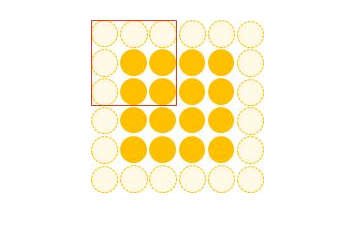

通常大家都想要在卷积时保持图片的原始尺寸。选择 3x3 的 filter 和 1 的 zero padding ，或 5x5 的 filter 和 2 的 zero padding 可以保持图片的原始尺寸。这也是为什么大家多选择 3x3 和 5x5 的 filter 的原因。另一个原因是 3x3 的 filter 考虑到了像素与其距离为 1 以内的所有其他像素的关系，而 5x5 则是考虑像素与其距离为 2 以内的所有其他像素的关系。

**尺寸：** Feature Map 的尺寸等于 (input_size + 2 * padding_size - filter_size)/stride + 1 。

**注意：** 上面的式子是计算 width 或 height 一维的。 padding_size 也表示的是单机补零的个数。例如 (4 + 2 - 3) / 1 + 1 = 4 ，保持原尺寸。

不用去背这个式子。其中 (input_size + 2 * padding_size) 是经过 Zero padding 扩充后真正要卷积的尺寸。 减去 filter_size 后表示可以滑动的范围。 再除以可以一次滑动（stride）多少后得到滑动了多少次，也就意味着得到了多少个输出节点。 再加上第一个不需要滑动也存在的输出节点后就是最后的尺寸。

### 4.6、形状、概念抓取

知道了每个 filter 在做什么之后，我们再来思考这样的一个 filter 会抓取到什么样的信息。

我们知道不同的形状都可由细小的 “零件” 组合而成的。比如下图中，用 2x2 的范围所形成的 16 种形状可以组合成各式各样的 “更大” 的形状。

卷积的每个 filter 可以探测特定的形状。又由于 Feature Map 保持了抓取后的空间结构。若将探测到细小图形的 Feature Map 作为新的输入再次卷积后，则可以由此探测到 “更大” 的形状概念。比如下图的第一个 “大” 形状可由 2,3,4,5 基础形状形成。第二个可由 2, 4, 5, 6 组成。第三个可由 6, 1 组成。

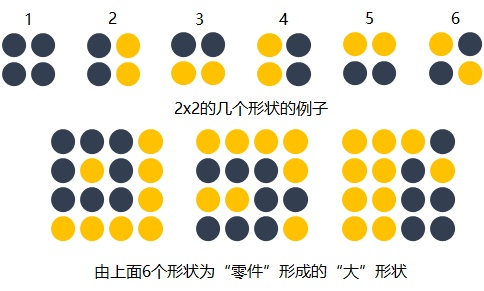

除了基础形状之外，颜色、对比度等概念对画面的识别结果也有影响。卷积层也会根据需要去探测特定的概念。

可以从下面这张图中感受到不同数值的 filters 所卷积过后的 Feature Map 可以探测边缘，棱角、模糊、突出等概念。

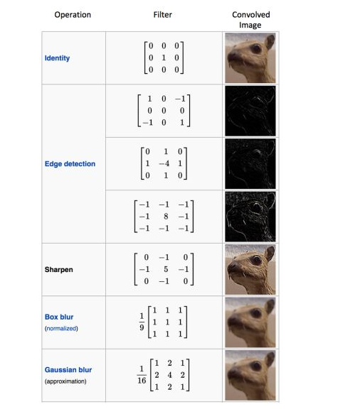

如我们先前所提，图片被识别成什么不仅仅取决于图片本身，还取决于图片是如何被观察的。

而 filter 内的权重矩阵 W 是网络根据数据学习得到的，也就是说，我们让神经网络自己学习以什么样的方式去观察图片。

拿老妇与少女的那幅图片举例，当标签是少女时，卷积神经网络就会学习抓取可以成少女的形状、概念。当标签是老妇时，卷积神经网络就会学习抓取成老妇的形状、概念。

下图展现了在人脸识别中经过层层的卷积后，所能够探测的形状、概念也变得越来越抽象和复杂。

 - 卷积神经网络会尽可能寻找最能解释训练数据的抓取方式。

### 4.7、多 filters

每个 filter 可以抓取探测特定的形状的存在。假如我们要探测下图的长方框形状时，可以用 4 个 filters 去探测 4 个基础 “零件” 。

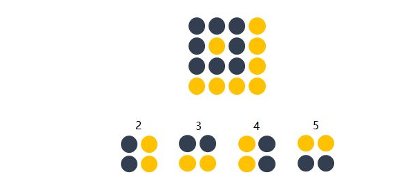

因此我们自然而然的会选择用多个不同的 filters 对同一个图片进行多次抓取。如下图，同一个图片，经过两个（红色，绿色）不同的 filters 扫描过后可得到不同特点的 Feature Maps 。每增加一个 filter，就意味着你想让神经网络多抓取一个特征。

这样卷积层的输出也不再是 depth 为 1 的一个平面，而是和输入一样是 depth 为复数的长方体。

如下图所示，当我们增加一个 filter （紫色表示）后，就又可以得到一个 Feature Map 。将不同 filters 所卷积得到的 Feature Map 按顺序堆叠后，就得到了一个卷积层的最终输出。

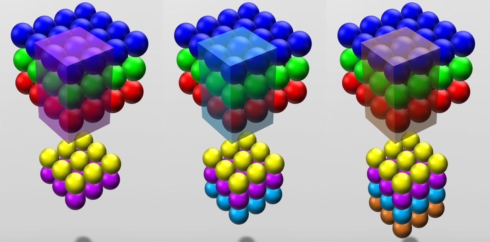

 - 卷积层的输入是长方体，输出也是长方体。

这样卷积后输出的长方体可以作为新的输入送入另一个卷积层中处理。

### 4.8、加入非线性

和前馈神经网络一样，经过线性组合和偏移后，会加入非线性增强模型的拟合能力。

将卷积所得到的 Feature Map 进过 ReLu 变换（elementwise）后得到的 output 就如下图所示。

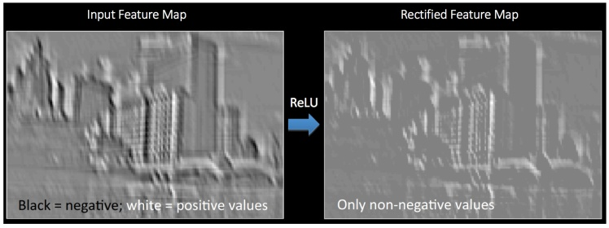

### 4.9、输出长方体

现在我们知道了一个卷积层的输出也是一个长方体。那么这个输出长方体的 （width, height, depth）由哪些因素决定和控制。

这里直接用 [CS231n](http://cs231n.github.io/convolutional-networks/) 的总结：

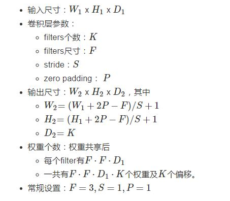

计算例子：请体会 [CS231n](http://cs231n.github.io/convolutional-networks/)

### 4.10、矩阵乘法执行卷积

如果按常规以扫描的方式一步步计算局部节点和 filter 的权重的点乘，则不能高效的利用 GPU 的并行能力。 所以更普遍的方法是用两个大矩阵的乘法来一次性囊括所有计算。

因为卷积层的每个输出节点都是由若干个输入节点的线性组合所计算。因为输出的节点个数是 W_2 x H_2 x D_2 ，所以就有 W_2 x H_2 x D_2 个线性组合。

矩阵乘法的意义可以理解为批量的线性组合按顺序排列。其中一个矩阵所表示的信息是多组权重，另一个矩阵所表示的信息是需要进行组合的向量。大家习惯性的把组成成分放在矩阵乘法的右边，而把权重放在矩阵乘法的左边。所以这个大型矩阵乘法可以用 W_row · X_col 表示，其中 W_row 和 X_col 都是矩阵。

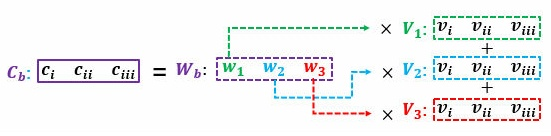

卷积的每个输出是由局部的输入节点和对应的 filter 权重展成向量后所计算的，如式子(2) 。那么 W_row 中的每一行则是每个 filter 的权重，有 F · F · D_1 个；而 X_col 的每一列是所有需要进行组合的节点（上面的动态图中被黑色透明框权重的节点），也有 F · F · D_1 个。 X_col 的列的个数则表示每个 filter 要滑动多少次才可以把整个图片扫描完，有 W_2 · H_2 次。因为我们有多个 filters ，W_row 的行的个数则是 filter 的个数 K 。

最后我们得到： 

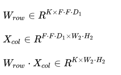

当然矩阵乘法后需要将 W_row · X_col 整理成形状为 W_2 x H_2 x D_2 的三维张量以供后续处理（如再送入另一个卷积层）。X_col 则也需要逐步的局部滑动图片，最后堆叠构成用于计算矩阵乘法的形式。

### 4.11、Max Pooling

在卷积后还会有一个 pooling 的操作，尽管有其他的比如 average pooling 等，这里只提 max pooling 。

max pooling 的操作如下图所示：整个图片被不重叠的分割成若干个同样大小的小块（pooling size）。每个小块内只取最大的数字，再舍弃其他节点后，保持原有的平面结构得出 output 。

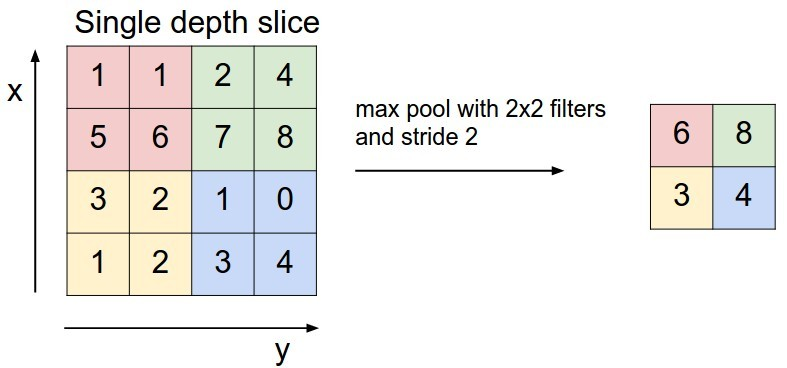

max pooling 在不同的 depth 上是分开执行的，且不需要参数控制。那么问题就 max pooling 有什么作用？部分信息被舍弃后难道没有影响吗？

Max Pooling 的主要功能是 downsampling，却不会损坏识别结果。这意味着卷积后的 Feature Map 中有对于识别物体不必要的冗余信息。那么我们就反过来思考，这些 “冗余”信息是如何产生的。

直觉上，我们为了探测到某个特定的形状的存在，用一个 filter 对整个图片进行逐步扫描。但只有出现了该特定形状的区域所卷积获得的输出才是真正有用的，用该 filter 卷积其他区域得出的数值就可能对该形状是否存在的判定影响较小。 比如下图中，我们还是考虑探测 “横折” 这个形状。 卷积后得到 3x3 的 Feature Map 中，真正有用的就是数字为3的那个节点，其余数值对于这个任务而言都是无关的。 所以用 3x3 的 Max pooling 后，并没有对“横折”的探测产生影响。 试想在这里例子中如果不使用 Max pooling，而让网络自己去学习。 网络也会去学习与 Max pooling 近似效果的权重。因为是近似效果，增加了更多的 parameters 的代价，却还不如直接进行 Max pooling 。

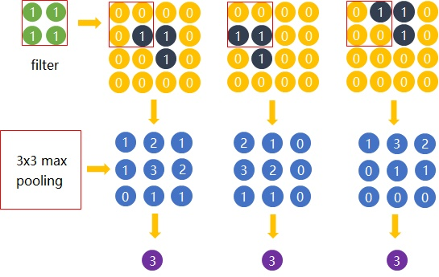

Max Pooling 还有类似 “选择句” 的功能。假如有两个节点，其中第一个节点会在某些输入情况下最大，那么网络就只在这个节点上流通信息；而另一些输入又会让第二个节点的值最大，那么网络就转而走这个节点的分支。

但是 Max pooling 也有不好的地方。因为并非所有的抓取都像上图的例子。有些周边信息对某个概念是否存在的判定也有影响。并且 Max pooling 是对所有的 Feature Maps 进行等价的操作。就好比用相同的网孔的渔网打鱼，一定会有漏网之鱼。

### 4.12、全连接层

当抓取到足以用来识别图片的特征后，接下来就是如何进行分类。全连接层（也叫前馈层）就可以用来将最后的输出映射到线性可分的空间。通常卷积网络的最后会将末端得到的长方体平摊（flatten）成一个长长的向量，并送入全连接层配合输出层进行分类。

卷积神经网络大致就是 covolutional layer, pooling layer, ReLu layer, fully-connected layer 的组合，例如下图所示的结构。

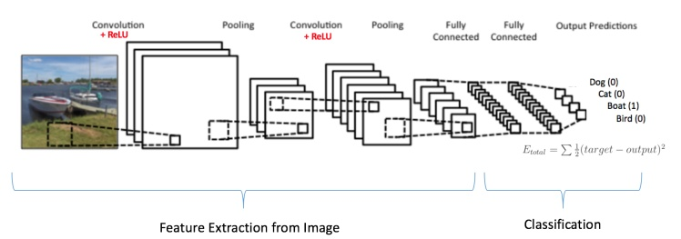

这里也体现了深层神经网络或 deep learning 之所以称 deep 的一个原因：模型将特征抓取层和分类层合在一起。负责特征抓取的卷积层主要是用来学习 “如何观察”。

## 5、附加

### 5.1、1x1 卷积核

如果卷积的输出输入都只是一个平面，那么 1x1 卷积核并没有什么意义，它是完全不考虑像素与周边其他像素的关系的。但卷积的输出输入是长方体，所以 1x1 卷积实际上是对每个像素点，在不同的 channels 上进行线性组合（信息整合），且保留了图片的原有平面结构，调控 depth，从而完成升维或降维的功能。

如下图所示，如果选择 2 个 filters 的 1x1 卷积层，那么数据就从原本的 depth 3 降到了 2 。若用 4 个 filters ，则起到了升维的作用。

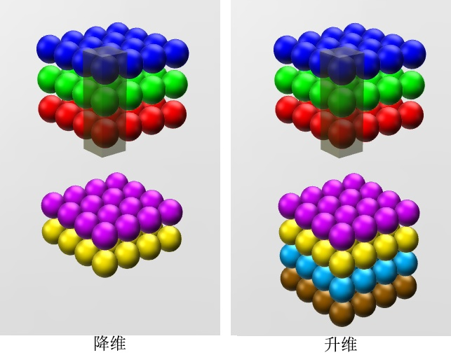

## 6、小结

上面将 CNN 的内容基本讲解清楚了，下一篇文章，我们将要结合代码来进一步了解 CNN 。