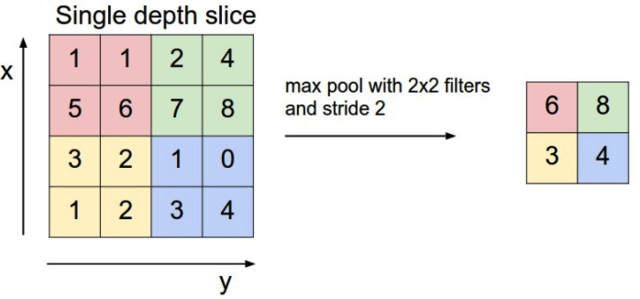
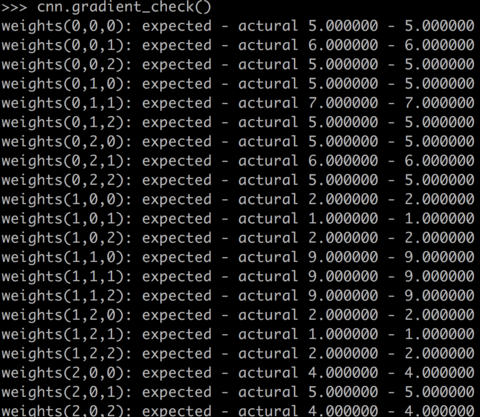
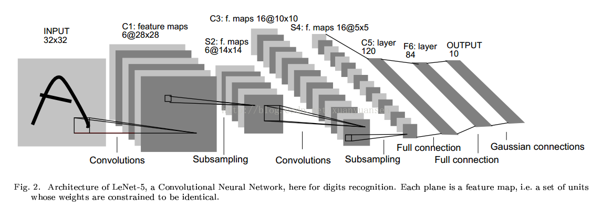

# 八、卷积神经网络（CNN）详解（二）

## 1、概述

首先，根据我们上一节的讲解，我们对卷积神经网络有了一个感性的认知，下面是一个卷积神经网络的示意图：


### 1.1、网络架构：

如上图所示，一个卷积神经网络由若干 **卷积层、Pooling层、全连接层** 组成。当然，你也可以构建各种不同的卷积神经网络，它的常用架构模式为：

INPUT -> [[CONV]*N -> POOL]*M -> [FC]*K

其中的 INPUT 代表输入层， CONV 代表卷积层， POOL 代表 Pooling 层，FC 代表全连接层。

也就是说，N 个卷积层叠加，然后（可选）叠加一个 Pooling 层，重复这个结构 M 次，最后叠加 K 个全连接层。

对于上图的卷积神经网络：

INPUT -> CONV -> POOL -> CONV -> POOL -> FC -> FC

按照上述模式可以表示为：

INPUT -> [[CONV]*1 -> POOL]*2 -> [FC]*2

也就是：

N=1, M=2, K=2

### 1.2、卷积层的计算

下面的动画显示了包含两个 filter 的卷积层的计算。我们可以看到 7*7*3 输入，经过两个 3*3*3 filter的卷积(步幅为2)，得到了 3*3*2 的输出。另外我们也会看到下图的 **Zero padding** 是 1，也就是在输入元素的周围补了一圈 0。**Zero padding** 对于图像边缘部分的特征提取是很有帮助的。


以上就是卷积层的计算方法。这里面体现了**局部连接**和**权值共享**：每层神经元只和上一层部分神经元相连(卷积计算规则)，且 filter 的权值对于上一层所有神经元都是一样的。对于包含两个 3*3*3 的 fitler 的卷积层来说，其参数数量仅有 (3*3*3+1)*2=56 个，且参数数量与上一层神经元个数无关。与全连接神经网络相比，其参数数量大大减少了。

### 1.3、Pooling 层输出值的计算

Pooling 层主要的作用是 **下采样**，通过去掉 Feature Map 中不重要的样本，进一步减少参数数量。Pooling 的方法很多，最常用的是 Max Pooling 。Max Pooling 实际上就是 n*n 的样本中取最大值，作为采样后的样本值。下图是 2*2 max pooling：



除了 Max Pooing 之外，常用的还有 Mean Pooling ——取各样本的平均值。

对于深度为 D 的 Feature Map，各层独立做 Pooling，因此 Pooling 后的深度仍然为 D。

## 2、卷积神经网络的实现

现在，我们亲自动手实现一个卷积神经网络，以便巩固我们所学的知识。

首先，我们要改变一下代码的架构，【层】成为了我们最核心的组件。这是因为卷积神经网络有不同的层，而每种层的算法都在对应的类中实现了。

 - 完整代码看这儿：https://github.com/chenyyx/deeplearning-notes/blob/master/src/7days/cnn.py

### 2.1、卷积层的实现

#### 2.1.1、卷积层的初始化

我们用 **ConvLayer** 类来实现一个卷积层。下面的代码是初始化一个卷积层，可以在构造函数中设置卷积层的**超参数**。

```python
class ConvLayer(object):
    def __init__(self, input_width, input_height, 
                 channel_number, filter_width, 
                 filter_height, filter_number, 
                 zero_padding, stride, activator,
                 learning_rate):
        self.input_width = input_width
        self.input_height = input_height
        self.channel_number = channel_number
        self.filter_width = filter_width
        self.filter_height = filter_height
        self.filter_number = filter_number
        self.zero_padding = zero_padding
        self.stride = stride
        self.output_width = ConvLayer.calculate_output_size(self.input_width, filter_width, zero_padding,stride)
        self.output_height = ConvLayer.calculate_output_size(self.input_height, filter_height, zero_padding, stride)
        self.output_array = np.zeros((self.filter_number, self.output_height, self.output_width))
        self.filters = []
        for i in range(filter_number):
            self.filters.append(Filter(filter_width, filter_height, self.channel_number))
        self.activator = activator
        self.learning_rate = learning_rate
```

**calculate_output_size** 函数用来确定卷积层输出的大小，其实现如下：

```python
    @staticmethod
    def calculate_output_size(input_size, filter_size, zero_padding, stride):
        return (input_size - filter_size + 2 * zero_padding) / stride + 1
```

**Filter** 类保存了卷积层的**参数**以及**梯度**，并且实现了用**梯度下降算法**来更新参数。

```python
class Filter(object):
    def __init__(self, width, height, depth):
        self.weights = np.random.uniform(-1e-4, 1e-4, (depth, height, width))
        self.bias = 0
        self.weights_grad = np.zeros(self.weights.shape)
        self.bias_grad = 0
    def __repr__(self):
        return 'filter weights:\n%s\nbias:\n%s' % (repr(self.weights), repr(self.bias))
    def get_weights(self):
        return self.weights
    def get_bias(self):
        return self.bias
    def update(self, learning_rate):
        self.weights -= learning_rate * self.weights_grad
        self.bias -= learning_rate * self.bias_grad
```

我们对参数的初始化采用了常用的策略，即：**权重**随机初始化为一个很小的值，而**偏置项**初始化为 0。

**Activator** 类实现了**激活函数**，其中，**forward** 方法实现了前向计算，而 **backward** 方法则是计算**导数**。比如，relu 函数的实现如下：

```python
class ReluActivator(object):
    def forward(self, weighted_input):
        #return weighted_input
        return max(0, weighted_input)
    def backward(self, output):
        return 1 if output > 0 else 0
```

#### 2.1.2、卷积层前向计算的实现

**ConvLayer** 类的 **forward** 方法实现了卷积层的前向计算（即计算根据输入来计算卷积层的输出），下面是代码实现：

```python
def forward(self, input_array):
        '''
        计算卷积层的输出
        输出结果保存在self.output_array
        '''
        self.input_array = input_array
        self.padded_input_array = padding(input_array,
            self.zero_padding)
        for f in range(self.filter_number):
            filter = self.filters[f]
            conv(self.padded_input_array, 
                filter.get_weights(), self.output_array[f],
                self.stride, filter.get_bias())
        element_wise_op(self.output_array, 
                        self.activator.forward)
```

上面的代码里面包含了几个工具函数。element_wise_op 函数实现了对 numpy 数组进行 按元素 操作，并将返回值写回到数组中，代码如下：

```python
# 对numpy数组进行element wise操作
def element_wise_op(array, op):
    for i in np.nditer(array,
                       op_flags=['readwrite']):
        i[...] = op(i)
```

**conv** 函数实现了 2D 和 3D 数组的卷积，代码如下：

```python
def conv(input_array, 
         kernel_array,
         output_array, 
         stride, bias):
    '''
    计算卷积，自动适配输入为2D和3D的情况
    '''
    channel_number = input_array.ndim
    output_width = output_array.shape[1]
    output_height = output_array.shape[0]
    kernel_width = kernel_array.shape[-1]
    kernel_height = kernel_array.shape[-2]
    for i in range(output_height):
        for j in range(output_width):
            output_array[i][j] = (    
                get_patch(input_array, i, j, kernel_width, kernel_height, stride) * kernel_array).sum() + bias
```

padding 函数实现了 zero padding 操作：

```python
# 为数组增加Zero padding
def padding(input_array, zp):
    '''
    为数组增加Zero padding，自动适配输入为2D和3D的情况
    '''
    if zp == 0:
        return input_array
    else:
        if input_array.ndim == 3:
            input_width = input_array.shape[2]
            input_height = input_array.shape[1]
            input_depth = input_array.shape[0]
            padded_array = np.zeros((input_depth, input_height + 2 * zp,input_width + 2 * zp))
            padded_array[:,zp : zp + input_height, zp : zp + input_width] = input_array
            return padded_array
        elif input_array.ndim == 2:
            input_width = input_array.shape[1]
            input_height = input_array.shape[0]
            padded_array = np.zeros((input_height + 2 * zp, input_width + 2 * zp))
            padded_array[zp : zp + input_height, zp : zp + input_width] = input_array
            return padded_array
```

### 2.2、卷积层反向传播算法的实现

现在，是介绍卷积层核心算法的时候了。我们知道反向传播算法需要完成几个任务：

 1. 将**误差项** 传递到上一层。
 2. 计算每个 **参数** 的 **梯度** 。
 3. 更新 **参数** 。

以下代码都是在 **ConvLayer** 类中实现。我们先来看看将 **误差项** 传递到上一层的代码实现。

```python
    def bp_sensitivity_map(self, sensitivity_array,
                           activator):
        '''
        计算传递到上一层的sensitivity map
        sensitivity_array: 本层的sensitivity map
        activator: 上一层的激活函数
        '''
        # 处理卷积步长，对原始sensitivity map进行扩展
        expanded_array = self.expand_sensitivity_map(
            sensitivity_array)
        # full卷积，对sensitivitiy map进行zero padding
        # 虽然原始输入的zero padding单元也会获得残差
        # 但这个残差不需要继续向上传递，因此就不计算了
        expanded_width = expanded_array.shape[2]
        zp = (self.input_width +  
              self.filter_width - 1 - expanded_width) / 2
        padded_array = padding(expanded_array, zp)
        # 初始化delta_array，用于保存传递到上一层的
        # sensitivity map
        self.delta_array = self.create_delta_array()
        # 对于具有多个filter的卷积层来说，最终传递到上一层的
        # sensitivity map相当于所有的filter的
        # sensitivity map之和
        for f in range(self.filter_number):
            filter = self.filters[f]
            # 将filter权重翻转180度
            flipped_weights = np.array(map(
                lambda i: np.rot90(i, 2), 
                filter.get_weights()))
            # 计算与一个filter对应的delta_array
            delta_array = self.create_delta_array()
            for d in range(delta_array.shape[0]):
                conv(padded_array[f], flipped_weights[d],
                    delta_array[d], 1, 0)
            self.delta_array += delta_array
        # 将计算结果与激活函数的偏导数做element-wise乘法操作
        derivative_array = np.array(self.input_array)
        element_wise_op(derivative_array, 
                        activator.backward)
        self.delta_array *= derivative_array
```

**expand_sensitivity_map** 方法就是将步长为 **S** 的 sensitivity map『还原』为步长为 1 的 **sensitivity map**，代码如下：

```python
def expand_sensitivity_map(self, sensitivity_array):
        depth = sensitivity_array.shape[0]
        # 确定扩展后sensitivity map的大小
        # 计算stride为1时sensitivity map的大小
        expanded_width = (self.input_width - self.filter_width + 2 * self.zero_padding + 1)
        expanded_height = (self.input_height - self.filter_height + 2 * self.zero_padding + 1)
        # 构建新的sensitivity_map
        expand_array = np.zeros((depth, expanded_height, expanded_width))
        # 从原始sensitivity map拷贝误差值
        for i in range(self.output_height):
            for j in range(self.output_width):
                i_pos = i * self.stride
                j_pos = j * self.stride
                expand_array[:,i_pos,j_pos] = sensitivity_array[:,i,j]
        return expand_array
```

**create_delta_array** 是创建用来保存传递到上一层的 sensitivity map 的数组。

```python
    def create_delta_array(self):
        return np.zeros((self.channel_number, self.input_height, self.input_width))
```

接下来，是计算梯度的代码。

```python
    def bp_gradient(self, sensitivity_array):
        # 处理卷积步长，对原始sensitivity map进行扩展
        expanded_array = self.expand_sensitivity_map(
            sensitivity_array)
        for f in range(self.filter_number):
            # 计算每个权重的梯度
            filter = self.filters[f]
            for d in range(filter.weights.shape[0]):
                conv(self.padded_input_array[d], expanded_array[f],filter.weights_grad[d], 1, 0)
            # 计算偏置项的梯度
            filter.bias_grad = expanded_array[f].sum()
```

最后，是按照 **梯度下降算法** 更新参数的代码，这部分非常简单。

```python
def update(self):
        '''
        按照梯度下降，更新权重
        '''
        for filter in self.filters:
            filter.update(self.learning_rate)
```

### 2.3、卷积层的梯度检查

为了验证我们的公式推导和代码实现的正确性，我们必须要对卷积层进行梯度检查。下面是代码实现：

```python
def init_test():
    a = np.array(
        [[[0,1,1,0,2],
          [2,2,2,2,1],
          [1,0,0,2,0],
          [0,1,1,0,0],
          [1,2,0,0,2]],
         [[1,0,2,2,0],
          [0,0,0,2,0],
          [1,2,1,2,1],
          [1,0,0,0,0],
          [1,2,1,1,1]],
         [[2,1,2,0,0],
          [1,0,0,1,0],
          [0,2,1,0,1],
          [0,1,2,2,2],
          [2,1,0,0,1]]])
    b = np.array(
        [[[0,1,1],
          [2,2,2],
          [1,0,0]],
         [[1,0,2],
          [0,0,0],
          [1,2,1]]])
    cl = ConvLayer(5,5,3,3,3,2,1,2,IdentityActivator(),0.001)
    cl.filters[0].weights = np.array(
        [[[-1,1,0],
          [0,1,0],
          [0,1,1]],
         [[-1,-1,0],
          [0,0,0],
          [0,-1,0]],
         [[0,0,-1],
          [0,1,0],
          [1,-1,-1]]], dtype=np.float64)
    cl.filters[0].bias=1
    cl.filters[1].weights = np.array(
        [[[1,1,-1],
          [-1,-1,1],
          [0,-1,1]],
         [[0,1,0],
         [-1,0,-1],
          [-1,1,0]],
         [[-1,0,0],
          [-1,0,1],
          [-1,0,0]]], dtype=np.float64)
    return a, b, cl
def gradient_check():
    '''
    梯度检查
    '''
    # 设计一个误差函数，取所有节点输出项之和
    error_function = lambda o: o.sum()
    # 计算forward值
    a, b, cl = init_test()
    cl.forward(a)
    # 求取sensitivity map，是一个全1数组
    sensitivity_array = np.ones(cl.output_array.shape,
                                dtype=np.float64)
    # 计算梯度
    cl.backward(a, sensitivity_array,
                  IdentityActivator())
    # 检查梯度
    epsilon = 10e-4
    for d in range(cl.filters[0].weights_grad.shape[0]):
        for i in range(cl.filters[0].weights_grad.shape[1]):
            for j in range(cl.filters[0].weights_grad.shape[2]):
                cl.filters[0].weights[d,i,j] += epsilon
                cl.forward(a)
                err1 = error_function(cl.output_array)
                cl.filters[0].weights[d,i,j] -= 2*epsilon
                cl.forward(a)
                err2 = error_function(cl.output_array)
                expect_grad = (err1 - err2) / (2 * epsilon)
                cl.filters[0].weights[d,i,j] += epsilon
                print 'weights(%d,%d,%d): expected - actural %f - %f' % (
                    d, i, j, expect_grad, cl.filters[0].weights_grad[d,i,j])  
```

上面的代码值得思考的地方在于，传递给卷积层的 sensitivity map 是全 1 数组，留给读者推导一下为什么是这样（提示：激活函数选择了 identity 函数： f(x) = x）。

运行以上梯度检查的代码，我们得到如下的输出，期望的梯度和实际计算出的梯度一致，这证明我们的算法推导和代码实现确实是正确的。



上面就是我们对于卷积层的实现。

### 2.4、Max Pooling 层的实现

max pooling 层的实现相对简单，我们直接贴出全部代码如下：

```python
class MaxPoolingLayer(object):
    def __init__(self, input_width, input_height, 
                 channel_number, filter_width, 
                 filter_height, stride):
        self.input_width = input_width
        self.input_height = input_height
        self.channel_number = channel_number
        self.filter_width = filter_width
        self.filter_height = filter_height
        self.stride = stride
        self.output_width = (input_width - filter_width) / self.stride + 1
        self.output_height = (input_height - filter_height) / self.stride + 1
        self.output_array = np.zeros((self.channel_number, self.output_height, self.output_width))
    def forward(self, input_array):
        for d in range(self.channel_number):
            for i in range(self.output_height):
                for j in range(self.output_width):
                    self.output_array[d,i,j] = (    
                        get_patch(input_array[d], i, j, self.filter_width, self.filter_height, self.stride).max())
    def backward(self, input_array, sensitivity_array):
        self.delta_array = np.zeros(input_array.shape)
        for d in range(self.channel_number):
            for i in range(self.output_height):
                for j in range(self.output_width):
                    patch_array = get_patch(input_array[d], i, j, self.filter_width, self.filter_height, self.stride)
                    k, l = get_max_index(patch_array)
                    self.delta_array[d, i * self.stride + k, j * self.stride + l] = sensitivity_array[d,i,j]
```

全连接层的实现和上一篇文章类似，在此就不再赘述了。至此，我们已经实现了一个简单的**卷积神经网络**所需要的基本组件。对于 **卷积神经网络** ，现在有很多优秀的开源实现，因此我们并不需要真的自己去实现一个。贴出这些代码的目的是为了让我们更好的了解 **卷积神经网络** 的基本原理。


## 3、卷积神经网络的应用

### MNIST 手写数字识别

LeNet-5 是实现手写数字识别的 **卷积神经网络**，在 MNIST 测试集上，它取得了 0.8% 的错误率。LeNet-5 的结构如下：



关于 LeNet-5 的详细介绍，网上的资料很多，因此就不再重复了。感兴趣的读者可以尝试用我们自己实现的卷积神经网络代码去构造并训练 LeNet-5（当然代码会更复杂一些）。

## 4、小结

至此，我们基本了解了卷积神经网络的基本套路。**卷积神经网络** 是深度学习最重要的工具（我犹豫要不要写上『之一』呢）。如果您真正了解了本文的内容，相当于迈过了入门深度学习的最重要的一个门槛。在下一篇文章中，我们介绍深度学习另外一种非常重要的工具：**循环神经网络** 。