# 九、循环神经网络（Recurrent Neural Network, RNN）（一）

## 1、概述

不知道小伙伴们用没用过 Google 翻译，它绝对是我见过的翻译效果最牛的翻译应用。想要体验的，请点 [这里](https://translate.google.cn/) 。

它能实现这么令人惊艳的性能。这里的技术核心就是 RNN - 我们常说的传说中的循环神经网络。 RNN 可以称得上是深度学习未来最有前景的工具之一。它在时间序列（比如语言文字，股票价格）的处理和预测上具有神功，你想了解它的威力的根源吗？

在前面的文章中，我们介绍了全连接神经网络和卷积神经网络，以及它们的训练和使用。它们只能单独地处理一个个的输入，前一个输入和后一个输入是完全没有关系的。但是某些任务需要能够更好地处理**序列**的信息，即前面的输入和后面的输入是有关系的。比如，当我们在理解一句话意思时，孤立的理解这句话的每个词是不够的，我们需要处理这些词连接起来的整个序列；当我们处理视频的时候，我们也不能只单独地去分析每一帧，而要分析这些帧连接起来的整个 **序列** 。这时，就需要用到深度学习领域中另一类非常重要的神经网络：循环神经网络（Recurrent Neural Network）。

## 2、RNN

### 2.1、语言模型

RNN 是在 **自然语言处理** 领域里最先被用起来的，比如 RNN 可以为 **语言模型** 来建模。那么我们说了这么多，什么才是语言模型呢？

我们可以和电脑玩一个游戏，我们写出一个句子前面的一些词，然后，让电脑帮我们写下接下来的一个词。比如下面这句话：

我昨天上学迟到了，老师批评了____ 。

我们给电脑展示了这句话前面的这些词，然后，让电脑写下接下来的一个词。在这个例子中，接下来的这个词最有可能是 【我】，而不太可能是 【小明】，甚至是 【吃饭】。

**语言模型** 就是这样一个东西：给定一个一句话前面的部分，预测接下来最有可能的一个词是什么。

**语言模型** 是对一种语言的特征进行建模，它有很多很多用处。比如在语音转文本（STT）的应用中，声学模型输出的结果，往往是若干个可能的候选词，这时候就需要 **语言模型** 来从这些候选词中选择一个最有可能的。当然，它同样也可以用在图像到文本的识别中（OCR）。

语言模型有以下两个方面的应用：
 - 1、基于每个序列在现实世界中出现的可能性对其进行打分，这实际上提供了一个针对语法和语义正确性的度量，语言模型通常作为机器翻译系统的一部分。
 - 2、语言模型可以用来生成新文本。比如：根据莎士比亚的作品训练语言模型可以生成莎士比亚风格的文本。

在使用 RNN 之前，语言模型主要是采用 N-Gram 。 N 可以是一个自然数，比如 2 或者 3 。它的含义是，假设一个词出现的概率只与前面 N 个词相关。我们以 2-Gram 为例。首先，对前面的一句话进行切词：

我 | 昨天 | 上学 | 迟到 | 了，老师 | 批评 | 了 ____ 。

如果用 2-Gram 进行建模，那么电脑在预测的时候，只会看到前面的 【了】，然后，电脑会在语料库中，搜索 【了】 后面最可能的一个词。不管最后电脑选的是不是 【我】，我们都知道这个模型是不靠谱的，因为 【了】前面说了那么一大堆实际上是没有用到的。如果是 3-Gram 模型呢，会搜索 【批评了】后面最可能的词，感觉上，比 2-Gram 靠谱了不少，但还是远远不够的。因为这句话最关键的信息 【我】，远在 9 个词之前！

现在我们可能会想，可以继续提升 N 的值呀，比如 4-Gram、5-Gram .... 。实际上，这个想法是没有实用性的。因为我们想处理任意长度的句子，N 设为多少都不合适；另外，模型的大小和 N 的关系是指数级的，4-Gram、5-Gram ... 。实际上，这个想法是没有实用性的。因为我们想处理任意长度的句子，N 设为多少都不合适；另外，模型的大小和 N 的关系是指数级的， 4-Gram 模型就会占用海量的存储空间。

这时候，就轮到 RNN 出场了，RNN 理论上可以往前看（往后看）任意多个词。

还有另外一方面，比如下面这个例子：

我们从一个问题开始，你能理解下面这句英文的意思吗？ “working love learning we on deep” ，答案显然是无法理解。那么下面这个句子呢？“We love working on deep learning”，整个句子的意思通顺了！我想说的是，一些简单的词序混乱就可以使整个句子不通顺。那么，我们能期待传统神经网络使语句变得通顺吗？不能！如果人类的大脑都感到困惑，那么传统神经网络很难解决这类问题。

在日常生活中我们也会遇到很多这样的问题，当顺序被打乱时，它们会被完全打乱。例如，

 - 我们之前看到的语言 —— 单词的顺序定义了它们的意义
 - 时间序列数据 —— 时间定义了事件的发生
 - 基因组序列数据 —— 每个序列都有不同的含义

现实中也确实有很多这样的情况，**序列的信息决定事件本身**。如果我们试图使用这类数据得到有用的输出，就需要一个这样的网络：能够访问一些关于数据的 **先验知识（prior knowledge）**，以便完全理解这些数据。

这时候，循环神经网络（RNN）也就有需求了，哈哈。

### 2.2、循环神经网络是啥

#### 2.2.1、引入

我们根据上面我们说到的例子，假设我们的任务是预测句子中的下一个词。让我们尝试使用 MLP（多层感知机）完成它。先来看最简单的形式，我们有一个输入层、一个隐藏层和一个输出层。输入层接收输入，隐藏层激活，最后接收层得到输出。


接下来搭建更深层的网络，其中有多个隐藏层。在这里，输入层接收输入，第一层隐藏层激活该输入，然后将这些激活发送到下一个隐藏层，并层层进行连续激活以得到输出。每个隐藏层有自己的权重和偏差。

由于每个隐藏层都有自己的权重和激活，所以它们具有独立的行为。现在的目标是确定连续输入之间的关系。我们能直接把输入给隐藏层吗？当然可以！


这些隐藏层的权重和偏差是不同的。因此，每一层都是独立的，不能结合在一起。为了将这些隐藏层结合在一起，我们使这些隐藏层具有相同的权重和偏差。


我们现在可以将这些隐藏层结合在一起，所有隐藏层的权重和偏差相同。所有这些隐藏层合并为**一个循环层** 。


这就像将输入给隐藏层一样。在所有 **时间步（time steps）** （我们后面会介绍什么是时间步），循环神经元的权重都是一样的，因为它现在是单个神经元。因此，一个循环神经元存储先前输入的状态，并与当前输入相结合，从而保持当前输入与先前输入的某些关系。

#### 2.2.2、基本循环神经网络

循环神经网络种类繁多，我们先从最简单的基本循环神经网络开始吧。

下图是一个简单的循环神经网络图，它由输入层，一个隐藏层和一个输出层组成：


纳尼？！看到这个玩意，大家内心是不是已经崩溃了。因为 **循环神经网络** 实在是太难画出来了，网上所有大神们都不得不用这种抽象艺术手法。不过呢，我们静下心来仔细看看的话，其实也是很好理解的。如果把上面有 W 的那个带箭头的圈去掉，它就成了最普通的 **全连接神经网络** 。

x 是一个向量，它代表 **输入层** 的值（这里面没有画出来表示神经元节点的圆圈）； s 是一个向量，它表示 **隐藏层** 的值（这里隐藏层画了一个节点，你也可以想象这一层其实是多个节点，节点数与向量 s 的维度相同）； U 是输入层到隐藏层的 **权重矩阵** ；o 也是一个向量，它表示 **输出层** 的值； V 是隐藏层到输出层的 **权重矩阵** 。那么，现在我们来看看 W 是什么。 **循环神经网络** 的 **隐藏层** 的值 s 不仅仅取决于当前这次的输入 x ，还取决于上一次 **隐藏层** 的值 s 。**权重矩阵 W** 就是 **隐藏层** 上一次的值作为这一次的输入的权重。

如果我们把上面的图展开，**循环神经网络** 也可以画成下面这个样子：


现在我们看上去就比较清楚了，这个网络在 t 时刻接收到输入 x_t 之后，隐藏层的值是 s_t ，输出值是 o_t 。关键一点是， s_t 的值不仅仅取决于 x_t ，还取决于 s_{t-1} 。我们可以用下面的公式来表示 **循环神经网络** 的计算方法：


式1 是 **输出层** 的计算公式，输出层是一个全连接层，也就是它的每个节点都和隐藏层的每个节点相连。 V 是输出层的 **权重矩阵** ，g 是 **激活函数**。 式2 是隐藏层的计算公式，它是 **循环层** 。U 是输入 x 的权重矩阵， W 是上一次的值 s_{t-1} 作为这一次的输入的 **权重矩阵**， f 是 **激活函数** 。

从上面的公式我们可以看出，**循环层** 和 **全连接层** 的区别就是 **循环层** 多了一个 **权重矩阵 W** 。

如果反复把 **式2** 代入到 **式1** ，我们将得到：


从上面可以看出，**循环神经网络** 的输出值 o_t，是受前面历次输入值 x_t、x_{t-1} 、x_{t-2}、 x_{t-3} ... 影响的，这就是为什么 **循环神经网络** 可以往前看任意多个输入值的原因。

了解了上面这些，我们可以用一段小巧的 python 代码让你重新理解下上述的原理：

```python
class RNN:

    # 循环神经网络的一次循环
    def step(self, x):
        # 更新隐藏状态
        self.h = np.tanh(np.dot(self.W_hh, self.h) + np.dot(self.W_xh, x))
        # 计算输出向量
        y = np.dot(self.W_hy, self.h)
        return y
```
说明：

这里的 h 就是 hidden variable 隐变量，即整个网络每个神经元的状态，x 是输入， y 是输出， 注意着三者都是高维向量。

**隐变量 h，就是通常说的神经网络本体，也正是循环得以实现的基础， 因为它如同一个可以储存无穷历史信息(理论上)的水库**，一方面会通过输入矩阵 W_xh 吸收输入序列x的当下值，一方面通过网络连接 W_hh 进行内部神经元间的相互作用（网络效应，信息传递），因为其网络的状态和输入的整个过去历史有关， 最终的输出又是两部分加在一起共同通过非线性函数 tanh。

**整个过程就是一个循环神经网络“循环”的过程。 W_hh 理论上可以可以刻画输入的整个历史对于最终输出的任何反馈形式**，从而刻画序列内部，或序列之间的时间关联， 这是 RNN 强大的关键。

#### 2.2.3、理解循环神经元（Recurrent Neuron）的细节


我们来看看上面的结构是如何被用来预测 “hello” 这个单词的第五个字母的。在上面的结构中，蓝色 RNN 块，对输入和之前的状态应用了 **循环递归公式** 。在我们的任务中，字母 “h” 前面没有任何其他字母，我们来看字母 “e” 。当字母 “e” 被提供给网络时，将循环递归公式应用于输入（也就是字母 e）和前一个状态（也就是字母 h），得到新的状态。也就是说，在 t-1 的时候，输入是 h ，输出是 h_{t-1} ，在 t 时刻，输入是 e 和 h_{t-1} ，输出是 h_t ，这里每次应用循环递归公式称为不同的 **时间步**。

描述当前状态的循环递归公式如下：


这里 h_t 是 t 时刻的状态， h_{t-1} 是前一时刻的状态，x_t 是当前的输入。我们有的是前一时刻的状态而不是前一时刻的输入，因为输入神经元将前一时刻的输入转换为前一时刻的状态。所以每一个连续的输入被称为 **时间步** 。

在我们的案例中，我们有四个输入（h、e、l、l），在每一个时间步应用循环递推公式时，均使用相同的函数和相同的权重。

考虑循环神经网络的最简单形式，激活函数是 tanh，权重是 W_{hh} ，输入神经元的权重是 W_{xh} ，我们可以写出 t 时刻的状态公式如下：


在上述情况下，循环神经元仅仅是将之前的状态考虑进去。对于较长的序列，方程可以包含多个这样的状态。一旦最终状态被计算出来我们就可以得到输出了。

现在，一旦得到了当前状态，我们就可以计算输出了。


至此，我们也弄清楚了循环神经元的细节了，我们来总结一下循环神经元的计算步骤：


#### 2.2.3、双向循环神经网络

对于 **语言模型** 来说，很多时候光看前面的词是不够的，比如下面这句话：

我的手机坏了，我打算 ____ 一部新手机。

可以想象，如果我们只看横线前面的词，手机坏了，那么我是打算修一修？换一部新的？还是大哭一场？这些都是无法确定的。但如果我们也看到了横线后面的词是 【一部新手机】，那么横线上的词填【买】的概率就大得多了。

在上一节中的 **基本循环神经网络** 是无法对此进行建模的，因此，我们需要 **双向循环神经网络**，如下图所示。

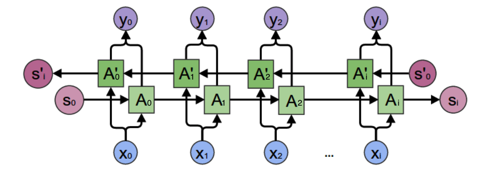

我们遇到这种从未来穿越回来的场景，难免处于懵逼的状态。不过我们还是可以用屡试不爽的老办法：先分析一个特殊场景，然后再总结一般规律。我们先考虑上图中， y_2 的计算。


#### 2.2.4、深度循环神经网络

前面我们介绍了这么多的**循环神经网络**都是只有一个隐藏层，我们当然也可以堆叠两个以上的隐藏层，这样就得到了 **深度循环神经网络** 。如下图所示：

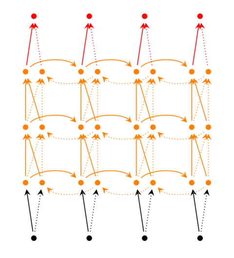

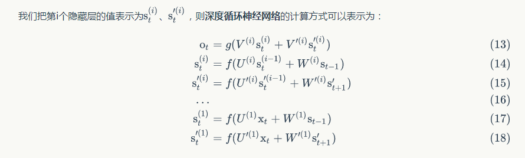

### 2.3、循环神经网络的训练

#### 2.3.1、循环神经网络的后向传播（BPTT）

我们很难凭借想象理解一个递归神经网络的权重是如何更新的。因此，为了理解和可视化反向传播，让我们按照时间步展开网络。在其中我们可以计算也可以不计算每一时间步的输出。

在向前传播的情况下，输入随着每一个时间步前进。在反向传播的情况下，我们 “回到过去” 改变权重，因此我们叫它 **通过时间的反向传播（BPTT）** 。

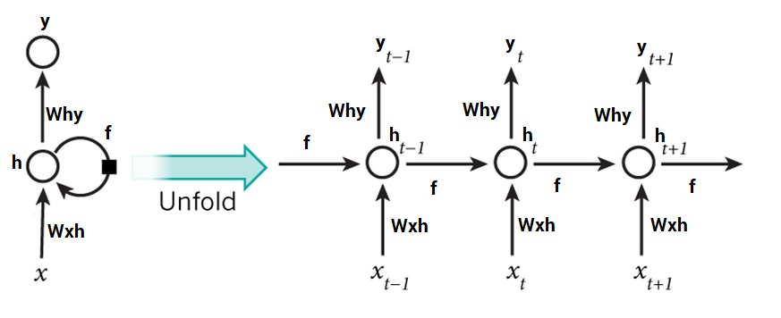

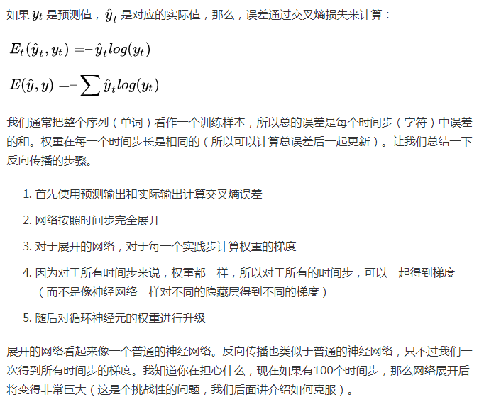


用更加简洁的说法来说明这些，即：

BPTT 算法是针对 **循环层** 的训练算法，它的基本原理和 BP 算法是一样的，也包含同样的三个步骤：

1. 前向计算每个神经元的输出值；
2. 反向计算每个神经元的 **误差项 \delta** 的值，它是误差函数 E 对神经元 j 的 **加权输入 net_j** 的偏导数；
3. 计算每个权重的梯度。

最后再用 **随机梯度下降** 算法更新权重。

如果您想要了解这背后的数学原理，可以参考这个链接：https://zybuluo.com/hanbingtao/note/541458 。如果这些搞得您很头大，所有您需要知道的是，按照时间步展开后的反向传播类似于常规神经网络的反向传播。


## 3、RNN 的梯度消失和爆炸问题

RNN 基于这样的机制，信息的结果依赖于前面的状态或前 N 个时间步。普通的 RNN 可能在学习长距离依赖性方面存在困难。例如，如果我们有这样一句话， “The man who ate my pizza has purple hair” 。在这种情况下，purple hair 描述的是 The man，而不是 pizza 。所以这是一个长距离的依赖问题。

如果我们在这种情况下后向传播，我们就需要应用链式法则。在三个时间步后对第一个求梯度的公式如下：

∂E/∂W = ∂E/∂y3 ∂y3/∂h3 ∂h3/∂y2 *∂y2/∂h1 .. 这就是一个长距离的依赖关系.

在这里，我们应用了链式规则，如果任何一个梯度接近0，所有的梯度都会成指数倍的迅速变成零。这样将不再有助于网络学习任何东西。这就是所谓的消失梯度问题。

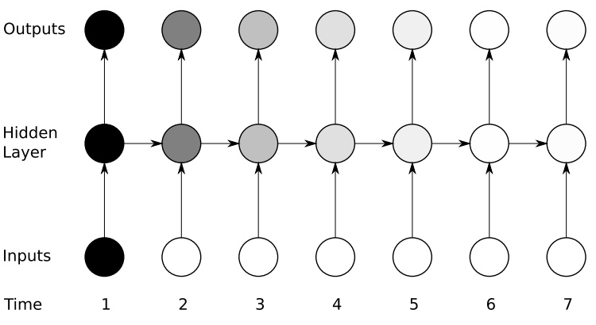

梯度消失问题和梯度爆炸问题相比，对网络更有威胁性，梯度爆炸就是由于单个或多个梯度值变得非常高，梯度变得非常大。

通常来说，**梯度爆炸** 更容易处理一些。因为梯度爆炸的时候，我们的程序会收到 NAN 错误。我们也可以设置一个梯度阈值，当梯度超过这个阈值的时候可以直接截取。

**梯度消失**更难检测，而且也更难处理一些。总的来说，我们有三种方法应对梯度消失问题：

1. 合理的初始化权重值。初始化权重，使每个神经元尽可能不要取极大或极小值，以躲开梯度消失的区域。
2. 使用 ReLu 代替 sigmoid 和 tanh 函数作为 激活函数。原理请参考我们上一章节介绍 卷积神经网络（CNN）的时候的讲解。
3. 使用其他结构的 RNNs， 比如长短时记忆网络（LSTM）和 Gated Recurrent Unit（GRU），这是最流行的做法。我们会在后面的章节中介绍到这两种网络。


## 4、RNN 的应用举例 —— 基于 RNN 的语言模型

现在，我们介绍一下基于 RNN 语言模型。我们首先把词依次输入到循环神经网络中，每输入一个词，循环神经网络就输出到目前为止，下一个最可能的词。例如，当我们依次输入：

我 | 昨天 | 上学 | 迟到 | 了

神经网络的输出如下图所示：

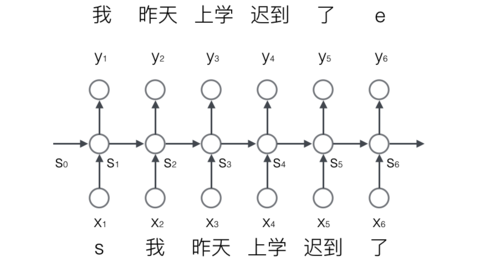

其中，s 和 e 是两个特殊的词，分别表示一个序列的开始和结束。

### 4.1、向量化

我们知道，神经网络的输入和输出都是**向量**，为了让语言模型能够被神经网络处理，我们必须把词表达为向量的形式，这样神经网络才能处理它。

神经网络的输入是 **词**，我们可以用下面的步骤对输入进行 **向量化** ：

1. 建立一个包含所有词的词典，每个词在词典里面有一个唯一的编号。
2. 任意一个词都可以用一个 N 维的 one-hot 向量来表示。其中， N 是词典中包含的词的个数。假设一个词在词典中的编号是 i ，v 是表示这个词的向量， v_j 是向量的第 j 个元素，则：

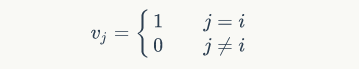

上面这个公式的含义，可以用下面的图来直观的表示：

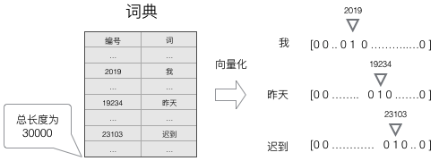

使用这种向量化方法，我们就得到了一个高维、稀疏的向量（稀疏是指绝大部分元素的值都是0）。处理这样的向量会导致我们的神经网络有很多的参数，带来庞大的计算量。因此，往往会需要使用一些降维的方法，将高维的稀疏向量转变为低维的稠密向量。不过这个话题我们就不在这篇文章中进行讨论了。

语言模型要求的输出是下一个最可能的词，我们可以让循环神经网络计算词典中每个词是下一个词的概率，这样，概率最大的词就是下一个最可能的词。因此，神经网络的输出向量也是一个 N 维向量，向量中的每个元素对应着词典中相应的词是下一个词的概率。如下图所示：

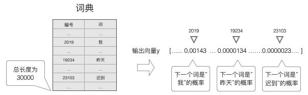


### 4.2、Softmax 层

前面提到，**语言模型** 是对下一个词出现的 **概率** 进行建模。那么，怎么样让神经网络输出概率呢？方法就是用 softmax 层作为神经网络的输出层。

我们先来看一下 softmax 函数的定义：

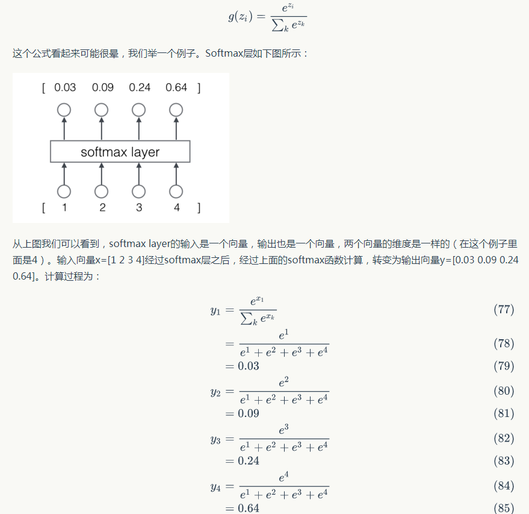 

我们来看看输出向量 y 的特征：

1. 每一项为取值为 0-1 之间的正数；
2. 所有项的总和是 1 。

我们不难发现，这些特征和 **概率** 的特征是一样的，因此我们可以把它们看做是概率。对于 **语言模型** 来说，我们可以认为模型预测下一个词是词典中第一个词的概率是 0.03 ，是词典中第二个词的概率是 0.09 ，以此类推。

### 4.3、语言模型的训练

可以使用 **监督学习** 的方法对语言模型进行训练，首先，需要准备训练数据集。接下来，我们介绍怎样把语料转换成语言模型的训练数据集。

首先，我们获取 **输入-标签** 对：

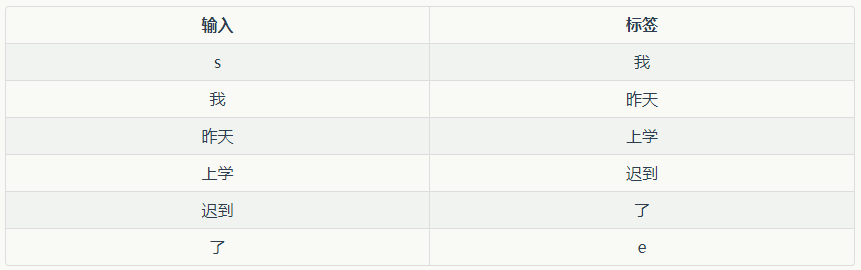 

然后，使用前面介绍过的**向量化**方法，对输入 x 和标签 y 进行 **向量化** 。这里面有意思的是，对标签 y 进行向量化，其结果也是一个 one-hot 向量。例如，我们对标签 【我】进行向量化，得到的向量中，只有第 2019 个元素的值是 1，其他位置的元素的值是 0 。它的含义就是下一个词是 【我】的概率是 1，是其他词的概率是 0。

最后，我们使用 **交叉熵误差函数** 作为优化目标，对模型进行优化。

在实际工程中，我们可以使用大量的语料来对模型进行训练，获取训练数据和训练的方法都是相同的。

### 4.4、交叉熵误差

一般来说，当神经网络的输出层是 softmax 层时，对应的误差函数 E 通常选择交叉熵误差函数，其定义如下：

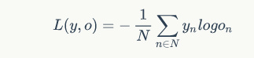

在上式中，N 是训练样本的个数，向量 y_n 是样本的标签，向量 o_n 是网络的输出。标签 y_n 是一个 one-hot 向量，例如，y_1 = [1, 0, 0, 0]，如果网络的输出 o = [0.03, 0.09, 0.24, 0.64] ，那么，交叉熵误差是（假设只有一个训练样本，即 N = 1）：

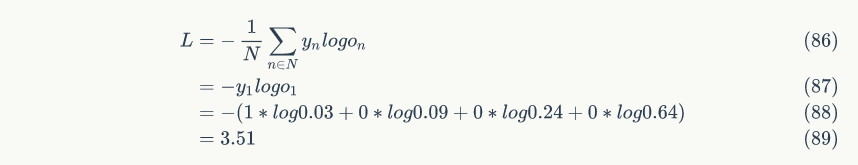

我们当然可以选择其他函数作为我们的误差函数，比如最小平方误差函数（MSE）。不过对概率进行建模时，选择交叉熵误差函数更 make sense 。

下一个文章，咱们讲 RNN 的具体实现。